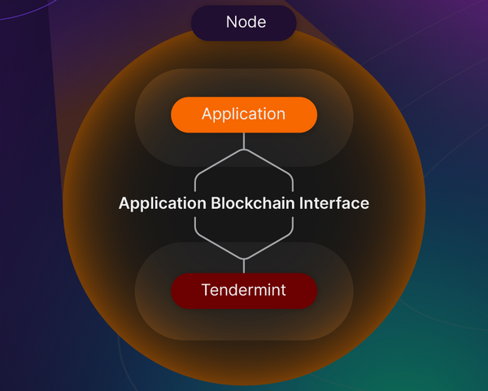

 

 ### **CometBFT Overview**

**Key Components:**

-   **CometBFT** packages the networking and consensus layers of a blockchain.
-   Provides an interface to the application layer called **Application Blockchain Interface (ABCI)**.
-   Allows developers to focus on higher-order concerns, such as:
    -   Peer-discovery
    -   Validator selection
    -   Staking
    -   Upgrades
    -   Consensus

**Architecture:**

-   **Consensus Engine:** Runs in one process and controls the state machine.
-   **Application:** Runs in a separate process.
-   **Socket Protocol:**
    -   Connects CometBFT to the application.
    -   If the application is written in a different language, ABCI provides a socket for connection.
    -   No socket is needed if the application and CometBFT are written in the same language.

### **Security Guarantees of CometBFT**

-   **Fork Prevention:** Forks are not created as long as at least half of the validators are honest.
-   **Accountability:** Strict accountability for fork creation allows determination of liability.
-   **Transaction Finality:** Transactions are finalized as soon as a block is created.
-   **Agnostic Approach:** CometBFT does not interpret transactions; this happens at the application layer.

**Block Time and Transaction Handling:**

-   **Block Time:** Approximately seven seconds.
-   **Block Capacity:** Blocks can contain thousands of transactions.
-   **Finality:** Transactions are irreversible once they appear in a block.

### **Application-Level Approaches Using Blockchains**

**Two Broad Approaches:**

1.  **Application-Specific Blockchain:**
    -   All possible actions are defined in the protocol.
2.  **Programmable State Machine:**
    -   Pushes application concerns to a higher level, such as bytecode from higher-level languages.
    -   **Example:** Ethereum-like blockchains, where only the state machine is defined in the on-chain protocol.

**Limitations of Programmable State Machines:**

-   **Lack of Universal Standards:** Basic concerns like tokens emerge organically, lacking universal standards.
-   **Repetitive and Error-Prone Code:** Contracts may contain repetitive code that might not fully implement the developer's intentions.
-   **Reasoning Challenges:** The flexibility of this approach makes it difficult to determine correctness or friendliness.
-   **Operational Complexity Limits:** Practical limits are much lower compared to other settings.
-   **Analysis and Reorganization Challenges:** Developers must adapt to the constraints, making analysis and reorganization difficult.

### **Purpose-Built or Application-Specific Blockchain**

-   No need for a **Turing-complete** language or a general-purpose programmable state machine.
-   Application concerns are addressed directly by the protocol created by developers.

### **Shift in Approach for Developers**

-   **EVM-based Blockchains:** Developers will notice a shift in how concerns are addressed:
    -   **Authorization and Access Control**
    -   **Storage Layout and State**
    -   **Application Governance**
-   Instead of implementing these as contracts on a state machine, they become properties of a unique, purpose-built blockchain.
-   

Developers are free to create blockchains in **any language** that supports sockets since the ABCI is a socket protocol, provided their application implements ABCI. ABCI defines the boundary between replication concerns and the application, which is a state machine.