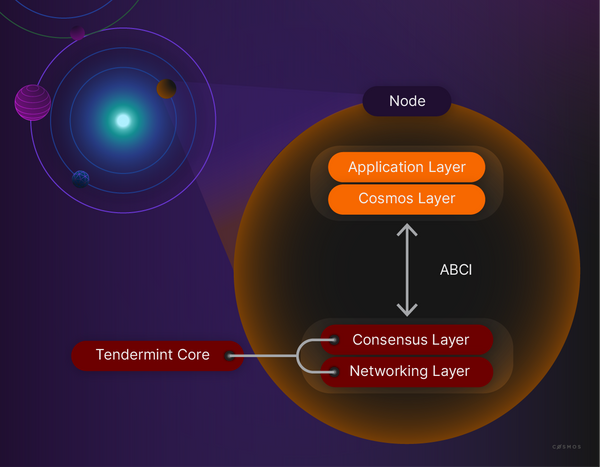

Tendermint modules **attend to consensus and networking**

This frees developers to focus on the application level without descending into lower-level blockchain concerns such as peer discovery, block propagation, consensus, and transaction finalization.

A blockchain node for an application-focused Cosmos blockchain consists of a state-machine, built with the Cosmos SDK, and the consensus and networking layer, which are handled by [CometBFT](https://docs.cometbft.com/v0.37/)

### CometBFT
CometBFT is a blockchain application platform which supports state machines in any **language**. The language-agnostic CometBFT helps developers securely and consistently replicate deterministic, finite state machines.

CometBFT is maintained even when 1/3rd of all machines fail, by providing two components:

- A blockchain consensus engine.
- A generic application interface.