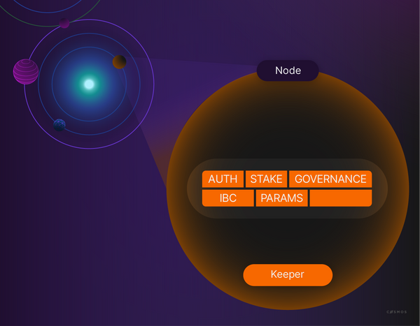

Keepers are the gatekeepers to any **stores** in the module. It is mandatory to go through a module's keeper to access a store. A keeper encapsulates the knowledge about the layout of the storage within the store and contains methods to update and inspect it. If you come from a model-view-controller (MVC) world, then it helps to think of the keeper as the **controller**.

Other modules may need access to a store, but other modules are also potentially malicious or poorly written. For this reason, developers need to consider who and what should have access to their module stores. To prevent a module from randomly accessing another module at runtime, a module needs to declare its intent to use another module at construction. At this point, such a module is granted a runtime key that lets it access the other module. Only modules that hold this key to a store can access the store. This is part of what is called an **object-capability model**.

Keepers are defined in `keeper.go`. A keeper's type definition generally consists of keys to the module's own store in the `multistore`, references to the keepers of other modules, and a reference to the application's codec