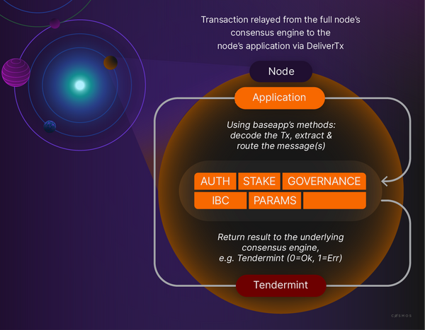

Each Cosmos chain is a purpose-built blockchain. Cosmos SDK modules define the unique properties of each chain. Modules can be considered state machines within the larger state machine. They contain the storage layout, or state, and the state transition functions, which are the message methods.

Modules define most of the logic of Cosmos SDK applications.

When a transaction is relayed from the underlying CometBFT consensus engine, BaseApp decomposes the Messages contained within the transaction and routes messages to the appropriate module for processing. Interpretation and execution occur when the appropriate module message handler receives the message.

