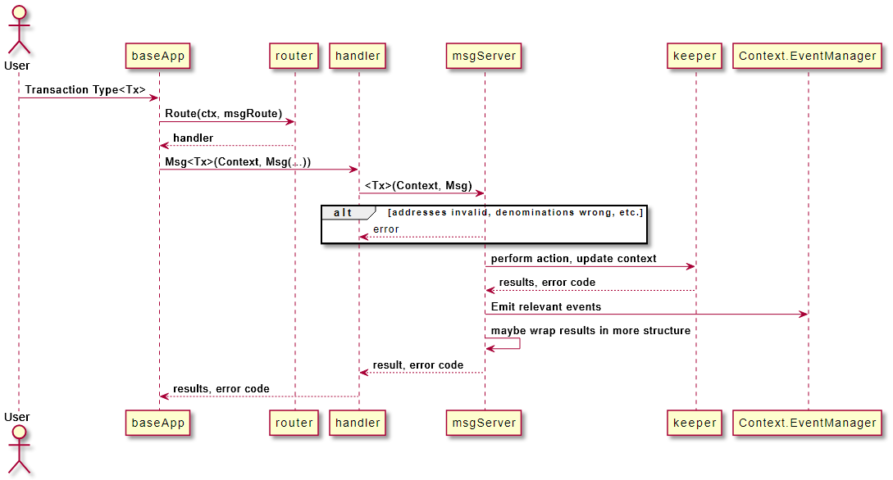

A Protobuf `Msg` service processes [messages](https://docs.cosmos.network/v0.50/build/building-modules/messages-and-queries#messages). Protobuf `Msg` services are specific to the module in which they are defined, and only process messages defined within the said module. They are called from `BaseApp` during [`DeliverTx`](https://docs.cosmos.network/v0.50/learn/advanced/baseapp#delivertx).

---------
### sdk.Msg processing usually follows these 3 steps:


### Validation
The message server must perform all validation required (both stateful and stateless) to make sure the message is valid. The signer is charged for the gas cost of this validation.


Previously, the ValidateBasic method was used to perform simple and stateless validation checks. This way of validating is deprecated, this means the msgServer must perform all validation checks


### State Transition

After the validation is successful, the `msgServer` method uses the [`keeper`](https://docs.cosmos.network/v0.50/build/building-modules/keeper) functions to access the state and perform a state transition.

### Events

Before returning, `msgServer` methods generally emit one or more [events](https://docs.cosmos.network/v0.50/learn/advanced/events) by using the `EventManager` held in the `ctx`. Use the new `EmitTypedEvent` function that uses protobuf-based event types:

```
ctx.EventManager().EmitTypedEvent(
    &group.EventABC{Key1: Value1,  Key2, Value2})
```