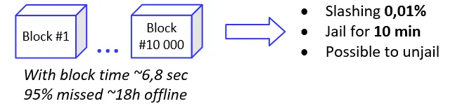
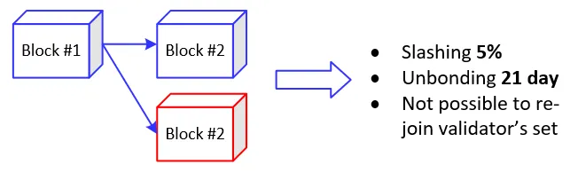

**Introduction to Slashing:**

-   **Definition:** Slashing is an event that results in the loss of a stake percentage due to network violations, impacting the safety of other participants.
-   **Purpose:** It serves as a financial incentive to encourage proper behavior and addresses the "nothing at stake" problem

## Slashing events
There are two types of events when stake liquidation happens:

https://medium.com/p2peconomy/slashing-in-cosmos-network-bbbaff949ee5