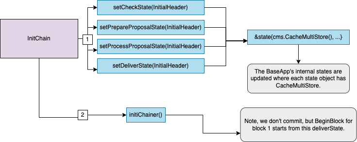
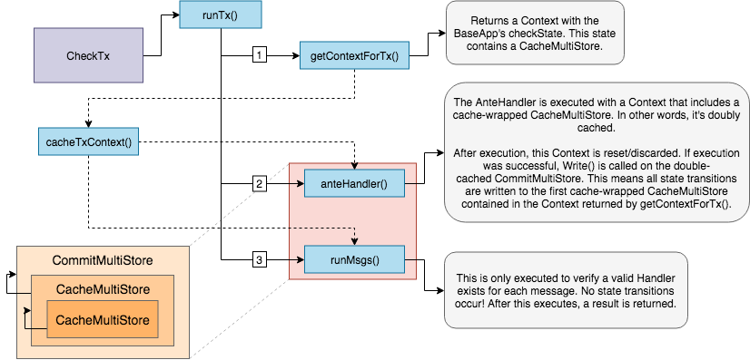
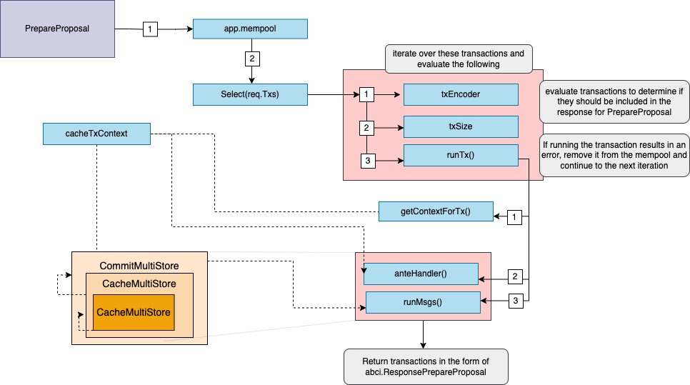
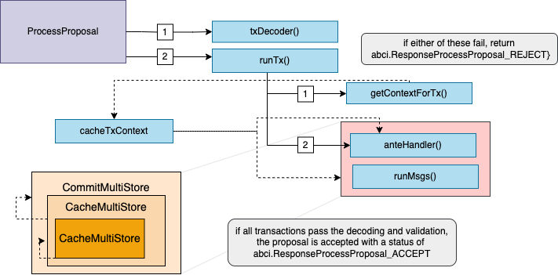
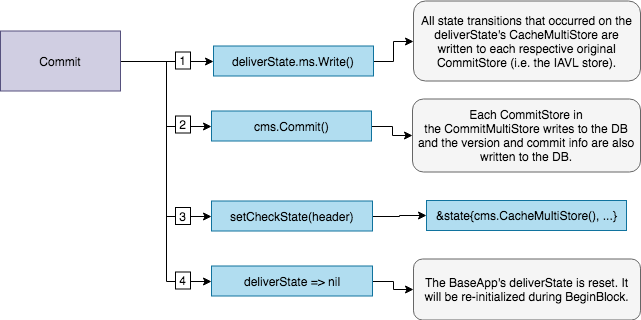

The `BaseApp` maintains **four** primary volatile states and a root or main state. The main state is the canonical state of the application and the volatile states, `checkState`, `prepareProposalState`, `processProposalState` and `finalizeBlockState` are used to handle state transitions in-between the main state made during [`Commit`](https://docs.cosmos.network/v0.52/learn/advanced/baseapp#commit).

Internally, there is only a single `CommitMultiStore` which we refer to as the main or root state. From this root state, we derive four volatile states by using a mechanism called *store branching* (performed by `CacheWrap` function). The types can be illustrated as follows:

### InitChain State Updates[​](https://docs.cosmos.network/v0.52/learn/advanced/baseapp#initchain-state-updates "Direct link to InitChain State Updates")

During `InitChain`, the four volatile states, `checkState`, `prepareProposalState`, `processProposalState` and `finalizeBlockState` are set by branching the root `CommitMultiStore`. Any subsequent reads and writes happen on branched versions of the `CommitMultiStore`. To avoid unnecessary roundtrip to the main state, all reads to the branched store are cached.

### CheckTx State Updates[​](https://docs.cosmos.network/v0.52/learn/advanced/baseapp#checktx-state-updates "Direct link to CheckTx State Updates")

During `CheckTx`, the `checkState`, which is based on the last committed state from the root store, is used for any reads and writes. Here we only execute the `AnteHandler` and verify a service router exists for every message in the transaction. Note, when we execute the `AnteHandler`, we branch the already branched `checkState`. This has the side effect that if the `AnteHandler` fails, the state transitions won't be reflected in the `checkState` \-- i.e. `checkState` is only updated on success.

### PrepareProposal State Updates[​](https://docs.cosmos.network/v0.52/learn/advanced/baseapp#prepareproposal-state-updates "Direct link to PrepareProposal State Updates")

During `PrepareProposal`, the `prepareProposalState` is set by branching the root `CommitMultiStore`. The `prepareProposalState` is used for any reads and writes that occur during the `PrepareProposal` phase. The function uses the `Select()` method of the mempool to iterate over the transactions. `runTx` is then called, which encodes and validates each transaction and from there the `AnteHandler` is executed. If successful, valid transactions are returned inclusive of the events, tags, and data generated during the execution of the proposal. The described behavior is that of the default handler, applications have the flexibility to define their own [custom mempool handlers](https://docs.cosmos.network/main/build/building-apps/app-mempool).

### ProcessProposal State Updates[​](https://docs.cosmos.network/v0.52/learn/advanced/baseapp#processproposal-state-updates "Direct link to ProcessProposal State Updates")

During `ProcessProposal`, the `processProposalState` is set based off of the last committed state from the root store and is used to process a signed proposal received from a validator. In this state, `runTx` is called and the `AnteHandler` is executed and the context used in this state is built with information from the header and the main state, including the minimum gas prices, which are also set. Again we want to highlight that the described behavior is that of the default handler and applications have the flexibility to define their own [custom mempool handlers](https://docs.cosmos.network/main/build/building-apps/app-mempool).

### FinalizeBlock State Updates[​](https://docs.cosmos.network/v0.52/learn/advanced/baseapp#finalizeblock-state-updates "Direct link to FinalizeBlock State Updates")

During `FinalizeBlock`, the `finalizeBlockState` is set for use during transaction execution and endblock. The `finalizeBlockState` is based off of the last committed state from the root store and is branched. Note, the `finalizeBlockState` is set to `nil` on [`Commit`](https://docs.cosmos.network/v0.52/learn/advanced/baseapp#commit).

The state flow for transaction execution is nearly identical to `CheckTx` except state transitions occur on the `finalizeBlockState` and messages in a transaction are executed. Similarly to `CheckTx`, state transitions occur on a doubly branched state -- `finalizeBlockState`. Successful message execution results in writes being committed to `finalizeBlockState`. Note, if message execution fails, state transitions from the AnteHandler are persisted.

### Commit State Updates[​](https://docs.cosmos.network/v0.52/learn/advanced/baseapp#commit-state-updates "Direct link to Commit State Updates")

During `Commit` all the state transitions that occurred in the `finalizeBlockState` are finally written to the root `CommitMultiStore` which in turn is committed to disk and results in a new application root hash. These state transitions are now considered final. Finally, the `checkState` is set to the newly committed state and `finalizeBlockState` is set to `nil` to be reset on `FinalizeBlock`.

