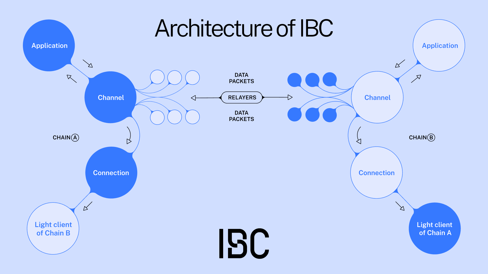
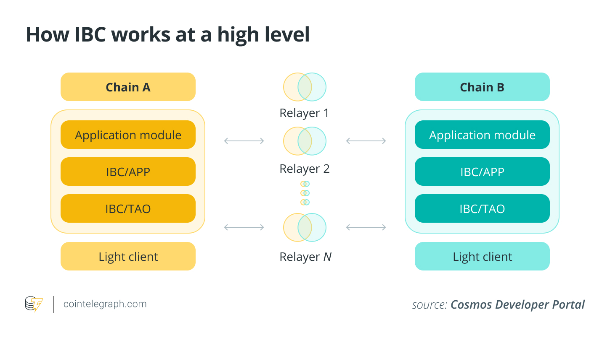

https://www.ibcprotocol.dev/

The Inter-Blockchain Communication Protocol (IBC) is a robust framework designed to facilitate communication between different blockchains, allowing them to share data and transfer assets in a secure and efficient manner. Here's a detailed breakdown of how IBC works:

### **1\. Two-Layer Architecture**

IBC operates on two distinct layers:

-   **Transport Layer (TAO)**: This layer handles the transport, authentication, and ordering of data packets between blockchains. It establishes secure connections and verifies the integrity of the data being transmitted.

-   **Application Layer (APP)**: This layer defines how the data packets are packaged and interpreted by the sending and receiving blockchains. It includes various application modules that dictate specific functionalities like token transfers or interchain accounts.

### **2\. Key Components of IBC**

Several critical components enable IBC's functionality:

-   **Light Clients**: These are lightweight representations of a blockchain that reside within another blockchain's state machine. They track the consensus state of their counterpart blockchain by verifying block headers and Merkle proofs.

-   **Connections**: Connections link two light clients together, facilitating communication between them.

-   **Channels**: Channels serve as conduits for transferring data packets between modules on different blockchains. Each channel is uniquely identified by a combination of port ID and channel ID.

-   **Relayers**: These are off-chain processes responsible for relaying messages between chains. Relayers monitor the state of each blockchain, construct appropriate transactions based on this state, and submit these transactions to the relevant chains.

### **3\. Packet Flow Process**

The process for transferring data via IBC can be summarized in several steps:

1.  **Initiation**: A user initiates a cross-chain transaction on one blockchain (the source chain).

2.  **Packet Creation**: The source chain creates an IBC packet containing relevant transaction details (sender, recipient, etc.).

3.  **Relaying**: The relayer scans the source chain for new packets, constructs a transaction with this packet, and submits it to the destination chain via its light client.

4.  **Verification**: Upon receiving the packet, the destination chain uses its light client to verify the authenticity of the packet against its own consensus rules.

5.  **Processing**: If verification is successful, the destination chain processes the transaction according to its application logic.

6.  **Acknowledgment**: Once processed, an acknowledgment is sent back through the same path to confirm that the transaction was successfully completed.

### **4\. Security Mechanisms**

IBC employs several security mechanisms to ensure safe cross-chain communication:

-   **Trust in Consensus**: Users must trust the consensus mechanism of both connected chains; if they do so, they can trust IBC communications between them.

-   **Byzantine Fault Tolerance**: The design allows for fault isolation; even if relayers act maliciously or fail, it does not compromise overall security as long as at least one honest relayer exists.

-   **Dynamic Capabilities**: Authentication mechanisms ensure that only authorized modules can access specific channels or ports within IBC-enabled chains.

### **5\. Interoperability Benefits**

By enabling seamless communication across diverse blockchains without requiring direct trust in intermediaries, IBC fosters an interconnected ecosystem where assets can flow freely across platforms while maintaining security and integrity.

In summary, IBC provides a standardized method for different blockchains to communicate effectively by utilizing a structured approach involving light clients, connections, channels, relayers, and robust security protocols---all contributing to creating an "internet of blockchains."

* * * *

