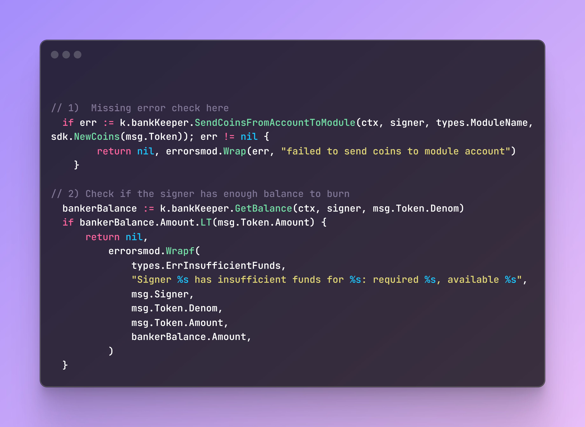

## 1️⃣ Write the basic structure Validate Basic

```go
package types
import (
    errorsmod "cosmossdk.io/errors"
    "encoding/hex"    sdk "github.com/cosmos/cosmos-sdk/types"
    sdkerrors "github.com/cosmos/cosmos-sdk/types/errors"
    "net/url")
func (msg *MsgSwapByDenom) ValidateBasicReza() error {
    // Validate the creator address
    _, err := sdk.AccAddressFromBech32(msg.Creator) //  Or msg.Sender
    if err != nil {
       return errorsmod.Wrapf(sdkerrors.ErrInvalidAddress, "invalid creator address: %v", err)
    }
    // Validate the denom (non-empty and valid format)
    if err := sdk.ValidateDenom(msg.Denom); err != nil {
       return sdkerrors.Wrapf(sdkerrors.ErrInvalidRequest, "invalid denom: %v", err)
    }
    // Validate max supply
    if msg.MaxSupply {
       if !msg.MaxSupplyAmount.IsPositive() {
          return sdkerrors.Wrap(sdkerrors.ErrInvalidRequest, "max supply amount must be positive when max supply is enabled")
       }
    } else {
       if !msg.MaxSupplyAmount.IsZero() {
          return sdkerrors.Wrap(sdkerrors.ErrInvalidRequest, "max supply amount must be zero when max supply is disabled")
       }
    }
    if msg.URI != "" {
       // Basic URI validation (you might want to use a more robust URI parsing library for production)
       _, err := url.ParseRequestURI(msg.URI)
       if err != nil {
          return sdkerrors.Wrap(sdkerrors.ErrInvalidRequest, "uri must be a valid URI format (e.g., http://, https://, ipfs://)")
       }
       if msg.URIHash == "" {
          return sdkerrors.Wrap(sdkerrors.ErrInvalidRequest, "uri hash is required when uri is provided")
       }
       // Basic URI Hash validation (assuming it's expected to be a hex-encoded hash)
       if _, err := hex.DecodeString(msg.URIHash); err != nil {
          return sdkerrors.Wrapf(sdkerrors.ErrInvalidRequest, "invalid uri hash format: %s. Expected hex-encoded string.", err)
       }
       // Example Hash length check (SHA256 - 32 bytes = 64 hex chars, SHA512 - 64 bytes = 128 hex chars)
       if len(msg.URIHash) != 64 && len(msg.URIHash) != 128 {
          return sdkerrors.Wrapf(sdkerrors.ErrInvalidRequest, "invalid uri hash length: %d. Expected length for common hash algorithms (e.g., 64 or 128).", len(msg.URIHash))
       }
    } else {
       if msg.URIHash != "" {
          return sdkerrors.Wrap(sdkerrors.ErrInvalidRequest, "uri hash should not be provided when uri is not set")
       }
    }
    return nil
}

```


--------------------------
## 2️⃣ Find error in this code



--------------------------
## 3️⃣ Write tests for this function

```go
package keeper

import (
	"context"

	errorsmod "cosmossdk.io/errors"
	sdk "github.com/cosmos/cosmos-sdk/types"
	govtypes "github.com/cosmos/cosmos-sdk/x/gov/types"
	"github.com/reza/x/zigch/types"
)

func (k msgServer) UpdateParams(goCtx context.Context, req *types.MsgUpdateParams) (*types.MsgUpdateParamsResponse, error) {

	if k.authority != req.Authority {
		return nil, errorsmod.Wrapf(govtypes.ErrInvalidSigner, "invalid authority; expected %s, got %s", k.authority, req.Authority)
	}
	ctx := sdk.UnwrapSDKContext(goCtx)

	if err := k.SetParams(ctx, req.Params); err != nil {
		return nil, err
	}

	return &types.MsgUpdateParamsResponse{}, nil
}

```

```go
package keeper_test

import (
	"fmt"

	"cosmossdk.io/math"
	authtypes "github.com/cosmos/cosmos-sdk/x/auth/types"
	govtypes "github.com/cosmos/cosmos-sdk/x/gov/types"
	"github.com/reza/x/zigch/keeper"
	"github.com/reza/x/zigch/types"
)

func (suite *ZigchKeeperTestSuite) TestUpdateParams() {
	sender := authtypes.NewModuleAddress(govtypes.ModuleName)
	tests := []struct {
		name      string
		authority string
		params    types.Params
		expected  error
	}{
		{
			name:      "invalid authority",
			authority: "invalid_authority",
			params:    types.Params{},
			expected:  fmt.Errorf("invalid authority"),
		},
		{
			name:      "valid authority",
			authority: sender.String(),
			params: types.Params{
				LeverageEnabled: true,
				Reza:            100,
			},
			expected: nil,
		},
		{
			name: "empty authority",
			params: types.Params{
				LeverageEnabled: true,
				Reza:            100,
			},
			authority: "",
			expected:  fmt.Errorf("invalid authority"),
		},
	}

	for _, tt := range tests {
		suite.Run(tt.name, func() {
			suite.SetupTest()

			msgServer := keeper.NewMsgServerImpl(suite.app.ZigchKeeperTestSuite)

			msg := &types.MsgUpdateParams{
				Authority: tt.authority,
				Params:    &tt.params,
			}

			_, err := msgServer.UpdateParams(suite.ctx, msg)
			if tt.expected != nil {
				suite.Require().ErrorContains(err, tt.expected.Error())
			} else {
				suite.Require().NoError(err)
				storedParams := suite.app.ZigchKeeperTestSuite.GetParams(suite.ctx)
				suite.Require().Equal(tt.params, storedParams)
			}
		})
	}
}

```

--------------------------
## 4️⃣ What is wrong with these requirements


-----------------