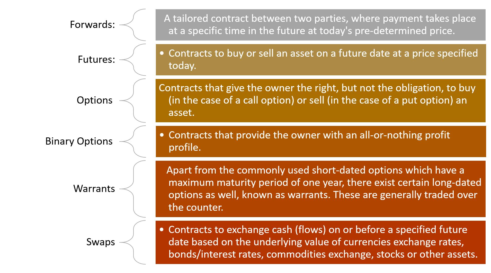

most models in the market:

### The Quant’s Dream: Programmable Derivatives

What make crypto-derivatives different from any other financial derivative is the simple fact that they are **programmable smart contracts** that can be dynamically used in higher order contracts. While a bank will spend years building the legal contract that represents Swap model, a hacker can use a crypto derivative protocol and build a financial derivative in minutes. More importantly, the nature of crypto-derivatives enables the implementation of more sophisticated financial models as there are many things that can be expressed in code and smart contracts that can’t be done using simple statistics.