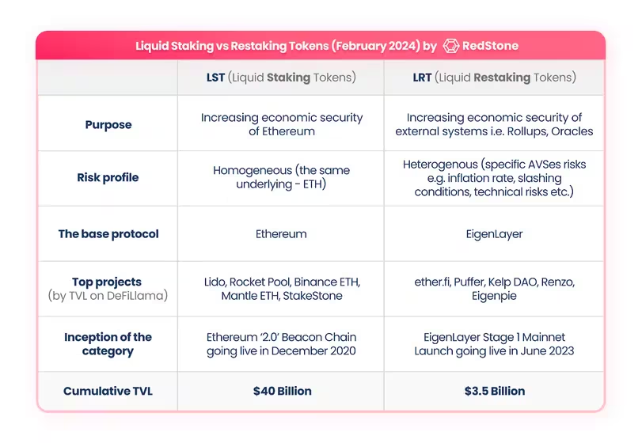

# Liquid Staking Tokens

What are Liquid Staking Tokens vs Liquid Restaking Tokens 

Liquid Staking Tokens (LSTs)
These represent tokens you've staked on a single blockchain network.
When you stake, say, Ethereum, you get an LST like stETH in return.
You can use this LST in DeFi while your original tokens remain staked.
The LST earns rewards from that one network only.

Liquid Restaking Tokens (LRTs)
These take the concept of LSTs a step further.
- With LRTs, your staked tokens are used as collateral across multiple protocols or networks.
- This allows you to potentially earn additional rewards beyond just staking.
- You're essentially "restaking" your already staked tokens.

Key Difference
The main difference is that LSTs involve staking on a single network, while LRTs involve using your staked tokens as collateral across multiple protocols or networks, potentially increasing your yield but also increasing complexity and risk.

Analogy
. LST is like putting your money in a single savings account and getting a certificate that represents that deposit.
. LRT is like using that savings account certificate as collateral to invest in multiple other opportunities simultaneously.

LRTs in more detail:
Tokens become LRTs rather than LSTs through a more complex mechanism that leverages cross-protocol interactions. Here's how it works 

- Layer of abstraction: LRTs add an extra layer on top of LSTs. They typically start with staked tokens (often represented by LSTs) and then use these as collateral for further activities.
- Smart contract integration: LRT protocols use advanced smart contracts that can interact with multiple other protocols or networks simultaneously.
- Cross-protocol collateralization: The staked assets are used as collateral across different protocols, allowing for participation in various DeFi activities beyond just staking.
- Yield aggregation: LRTs can accumulate yields from multiple sources - the original staking rewards plus additional yields from other protocols where the assets are being used.
- Risk distribution: By spreading assets across multiple protocols, LRTs can potentially distribute risk, though this also introduces new types of risks.
- Interoperability: LRTs often leverage blockchain interoperability features to enable cross-chain activities.

This ability to "restake" across protocols is what distinguishes LRTs from simpler LSTs. It's a more advanced concept that's still evolving in the DeFi space.

Liquid Restaking Tokens (LRTs) are a new development in the DeFi space that allow users to earn yield on their staked ETH without sacrificing liquidity. They represent a liquid token representation of a restaked ETH position, allowing users to benefit from both the base ETH staking yield and additional yield from Active Validated Services (AVSs).

LRTs provide several advantages over traditional restaking methods, including:

- **Increased Yield Opportunities:** LRTs offer users enhanced returns on their staked assets from AVSs.
- **Simplified User Experience:** The complexity of running a validator node is abstracted away by LRT protocols, making it easier for users to participate in the restaking process.
- **Lower Capital Requirements:** Users can gain access to ETH restaking yield without needing 32 ETH to run their own validator.
- **Risk Management:** LRT protocols manage the risk of AVS validation on behalf of their users, mitigating potential slashing risks.
- **Capital Efficiency:** LRT holders can access other DeFi opportunities with their capital, such as borrowing against their LRTs on borrow/lend protocols.

The current Liquid Restaking landscape includes protocols like Ether.fi, Renzo, Puffer, Kelp DAO, Eigenpie, Swell, and others. While LRTs offer significant benefits, it is important to note that they are not officially endorsed by EigenLayer. Users should carefully evaluate the risks associated with these protocols before investing.