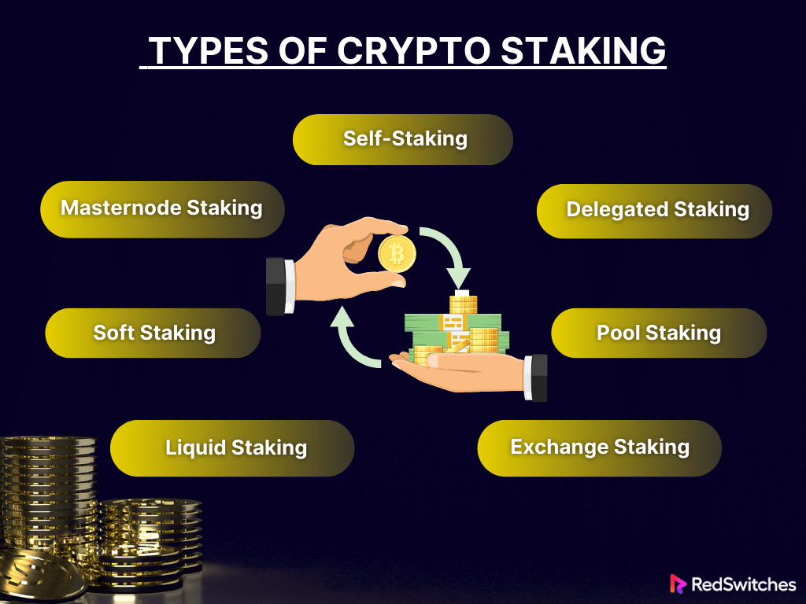

Staking in crypto refers to the process of participating in the proof-of-stake (PoS) consensus mechanism of a blockchain by locking up a certain amount of cryptocurrency to support network operations such as block validation and security. There are several types of staking mechanisms used in different blockchain networks:

### Types of Staking in Crypto

1. **Proof of Stake (PoS)**:
   - **Definition**: Participants lock up their tokens to become validators. Validators are chosen to create new blocks based on the number of tokens they have staked.
   - **Example**: Ethereum 2.0

2. **Delegated Proof of Stake (DPoS)**:
   - **Definition**: Token holders vote for a small number of delegates (validators) to secure the network. The more tokens a delegate has, the more likely they are to be selected to create a block.
   - **Example**: EOS, TRON

3. **Bonded Proof of Stake (BPoS)**:
   - **Definition**: Similar to PoS, but validators must bond their tokens for a specific period. The bonded tokens can be slashed if the validator acts maliciously.
   - **Example**: Cosmos, Polkadot

4. **Liquid Proof of Stake (LPoS)**:
   - **Definition**: Combines aspects of traditional PoS and DPoS. Token holders can stake their tokens directly or delegate them to validators.
   - **Example**: Tezos

5. **Hybrid Proof of Stake (Hybrid PoS)**:
   - **Definition**: Combines PoS with another consensus mechanism, like proof of work (PoW), to enhance security and decentralization.
   - **Example**: Decred

6. **Leased Proof of Stake (LPoS)**:
   - **Definition**: Token holders can lease their tokens to full nodes, which then use the combined stake to increase their chances of being selected to validate transactions.
   - **Example**: Waves

7. **Cold Staking**:
   - **Definition**: Allows token holders to stake their tokens without keeping them in a hot wallet, reducing the risk of theft.
   - **Example**: NavCoin, Stratis

8. **Staking Pools**:
   - **Definition**: A group of token holders combine their resources to increase their chances of being selected as validators. Rewards are distributed proportionally among participants.
   - **Example**: PoolTogether, Rocket Pool

9. **Masternode Staking**:
   - **Definition**: Involves setting up a masternode, which requires a significant amount of tokens to be staked. Masternodes perform additional functions like governance and instant transactions.
   - **Example**: Dash, PIVX

10. **Staking-as-a-Service**:
    - **Definition**: Third-party platforms offer staking services, managing the technical aspects on behalf of token holders in exchange for a fee.
    - **Example**: Coinbase, Binance Staking

11. **Yield Farming**:
    - **Definition**: A form of staking in the DeFi ecosystem where users provide liquidity to decentralized exchanges or lending platforms in exchange for rewards.
    - **Example**: Uniswap, Compound

12. **Synthetic Staking**:
    - **Definition**: Involves staking synthetic assets, which are tokenized representations of other assets, providing a way to earn staking rewards without holding the actual underlying asset.
    - **Example**: Synthetix

13. Cross-Chain Staking:

      Staking assets on one blockchain to secure another
      Often used in interoperability protocols
      Example: Cosmos Network

14. Non-Custodial Staking:

      Staking directly from a user's wallet without transferring assets to a third party
      Maintains full control over assets

      -----

**Self-staking**

Self-staking in cryptocurrency refers to the process where an individual stakes their digital assets directly on a blockchain network that uses a Proof of Stake (PoS) protocol. This method involves setting up and maintaining a node, securing the staked assets, and actively participating in the network’s consensus mechanism.

The staker commits their coins as a stake and, in return, gets the chance to validate transactions, create new blocks, and earn [staking rewards]. This approach offers greater control over the staking process and potentially higher rewards. It also comes with several responsibilities and risks, such as ensuring continuous node operation and security against potential breaches.      

**Pool Staking**

Pool staking represents a collaborative approach to cryptocurrency staking. In this model, numerous stakers combine their digital assets to form a staking pool. This pooling of resources significantly enhances their collective probability of being chosen to validate new blocks in the blockchain, thereby earning staking rewards.

It’s particularly beneficial for individuals who possess smaller amounts of cryptocurrency, as it allows them to participate in the staking process without meeting the higher asset thresholds required for solo staking.

**Liquid Staking**

Liquid staking represents an innovative approach in the crypto currency staking landscape. It allows participants to stake their digital assets and earn staking rewards without sacrificing liquidity. In this system, when users stake their cryptocurrency, they receive a corresponding amount of liquid tokens.

These tokens act as a stand-in for the staked assets and can be freely traded or used in various decentralized finance (DeFi) applications. This approach seamlessly blends the benefits of staking with the flexibility of liquid markets, enabling users to participate in other investment opportunities without un-staking their assets.

**Soft Staking**

Soft staking offers a more user-friendly and flexible approach to crypto staking. Cryptocurrency exchanges commonly provide it and do not require users to lock their assets for a fixed period. This method allows participants to earn staking rewards while keeping their cryptocurrencies in an exchange wallet. The key advantage here is the ability to trade or move these assets at short notice, providing a balance between earning passive income and maintaining trading liquidity.