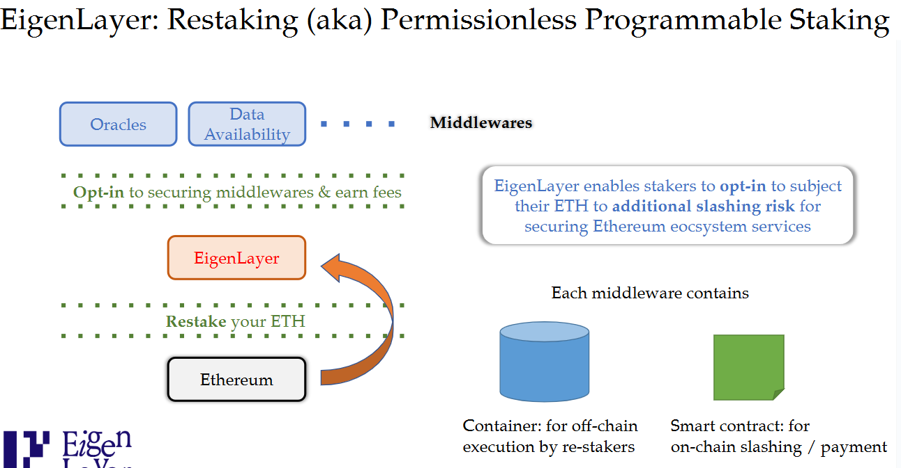
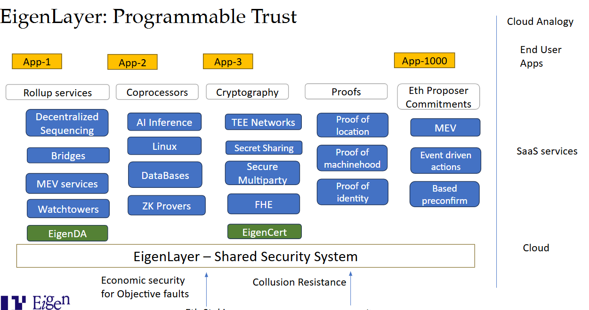

---

## **General Overview and Vision**

### 1. **What is the main vision behind the project introduced in the talk?**
**Answer:**  
The main vision is to create a *coordination engine for open innovation* in the digital world. This means building a platform that enables decentralized parties to efficiently coordinate and innovate together, similar to how governments coordinate markets or how cloud services coordinate software development. The project aims to allow anyone to build new digital platforms using decentralized trust, making it easier to create, combine, and deploy innovative services.

---

### 2. **What are the two fundamental types of positive-sum games discussed in the talk?**
**Answer:**  
The two types are:
- **Innovation:** Creating new resources or transforming non-resources into resources (e.g., making silicon from sand, sharing ideas).
- **Coordination:** Bringing together multiple parties to achieve results greater than the sum of individual efforts (e.g., governments coordinating economies).

---

### 3. **How does the speaker relate innovation and coordination to existing societal structures?**
**Answer:**  
The speaker uses the analogy of a country, where the government acts as a *coordination layer* and the free market represents *open innovation*. Similarly, the project aims to provide a digital coordination layer on which anyone can innovate.

---

### 4. **What is meant by “open innovation” in this context?**
**Answer:**  
*Open innovation* refers to a system where anyone can build new services, platforms, or software on top of a shared, decentralized foundation, leveraging composability and interoperability.

---

### 5. **Why is decentralized trust important for the platform’s vision?**
**Answer:**  
Decentralized trust ensures that no single party controls the system, enhancing security, neutrality, and enabling the platform to serve as a reliable coordination layer for a diverse set of services and users.

---

## **Technical Foundations**

### 6. **What is the core technical function of the platform discussed (EigenLayer)?**
**Answer:**  
EigenLayer acts as a *coordination layer* by pooling staked ETH from Ethereum and enabling it to secure a variety of new, programmable, permissionless services called *Actively Validated Services (AVS)*. This is called *restaking*.

---

### 7. **What is “restaking” and how does it differ from standard staking?**
**Answer:**  
- **Standard staking**: Locking ETH in Ethereum to validate and secure the Ethereum network.
- **Restaking**: Taking already-staked ETH and committing it to additional, programmable conditions to secure other services beyond Ethereum, extending the utility and security guarantees of the original stake.

---

### 8. **How is restaking described more precisely in the talk?**
**Answer:**  
It is described as **permissionless programmable staking**: anyone can create new middleware or services that impose additional conditions on staked ETH, and stakers can choose to participate in securing these services.

---

### 9. **What are Actively Validated Services (AVS)?**
**Answer:**  
AVS are decentralized services built on EigenLayer that require active validation by node operators. Examples include data availability, sequencing, proof generation, or watchtower services. They are akin to decentralized versions of SaaS (Software as a Service) in the cloud.

---

### 10. **How does EigenLayer enable programmable trust?**
**Answer:**  
By allowing the same pool of staked ETH and validators to secure multiple, programmable services, EigenLayer provides both economic security and decentralization to any service built on top of it. Smart contracts define slashing, payment, and registration conditions for each AVS.

---

### 11. **What is “shared security” and why is it important?**
**Answer:**  
*Shared security* means that the same pool of staked ETH and validators secures multiple services. This makes attacks much harder and provides stronger security guarantees because an attacker would need to compromise the entire pool rather than individual, isolated pools.

---

### 12. **What are the two key dimensions of programmable trust provided by EigenLayer?**
**Answer:**  
- **Economic Security:** The amount of staked ETH that can be slashed if a service is compromised.
- **Decentralization:** Using a neutral, large set of node operators that validate multiple services, providing collusion resistance.

---

## **Ecosystem Structure**

### 13. **Who are the main participants in the EigenLayer ecosystem?**
**Answer:**  
- **Stakers:** Provide ETH and take on additional validation responsibilities.
- **Operators:** Run infrastructure to validate AVS.
- **Service Creators/Builders:** Develop and deploy new AVS.
- **End-Users:** Use the applications built on top of AVS.

---

### 14. **What is the analogy between cloud services and EigenLayer’s ecosystem?**
**Answer:**  
Just as modern web development uses cloud infrastructure and SaaS to rapidly build applications, EigenLayer enables developers to use decentralized AVS as building blocks, accelerating innovation and reducing redundant development effort.

---

### 15. **How are smart contracts used within EigenLayer?**
**Answer:**  
Each AVS has a smart contract specifying payment terms, slashing conditions, and registration requirements. These contracts interface with the main EigenLayer contract to manage staked assets and validator participation.

---

## **Types of Services on EigenLayer**

### 16. **What are some categories of services that can be built as AVS?**
**Answer:**  
- **Rollup Services:** Data availability, decentralized sequencing, bridges, MEV (Maximal Extractable Value) services, encrypted mempools, watchtowers.
- **Co-processors:** Off-chain computation, AI, running Linux programs, database queries, ZK proof services.
- **Cryptographic Services:** Trusted execution environments (TEEs), secret sharing, secure multiparty computation, fully homomorphic encryption.
- **Proofs and Attestations:** Proof of location, proof of machinehood, proof of identity.
- **Event-driven Actions:** Automated responses to on-chain events (e.g., liquidations, fast pre-confirmations).

---

### 17. **What is a data availability (DA) service and why is it important for rollups?**
**Answer:**  
A DA service ensures that the data needed to verify rollup computations is published and accessible. This allows anyone to check the correctness of off-chain computations, which is critical for rollup scalability and security.

---

### 18. **What are watchtowers and what role do they play?**
**Answer:**  
Watchtowers are decentralized nodes that monitor rollups for fraudulent or faulty behavior and raise alerts if problems are detected, especially important as the number of rollups grows.

---

### 19. **How do co-processors extend the capabilities of Ethereum?**
**Answer:**  
Co-processors allow Ethereum smart contracts to utilize off-chain computation, AI, databases, or cryptographic proofs, and bring those results back on-chain, vastly expanding possible applications.

---

### 20. **What is a trusted execution environment (TEE) and how is it used in this context?**
**Answer:**  
A TEE is a secure hardware enclave that runs code with confidentiality and integrity guarantees. AVS can use TEEs for applications that require secure computation or data privacy, with the network validating outputs.

---

### 21. **What are proofs of location and machinehood, and why are they useful?**
**Answer:**  
- **Proof of location:** Verifies where a node is physically located, useful for geofencing or network topology.
- **Proof of machinehood:** Ensures each participant is a unique device, preventing Sybil attacks or verifying hardware diversity.

---

### 22. **How can AVS improve DeFi platform usability?**
**Answer:**  
AVS can automate event-driven actions, such as liquidations, and reduce time to action (like time to liquidation), leading to tighter, more efficient financial systems.

---

## **Security and Economic Mechanisms**

### 23. **Why is shared security considered “strictly better” than isolated security pools?**
**Answer:**  
Because to attack any individual service, an attacker must compromise the total pooled security, which is much larger than individual, isolated pools. This increases the cost and difficulty of attacks.

---

### 24. **What is attributable security and how does EigenLayer plan to implement it?**
**Answer:**  
Attributable security means a service can claim a guaranteed portion of the staked ETH as insurance against attacks. EigenLayer plans to allow services to pre-buy slashing insurance, ensuring they can slash a specified amount if compromised.

---

### 25. **How does the concept of insurance work in EigenLayer’s future roadmap?**
**Answer:**  
Services can purchase insurance that guarantees a specific slashing amount from the shared pool, combining the benefits of pooled (shared) and attributable (service-specific) security, and avoiding over-provisioning of insurance.

---

### 26. **What is meant by “elastic scaling of security”?**
**Answer:**  
Just as cloud computing allows users to scale resources as needed, EigenLayer allows services to dynamically adjust the amount of security (staked ETH) they utilize based on real-time demand and risk.

---

### 27. **How does EigenLayer create economies of scale for security?**
**Answer:**  
By pooling security, users and services do not need to secure each AVS separately; a single purchase of insurance or participation covers multiple services, reducing costs and improving efficiency.

---

## **Project Roadmap and Deployment**

### 28. **How was the EigenLayer launch roadmap originally structured?**
**Answer:**  
- **Stage 1:** Stakers
- **Stage 2:** Operators
- **Stage 3:** Services

---

### 29. **How has the launch roadmap changed?**
**Answer:**  
Now, **Stage 1** (already live) is EigenLayer staking; **Stage 2** will launch the full ecosystem (stakers, operators, services except for economic features); **Stage 3** will add payments and slashing mechanisms.

---

### 30. **What is the status of the EigenLayer network as described in the talk?**
**Answer:**  
- Stage 1 (staking) is live on mainnet.
- Stage 2 (ecosystem testnet) is coming soon and will include stakers, operators, and services (excluding economic features).
- Stage 3 (mainnet with payments and slashing) will follow.

---

### 31. **Why are economic features (payments and slashing) being launched in a later stage?**
**Answer:**  
Launching economic features later allows for thorough testing and validation of the ecosystem’s operational aspects before introducing financial incentives and penalties, reducing risk of loss or exploits.

---

## **Analogy and Historical Context**

### 32. **How does the speaker compare building applications in 1995 vs. 2023?**
**Answer:**  
In 1995, developers had to build all infrastructure (servers, authentication, payments) themselves. In 2023, developers use cloud and SaaS solutions, drastically increasing innovation speed. EigenLayer aims to create a similar paradigm shift for decentralized applications.

---

### 33. **What does the speaker mean by “paradigm for programmable trust”?**
**Answer:**  
EigenLayer allows services to define and enforce their own trust and security requirements programmatically, using a shared, decentralized pool of validators and staked ETH.

---

### 34. **How does EigenLayer mirror economies of scale found in cloud computing?**
**Answer:**  
Like cloud providers pooling compute resources for multiple customers, EigenLayer pools security so multiple AVS can share the same validator set and staked assets, reducing redundant costs.

---

## **Community, Innovation, and Emergence**

### 35. **What role does the community play in the EigenLayer ecosystem?**
**Answer:**  
The community is crucial for ideating, building, and operating new AVS. Many emergent services and innovations arise from community contributions, not just the core team.

---

### 36. **What is meant by “emergent” use cases?**
**Answer:**  
Emergent use cases are applications or services that were not anticipated by the core team, but arise naturally as developers experiment and build on the open platform.

---

### 37. **Why is composability emphasized in the EigenLayer ecosystem?**
**Answer:**  
Composability allows developers to combine different AVS building blocks to quickly create new applications, mirroring the rapid innovation enabled by composable SaaS in web2/cloud.

---

### 38. **How does EigenLayer aim to help crypto reach a billion users?**
**Answer:**  
By providing core, composable infrastructure (AVS) that can be mixed and matched by developers to create user-friendly, scalable, and innovative applications, reducing barriers to entry and enabling mass adoption.

---

## **Technical Deep Dive**

### 39. **What is the role of slashing in EigenLayer?**
**Answer:**  
Slashing penalizes validators who fail to correctly validate or act maliciously, ensuring honest participation and securing both Ethereum and AVS.

---

### 40. **How do AVS specify their own security and payment conditions?**
**Answer:**  
Each AVS deploys a smart contract defining:
- Who can register as validators/operators,
- How much they get paid,
- What actions lead to slashing and how much is slashed.

---

### 41. **How does decentralized sequencing improve rollup security?**
**Answer:**  
Replacing centralized sequencers with a decentralized network increases censorship resistance, reduces single points of failure, and aligns incentives with the broader ecosystem.

---

### 42. **What is the significance of encrypted mempools for rollups?**
**Answer:**  
Encrypted mempools prevent transaction information from being exposed to sequencers or validators before inclusion, mitigating front-running and MEV exploits.

---

### 43. **How can EigenLayer help manage MEV on Ethereum L1?**
**Answer:**  
By restaking Ethereum block proposers on EigenLayer, new AVS can coordinate MEV management, enforce fair ordering, and enable fast transaction pre-confirmations with slashing-based guarantees.

---

### 44. **What is “based sequencing” and how does EigenLayer support it?**
**Answer:**  
Based sequencing is a model where Ethereum L1 block proposers can also order transactions for rollups. EigenLayer can facilitate pre-confirmations and accountability via slashing if promises are not kept.

---

### 45. **How does EigenLayer support elastic demand for security?**
**Answer:**  
The shared security pool can dynamically allocate security to services as their needs fluctuate (e.g., during market volatility or specific events), similar to how cloud resources are allocated on demand.

---

### 46. **What is slashing insurance and how does it differ from burning slashed ETH?**
**Answer:**  
Slashing insurance allows services to claim a portion of slashed ETH as compensation or reimbursement, rather than simply burning it, providing more targeted and useful risk management.

---

### 47. **How does EigenLayer ensure collusion resistance among validators?**
**Answer:**  
By leveraging a large, neutral, and decentralized set of validators (inherited from Ethereum), EigenLayer makes collusion more difficult, as attackers must compromise a significant portion of the network.

---

### 48. **What are the benefits of permissionless service creation on EigenLayer?**
**Answer:**  
Anyone can create and deploy new AVS without asking permission, fostering rapid experimentation, innovation, and diversity of services.

---

### 49. **Why is programmability important for staking and security?**
**Answer:**  
Programmability allows services to define custom security rules and validation logic, tailor economic incentives, and innovate beyond the limitations of static, one-size-fits-all staking.

---

### 50. **How does the system balance pooled and attributable security for different use cases?**
**Answer:**  
By allowing services to buy guaranteed insurance from the shared pool (attributable security) while still benefiting from the overall size and strength of pooled security, EigenLayer offers flexibility for services with different risk profiles.

---

## **Forward-Looking Questions**

### 51. **What are some potential future categories of AVS not mentioned in the talk?**
**Answer:**  
Potential future AVS may include decentralized AI inference, cross-chain oracle networks, compliance and regulatory attestation services, supply chain tracking, or decentralized social graph verification.

---

### 52. **How might EigenLayer impact the design of future decentralized applications (dApps)?**
**Answer:**  
EigenLayer will allow dApps to offload security, data, computation, and validation services to specialized AVS, enabling dApps to focus on end-user experience and business logic, and reducing redundant infrastructure.

---

