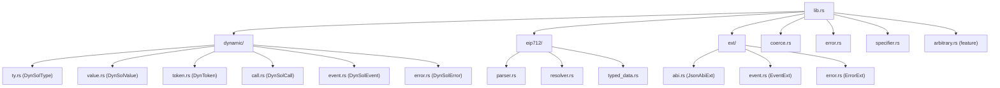
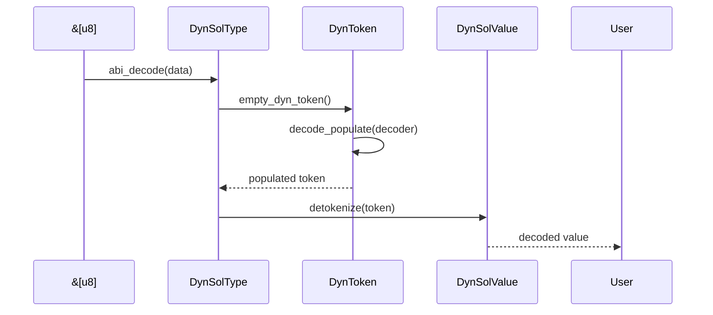
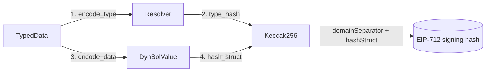

### 🧭 Project Overview

This is the **Alloy Dynamic ABI** crate (`alloy-dyn-abi`) – a *pure-Rust, `no_std`-friendly* library for **encoding & decoding Solidity values at runtime** when the exact types are **not known at compile time**.  
It is the dynamic counterpart to the static `alloy-sol-types`.

---

### 🗺️ Mermaid Diagrams

#### 1. Crate Module Map


#### 2. Data-Flow for ABI Decode


#### 3. EIP-712 Signing Hash Flow


---

### 🔍 Key Concepts & Types

| Name | Purpose | Location |
|------|---------|----------|
| **DynSolType** | Runtime representation of a Solidity type | `dynamic/ty.rs` |
| **DynSolValue** | Runtime value matching a `DynSolType` | `dynamic/value.rs` |
| **DynToken** | Intermediate ABI token (word, seq, packed) | `dynamic/token.rs` |
| **DynSolCall** | Function call w/ selector, inputs, outputs | `dynamic/call.rs` |
| **DynSolEvent** | Event w/ indexed & body types | `dynamic/event.rs` |
| **DynSolError** | Custom or built-in Solidity error | `dynamic/error.rs` |
| **TypedData** | Full EIP-712 message container | `eip712/typed_data.rs` |
| **Resolver** | Dependency graph for EIP-712 types | `eip712/resolver.rs` |
| **JsonAbiExt** | Encode/decode for `Function`/`Error`/`Constructor` | `ext/abi.rs` |

---

### ⚙️ Important Functions

#### 1. `DynSolType::abi_decode(data: &[u8]) -> Result<DynSolValue>`
*Entry point for decoding arbitrary ABI blobs at runtime.*

#### 2. `DynSolValue::abi_encode_params() -> Vec<u8>`
*Encodes the value back to ABI, handling tuples as top-level lists.*

#### 3. `DynSolType::coerce_str(s: &str) -> Result<DynSolValue>`
*Human-friendly parser: `"[(true, \"hello\"), 42ether]"` → `DynSolValue`.*

#### 4. `TypedData::eip712_signing_hash() -> Result<B256>`
*Computes `keccak256("\x19\x01" ‖ domain ‖ hashStruct(message))`.*

#### 5. `Resolver::resolve("MyStruct") -> DynSolType`
*Builds a runtime type from an EIP-712 type graph.*

---

### 🛡️ Safety & DoS Mitigations

* **Recursive limits** – decoding arrays-of-arrays caps depth.  
* **ZST checks** – zero-sized tuples/arrays short-circuit early.  
* **Memory reservation** – `try_vec!` prevents OOM on malicious input.  
* **Cycle detection** – EIP-712 resolver rejects circular dependencies.

---

### 🧪 Testing Highlights

* > 100k automatic proptest cases via `arbitrary.rs`.  
* Round-trip invariant: `encode(decode(bytes)) == bytes`.  
* EIP-712 compatibility tests against MetaMask’s reference vectors.

---

### 🧩 Feature Flags

| Flag | Effect |
|------|--------|
| `eip712` | Enables `CustomStruct`, `TypedData`, EIP-712 parsing. |
| `arbitrary` | Provides `proptest` + `arbitrary` impls for fuzzing. |
| `std` (default) | Enables `std::error::Error` and extra parsers. |

---

### 🚀 Quick Usage Snippet

```rust
use alloy_dyn_abi::{DynSolType, DynSolValue};

let ty: DynSolType = "(uint256,string)[]".parse()?;
let value = ty.coerce_str("[(42, \"hello\"), (1337, \"world\")]")?;
let encoded = value.abi_encode_params();
let decoded = ty.abi_decode_params(&encoded)?;
assert_eq!(value, decoded);
```

---

### 📦 Ecosystem Role

`alloy-dyn-abi` is the **dynamic glue** between:

* **Off-chain tooling** (wallets, explorers, scripts)  
* **On-chain data** (logs, revert reasons, calldata)  

without requiring Rust codegen or compile-time knowledge of Solidity contracts.