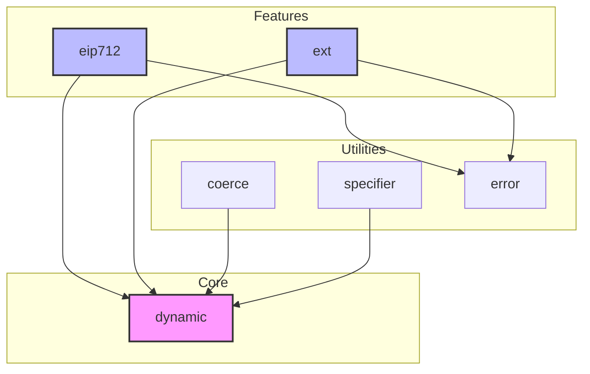
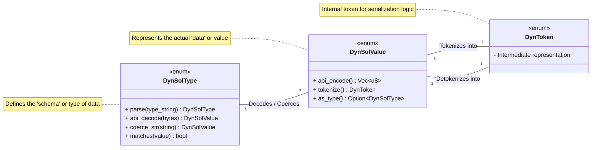
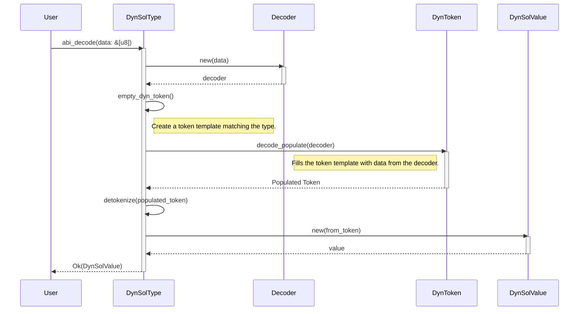

-----

## 📊 Project Architecture Diagrams

Here are a few Mermaid diagrams to visually represent the project's structure, core components, and a typical data flow.

### Module Dependency Graph

This graph shows how the main modules within the crate depend on each other. The `dynamic` module is the foundation upon which other features are built.



### Core Concepts Relationship

This diagram illustrates the relationship between the three fundamental enums that power the library: `DynSolType`, `DynSolValue`, and `DynToken`.



### ABI Decoding Sequence

This diagram shows the step-by-step process of decoding raw ABI-encoded bytes into a structured `DynSolValue` using a `DynSolType`.



-----

## प्रोजेक्ट का विवरण

This project, `alloy-dyn-abi`, is a Rust crate designed to handle **dynamic ABI (Application Binary Interface) data for Ethereum**. Its primary purpose is to allow you to encode and decode Solidity data when you don't know the specific data types at compile time. This is incredibly useful for building general-purpose tools, explorers, and clients that need to interact with any smart contract.

### ⚙️ Core Concepts

The entire library revolves around three central enums that work together:

1.  **`DynSolType`**: *The Schema.* This enum represents any possible Solidity type, from a simple `bool` to a complex nested struct `MyStruct[]`. You can create an instance of it by parsing a Solidity type string, like `"uint256[2]"` or `"(address,bytes)"`.

2.  **`DynSolValue`**: *The Data.* This enum represents a concrete value for a corresponding `DynSolType`. For example, a `DynSolValue::Uint(U256::from(42), 256)` would correspond to a `DynSolType::Uint(256)`. It holds the actual data you want to encode or the data you have just decoded.

3.  **`DynToken`**: *The Intermediate.* This is an internal, tokenized representation of the data used during the encoding and decoding process. `DynSolValue` is tokenized into `DynToken` before being written to bytes, and bytes are decoded into `DynToken` before being converted into a final `DynSolValue`.

> **Analogy:** Think of `DynSolType` as a database schema, `DynSolValue` as a row of data in that database, and `DynSolToken` as a temporary format used for data transfer.

### 📦 Key Modules Breakdown

The project is logically divided into several modules:

  * ### `dynamic` Module (The Engine Room)

    This is the heart of the library, containing the core data structures for dynamic operations.

      - **`DynSolType`**: Defines a Solidity type at runtime.
      - **`DynSolValue`**: Represents a Solidity value at runtime.
      - **`DynSolCall`**: Represents a full function call, including its name, inputs, outputs, and selector (`bytes4`).
      - **`DynSolEvent`**: Represents an event definition, including its name, indexed topics, and non-indexed data fields.
      - **`DynSolError`**: Represents a custom Solidity error.

  * ### `eip712` Module (Typed Data Signing)

    This module provides comprehensive support for **EIP-712**, which allows for signing human-readable typed data.

      - **`TypedData`**: A struct that represents a complete EIP-712 message, including the domain, primary type, and message data.
      - **`Resolver`**: A powerful dependency graph manager that can parse and resolve complex, nested EIP-712 struct types, detect circular dependencies, and correctly compute the `typeHash`.
      - *This module is gated by the `eip712` feature flag.*

  * ### `ext` Module (Extra Powers)

    This module provides convenient **extension traits** that add dynamic capabilities to data structures from other `alloy` crates, like `alloy-json-abi`.

      - **`JsonAbiExt`**: Adds `abi_encode_input` and `abi_decode_input` methods to `alloy_json_abi::Function`, `Error`, and `Constructor`.
      - **`EventExt`**: Adds `decode_log_parts` to `alloy_json_abi::Event` to easily decode event logs.
      - **`ErrorExt`**: Adds `decode_error` to `alloy_json_abi::Error`.

### ✨ Important Functions & Features

Here's a summary of the most important functionalities and the primary functions you would use:

| Function/Feature | Location | Description |
| :--- | :--- | :--- |
| **Parsing Type Strings** | `DynSolType::parse()` | Creates a `DynSolType` from a string like `"address[]"` or `"(bool,uint256)"`. |
| **Coercing Data** | `DynSolType::coerce_str()` | 🧠 Parses a user-friendly string value (e.g., `"1.5 ether"`) into a `DynSolValue` according to the `DynSolType`. |
| **ABI Encoding** | `DynSolValue::abi_encode()` | Encodes a `DynSolValue` into ABI-encoded `Vec<u8>`. |
| **ABI Decoding** | `DynSolType::abi_decode()` | Decodes raw `&[u8]` into a `DynSolValue` using the type as a schema. |
| **EIP-712 Signing Hash** | `TypedData::eip712_signing_hash()` | ✍️ Calculates the final `bytes32` hash for an EIP-712 message, ready to be signed by a wallet. |
| **JSON ABI Integration** | `ext` traits | Seamlessly use dynamic values with contract ABIs parsed from JSON files. |

### Typical Workflow

A common use case for this library would follow these steps:

1.  **Get a type definition**:

    ```rust
    let type_string = "(address from, uint256 amount)";
    let tuple_type = type_string.parse::<DynSolType>()?;
    ```

2.  **Get or create data**: You might parse user input or have data from another source.

    ```rust
    let user_data = "(\"0x...\", 1.5 ether)";
    let value = tuple_type.coerce_str(user_data)?;
    ```

3.  **Encode the data**:

    ```rust
    // Encode for function arguments (top-level tuples are not wrapped)
    let encoded_bytes = value.abi_encode_params();
    ```

4.  **Decode the data**:

    ```rust
    let decoded_value = tuple_type.abi_decode_params(&encoded_bytes)?;
    assert_eq!(value, decoded_value);
    ```

In summary, `alloy-dyn-abi` is a robust and well-structured library that provides the essential tools for working with Ethereum's Application Binary Interface in a type-safe, yet flexible and dynamic, way.