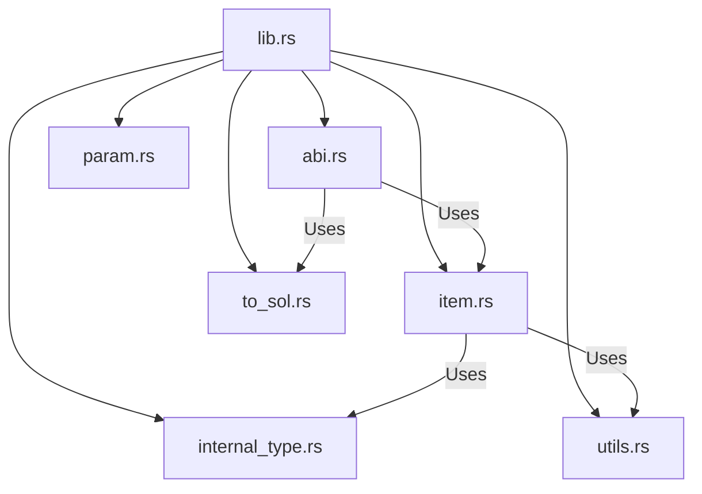
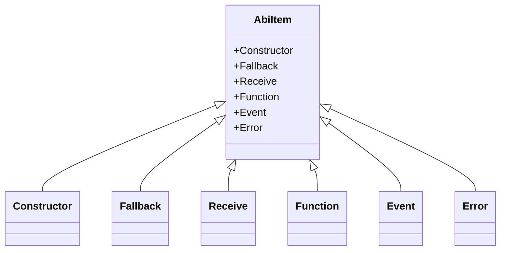

---

# 📊 Mermaid Diagrams

### **1. Project Structure**



---

### **2. Core ABI Item Hierarchy**



---

### **3. JSON ABI Handling**

```mermaid
flowchart LR
    subgraph JsonAbi
        A1[Constructor]
        A2[Fallback]
        A3[Receive]
        A4[Functions: BTreeMap]
        A5[Events: BTreeMap]
        A6[Errors: BTreeMap]
    end

    B[Parse ABI string] --> A4
    B --> A5
    B --> A6
    B --> A1
    B --> A2
    B --> A3

    JsonAbi -->|Serialize/Deserialize| C[serde JSON]
    JsonAbi -->|to_sol()| D[SolPrinter]
```

---

# 📖 Project Explanation

## 🏗 **High-Level Purpose**

This library manages **Solidity contract ABIs** in Rust:

* Parse ABI definitions from **JSON** or **Human-Readable ABI strings**.
* Represent them as Rust structures.
* Convert back into Solidity-like syntax.
* Ensure ABI validity (no duplicates, correct signatures, valid identifiers).

It’s especially useful in blockchain tooling, smart contract development, and Rust-based Ethereum projects.

---

## 🔑 **Important Parts**

### **1. `abi.rs` → ABI Manager**

* Defines **`JsonAbi`** struct:

  * Stores constructor, fallback, receive, functions, events, and errors.
* Key methods:

  * `parse()` → Parse human-readable ABI strings.
  * `from_json_str()` → Load from JSON text.
  * `to_sol()` → Render ABI as Solidity interface.
  * `dedup()` → Remove duplicate function/event/error definitions.
  * `function_by_selector()` → Find a function by its selector.

---

### **2. `item.rs` → ABI Items**

* Defines **`AbiItem` enum** with variants:

  * `Constructor`, `Function`, `Event`, `Error`, `Fallback`, `Receive`.
* Each item has:

  * **Inputs** (`Vec<Param>`)
  * **Outputs** (`Vec<Param>`)
  * **StateMutability** (e.g., `view`, `payable`)
* Provides parsing:

  * `Function::parse("foo(uint)")`
  * `Event::parse("event Transfer(address,uint)")`
  * `Error::parse("error InsufficientBalance(address,uint)")`

---

### **3. `param.rs` → ABI Parameters**

* Handles **function arguments and return types**.
* Each param can include:

  * `ty` (Solidity type)
  * `name` (parameter name)
  * `internal_type` (struct, enum, contract, etc.)
  * `components` (nested params for tuples/structs)

---

### **4. `internal_type.rs` → Solidity Internal Types**

* Enum **`InternalType`** for:

  * `Struct`, `Enum`, `Contract`, `AddressPayable`, `Other`
* Used to differentiate between user-defined vs built-in Solidity types.
* Provides helper checks like `.is_struct()`, `.is_enum()`.

---

### **5. `to_sol.rs` → Pretty Printer**

* Implements **`SolPrinter`**.
* Converts parsed ABI into Solidity interface code:

  ```solidity
  interface Example {
      function transfer(address to, uint256 amount) external;
      event Transfer(address indexed from, address indexed to, uint256 amount);
  }
  ```

---

### **6. `utils.rs` → Utilities**

* Common helpers like:

  * `validate_identifier` (ensures valid Solidity identifiers)
  * Signature computation (`keccak256` hashing for selectors)
  * String formatting functions.

---

# 🗂️ Quick Reference Table

| File                  | Responsibility                            | Example Functionality     |
| --------------------- | ----------------------------------------- | ------------------------- |
| **abi.rs**            | ABI management, parsing, serialization    | `JsonAbi::parse()`        |
| **item.rs**           | ABI item types (function, event, etc.)    | `Function::parse()`       |
| **param.rs**          | Function & event parameters               | `Param::parse()`          |
| **internal\_type.rs** | Handling internal Solidity types          | `InternalType::is_enum()` |
| **to\_sol.rs**        | ABI → Solidity interface printer          | `to_sol()`                |
| **utils.rs**          | Helpers (validation, hashing, formatting) | `validate_identifier()`   |

---

