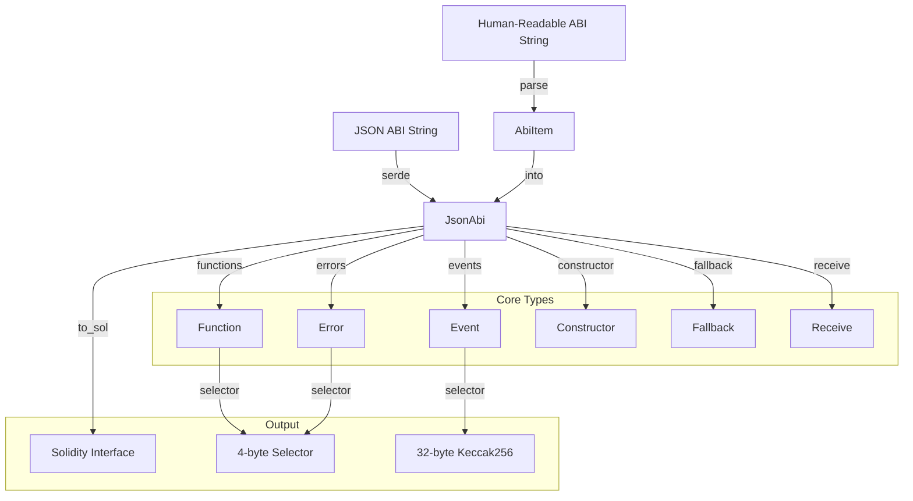

# 📘 Project Overview: `alloy-json-abi`

This is a **Rust library** for parsing and manipulating **Ethereum smart contract ABIs** (Application Binary Interfaces). It supports both **JSON ABI** and **Human-Readable ABI** formats, and can generate **Solidity interfaces** from ABIs.

---

## 📊 Mermaid Diagram: Crate Structure & Data Flow



---

## 🧩 Key Modules & Files

| File | Purpose |
|------|---------|
| `lib.rs` | Public API exports |
| `abi.rs` | `JsonAbi` struct and deserialization logic |
| `item.rs` | ABI item types: `Function`, `Event`, `Error`, etc. |
| `param.rs` | `Param` and `EventParam` types |
| `internal_type.rs` | `InternalType` enum for UDTs, structs, enums |
| `to_sol.rs` | Solidity interface generation |
| `utils.rs` | Signature and selector utilities |

---

## 🔍 Core Concepts

### 1. **JsonAbi**
The root type representing a full ABI.

```rust
pub struct JsonAbi {
    pub constructor: Option<Constructor>,
    pub fallback: Option<Fallback>,
    pub receive: Option<Receive>,
    pub functions: BTreeMap<String, Vec<Function>>,
    pub events: BTreeMap<String, Vec<Event>>,
    pub errors: BTreeMap<String, Vec<Error>>,
}
```

### 2. **AbiItem**
An enum representing any ABI component:

```rust
pub enum AbiItem<'a> {
    Constructor(Cow<'a, Constructor>),
    Function(Cow<'a, Function>),
    Event(Cow<'a, Event>),
    Error(Cow<'a, Error>),
    Fallback(Cow<'a, Fallback>),
    Receive(Cow<'a, Receive>),
}
```

### 3. **Param & EventParam**
Parameters for functions/events:

```rust
pub struct Param {
    pub ty: String,
    pub name: String,
    pub components: Vec<Param>,
    pub internal_type: Option<InternalType>,
}
```

---

## ⚙️ Important Functions

| Function | Purpose |
|----------|---------|
| `JsonAbi::parse` | Parse human-readable ABI strings |
| `JsonAbi::from_json_str` | Parse JSON ABI |
| `JsonAbi::to_sol` | Generate Solidity interface |
| `Function::selector` | Compute 4-byte selector |
| `Event::selector` | Compute 32-byte Keccak256 topic |
| `AbiItem::parse` | Parse a single ABI item |

---

## 🧪 Example Usage

### Parse Human-Readable ABI
```rust
let abi = JsonAbi::parse([
    "function transfer(address to, uint amount)",
    "event Transfer(address indexed from, address indexed to, uint value)",
])?;
```

### Generate Solidity Interface
```rust
let sol = abi.to_sol("MyContract", None);
```

---

## 🧠 Tips

- **InternalType** tells you if a parameter is a struct, enum, or UDT.
- **Selectors** are used for calling functions or identifying events/logs.
- **Solidity interface** generation is useful for testing or frontend integration.

---

## 📌 Summary

> `alloy-json-abi` is a powerful, zero-dependency Rust crate for working with Ethereum ABIs. It bridges the gap between **human-readable**, **JSON**, and **Solidity** formats, making it ideal for tooling, testing, and codegen.

