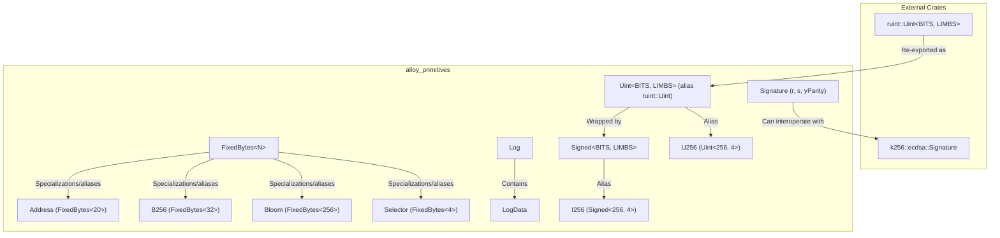
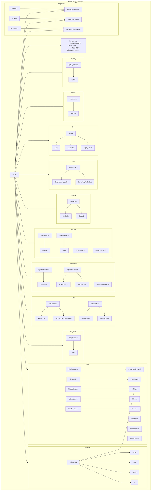

---

## 📦 Project Overview: `alloy-primitives`

The `alloy-primitives` crate provides **core, foundational data types and utilities** commonly used when interacting with Ethereum and other EVM-based blockchains. It focuses on correctness, performance, and compatibility with `no_std` environments.

### 🎯 Key Goals

*   **Ethereum-Specific Types:** Defines essential types like `Address`, `U256`, `B256`, `Signature`.
*   **Performance:** Optimized for use in high-performance applications, including cryptographic operations.
*   **`no_std` Compatibility:** Designed to work in environments without the standard library.
*   **Interoperability:** Integrates with popular crates like `serde`, `sqlx`, `diesel`, `rlp`, `k256`.

---

## 🧠 Core Concepts & Important Parts

### 🔢 Fixed-Size Integers

*   **`Uint<BITS, LIMBS>` (from `ruint`):** The underlying unsigned integer type, parameterized by bit-width and number of 64-bit limbs. E.g., `U256` is `Uint<256, 4>`.
*   **`Signed<BITS, LIMBS>`:** A signed integer wrapper around `Uint`, using two's complement representation. E.g., `I256` is `Signed<256, 4>`.
*   **Aliases:** Convenient type aliases are provided for common sizes (e.g., `U8`, `U16`, ..., `U256`, `U512`, `I8`, `I16`, ..., `I256`).
    *   File: `aliases.rs`

### 🧬 Fixed-Size Byte Arrays

*   **`FixedBytes<N>`:** A core struct representing a `[u8; N]` array. It provides methods for hex encoding/decoding, concatenation, and conversions.
    *   File: `bits/fixed.rs`
*   **`B64`, `B128`, `B256`, `B512`:** Common aliases for `FixedBytes` (e.g., `B256 = FixedBytes<32>`).
*   **`wrap_fixed_bytes!` Macro:** A powerful macro to create distinct newtypes wrapping `FixedBytes<N>`, preventing type confusion (e.g., `KeccakOutput` vs. `MerkleTreeItem`).
    *   File: `bits/macros.rs`

### 📍 Ethereum Address

*   **`Address`:** A specialized newtype for `FixedBytes<20>`, representing an Ethereum address.
*   **Checksumming:** Implements EIP-55 checksum validation and generation.
    *   File: `bits/address.rs`

### 🔑 Cryptographic Hashes & Utilities

*   **`B256`:** An alias for `FixedBytes<32>`, often used for Keccak-256 hashes, block hashes, transaction hashes, etc.
*   **`keccak256` Function:** Calculates the Keccak-256 hash.
*   **`eip191_hash_message` Function:** Prepares and hashes a message according to EIP-191 (used for personal_sign).
*   **Constants:** `KECCAK256_EMPTY` (hash of empty data).
    *   File: `utils/mod.rs`

### ✍️ ECDSA Signatures

*   **`Signature`:** Represents an ECDSA signature (r, s, yParity/v). Handles EIP-155 `v` value normalization and recovery ID.
*   **Utilities:** Functions like `to_eip155_v`, `normalize_v`.
    *   File: `signature/mod.rs`, `signature/utils.rs`

### 🌐 Bloom Filters

*   **`Bloom`:** Implements the Ethereum bloom filter used in block headers for logs.
*   **Constants:** `BLOOM_BITS_PER_ITEM`, `BLOOM_SIZE_BYTES`.
    *   File: `bits/bloom.rs`

### 🪵 Logs

*   **`Log`, `LogData`:** Structures representing Ethereum log entries emitted by smart contracts.
*   **`logs_bloom` Function:** Calculates the bloom filter for a collection of logs.
    *   File: `log.rs`

### 🛠️ Utilities

*   **Unit Conversion:** Functions like `parse_ether`, `format_units`, `parse_units` for converting between denominations (Wei, Gwei, Ether).
    *   File: `utils/units.rs`
*   **Hex Utilities:** Re-exports the `hex` crate and provides the `hex!` macro for compile-time hex decoding.
    *   File: `hex_literal.rs`, `lib.rs`
*   **Sealed Trait Pattern:** `Sealable` and `Sealed` traits for internal extensibility.
    *   File: `sealed.rs`
*   **Maps:** Re-exports `HashMap`/`HashSet` (from `std` or `hashbrown`) and optionally `IndexMap`/`IndexSet`.
    *   File: `map/mod.rs`

### 🔌 Integrations & Features

The crate supports optional features for integration with other libraries:

*   **`serde`**: Serialization/Deserialization (JSON, etc.).
*   **`rlp`**: Recursive Length Prefix encoding/decoding.
*   **`sqlx`**: Database interaction (Postgres, MySQL, SQLite).
*   **`diesel`**: Database interaction (Postgres).
*   **`postgres`**: Database interaction (Postgres, custom protocol).
*   **`borsh`**: Borsh serialization.
*   **`arbitrary`**: Support for property-based testing.
*   **`k256`**: Integration with the `k256` crate for secp256k1 cryptography.

---

## 📊 Mermaid Diagrams

### 1. Core Type Hierarchy

This diagram shows the relationship between the main data types.

### 2. Module Structure (Key Modules)

This diagram outlines the main modules and their exported types/functions.

---

## 📌 Summary

The `alloy-primitives` crate is a **fundamental building block** for Ethereum development in Rust. It offers a robust, efficient, and type-safe set of primitives, ensuring developers have the correct tools to handle addresses, hashes, signatures, large integers, and logs without confusion or performance overhead. Its modular design and extensive feature flags make it highly adaptable to various use cases, from lightweight libraries to full-fledged node implementations.