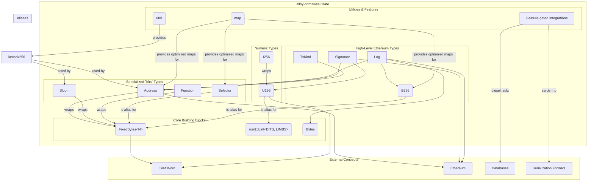

-----

## Project Architecture Diagram

This Mermaid diagram illustrates the modular structure of the `alloy-primitives` library, showing how core types relate to each other and to specialized modules.

-----

## Project Description

The project is **`alloy-primitives`**, a foundational Rust library designed to provide core, high-performance data types for interacting with the Ethereum ecosystem. It focuses on creating strongly-typed, efficient, and `no_std`-compatible building blocks for tasks like transaction handling, cryptographic operations, and data serialization.

### Core Concepts

The library's philosophy is to provide types that are both developer-friendly and highly optimized. It achieves this by:

  * **Strong Typing**: Instead of using a generic `[u8; 20]` for an Ethereum address, it provides a dedicated `Address` struct. This prevents mixing up different kinds of data (e.g., an address and a hash fragment).
  * **Performance**: It uses custom hashers for fixed-size types in hashmaps and avoids heap allocations where possible.
  * **Modularity**: Functionality is broken into logical modules, and major integrations (like serialization or database support) are gated behind feature flags.

### Key Data Structures 🧱

The library is built around a few central data types.

#### 1\. Fixed-Size Types (`bits` module)

This module contains types that wrap fixed-size byte arrays.

  * **`FixedBytes<N>`**: The generic foundation for all fixed-size data. It's a simple wrapper around `[u8; N]` that provides helpful utilities like hex encoding/decoding and bitwise operations.
  * 🏦 **`Address`**: A specialized wrapper around `FixedBytes<20>`. This is one of the most important types. It's not just a byte array; it includes logic for:
      * **EIP-55 Checksumming**: `to_checksum()` and `parse_checksummed()` for validating and formatting addresses with mixed-case checksums.
      * **Contract Address Calculation**: `create()` (for regular contract deployments) and `create2()` (for deterministic deployments using a salt).
  * **`B256`**: A type alias for `FixedBytes<32>`, used universally for hashes (transaction hashes, block hashes, Keccak-256 outputs).
  * **`Bloom`**: A 256-byte structure representing an [Ethereum bloom filter](https://eips.ethereum.org/EIPS/eip-1186), used to quickly check if a block's logs might contain certain topics or addresses.

#### 2\. Numeric Types (`signed` and `ruint`)

Ethereum requires handling very large numbers, both signed and unsigned.

  * 🔢 **`U256`**: The standard 256-bit **unsigned integer**, aliased from the `ruint` crate. It's used for everything from token balances and gas calculations to raw EVM stack items.
  * **`I256`**: A custom 256-bit **signed integer** built using `U256`. It represents numbers in [two's complement](https://en.wikipedia.org/wiki/Two%27s_complement) and supports the full range of arithmetic operations, which is crucial for handling signed values in smart contracts.

#### 3\. Cryptographic Primitives (`signature` module)

This module handles cryptographic signatures, which are essential for transaction authentication.

  * ✍️ **`Signature`**: Represents a 65-byte ECDSA signature, containing the `r`, `s`, and `y_parity` (or `v`) components.
    > **Key Function**: `recover_address_from_prehash(&self, prehash: &B256)` is a critical method that takes a signed message hash and recovers the public `Address` of the signer. This is the mechanism that verifies transaction senders in Ethereum.

#### 4\. Ethereum-Specific Types

These types model specific data structures within the Ethereum protocol.

  * **`Log` & `LogData`**: Represents an event log emitted by a smart contract. It contains the contract's `address`, a list of indexed `topics` (`B256`), and additional `data` (`Bytes`).
  * **`TxKind`**: An enum that clearly distinguishes between two types of transactions:
      * `TxKind::Create`: A transaction to deploy a new smart contract.
      * `TxKind::Call(Address)`: A transaction to interact with an existing contract or transfer ETH.

### Important Functions & Utilities 🛠️

The `utils` module provides essential helper functions used throughout the library and by end-users.

| Function                 | Module  | Description                                                                                             |
| ------------------------ | ------- | ------------------------------------------------------------------------------------------------------- |
| `keccak256()`            | `utils` | A simple, fast interface to the Keccak-256 hashing algorithm. Used everywhere in Ethereum.              |
| `eip191_hash_message()`  | `utils` | Hashes a message according to the EIP-191 standard (`\x19Ethereum Signed Message:\n...`), used for signing data. |
| `parse_units()` / `parse_ether()` | `utils` | Converts a human-readable string (e.g., "1.5") into its Wei equivalent (`U256`) for a given unit. |
| `format_units()` / `format_ether()`| `utils` | Converts a Wei value (`U256` or `I256`) back into a human-readable decimal string.                |

### Modularity & Features

> The project is highly modular. Database and serialization support are opt-in, keeping the core library lean. This is managed via Cargo features:
>
>   * `serde`: Enables serialization/deserialization for all major types.
>   * `rlp`: Provides Recursive Length Prefix encoding/decoding, the standard for Ethereum transactions.
>   * `diesel` & `sqlx`: Adds support for interacting with SQL databases.
>   * `map`: Provides optimized `HashMap` and `HashSet` variants (e.g., `AddressMap`) that use a faster hashing algorithm for fixed-byte types.