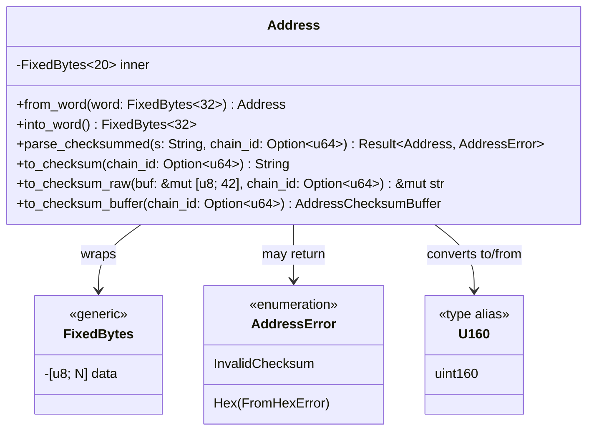
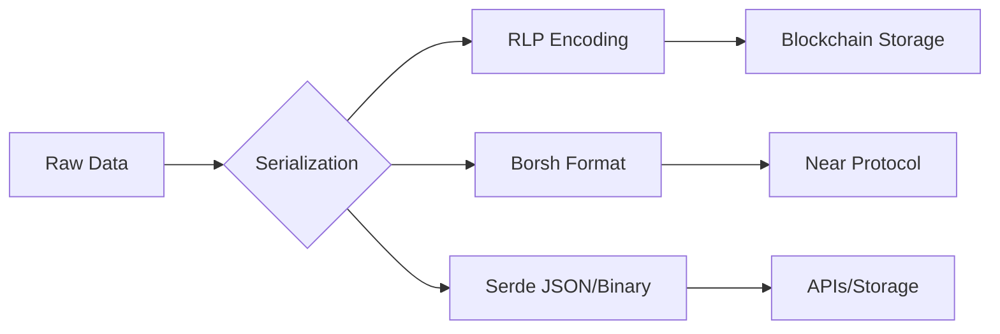
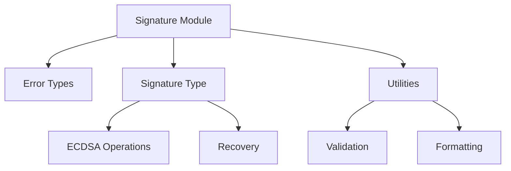
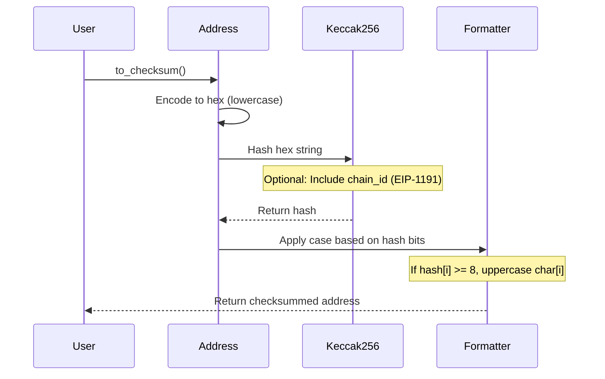

## 🦀 Project Overview: Alloy Primitives

This is a Rust library that provides core primitive types for Ethereum/EVM development. It's part of the Alloy project and offers fundamental building blocks for working with Ethereum addresses, bytes, signatures, and other blockchain-specific data types.

### 📊 Project Structure Overview

```mermaid
graph TD
    A[alloy-primitives] --> B[bits/]
    A --> C[bytes/]
    A --> D[log/]
    A --> E[map/]
    A --> F[signature/]
    A --> G[signed/]
    A --> H[utils/]
    A --> I[Core Files]
    
    B --> B1[address.rs]
    B --> B2[bloom.rs]
    B --> B3[fixed.rs]
    B --> B4[function.rs]
    B --> B5[macros.rs]
    B --> B6[rlp.rs]
    B --> B7[serde.rs]
    
    C --> C1[borsh.rs]
    C --> C2[rlp.rs]
    C --> C3[serde.rs]
    
    F --> F1[error.rs]
    F --> F2[sig.rs]
    F --> F3[utils.rs]
    
    G --> G1[conversions.rs]
    G --> G2[errors.rs]
    G --> G3[int.rs]
    G --> G4[ops.rs]
    G --> G5[serde.rs]
    G --> G6[sign.rs]
    
    I --> I1[lib.rs]
    I --> I2[aliases.rs]
    I --> I3[common.rs]
    I --> I4[diesel.rs]
    I --> I5[postgres.rs]
    I --> I6[sqlx.rs]
```



### 🎯 Core Components

#### 1. **Address Module** (`bits/address.rs`)

The most detailed component shown in the provided code is the **Ethereum Address** implementation.



### 📝 Key Features & Functionality

#### **1. Address Handling** 🏠

The `Address` type is a 20-byte Ethereum address with advanced features:

- **EIP-55 Checksum Support**: Implements the standard Ethereum address checksum format
- **EIP-1191 Support**: Chain-specific checksums for better security
- **Multiple Display Formats**:
  - Standard: `0xd8dA6BF26964aF9D7eEd9e03E53415D37aA96045`
  - Compressed: `0xd8dA…6045`
  - Debug (lowercase): `0xd8da6bf26964af9d7eed9e03e53415d37aa96045`

##### **Key Methods:**

| Method | Purpose | Example |
|--------|---------|---------|
| `from_word()` | Extract address from 32-byte word | Converts EVM storage word to address |
| `into_word()` | Pad address to 32 bytes | Prepares address for EVM storage |
| `parse_checksummed()` | Parse with checksum validation | Ensures address integrity |
| `to_checksum()` | Generate checksummed string | Creates EIP-55 compliant format |

#### **2. Fixed-Size Byte Arrays** 📦

The library provides `FixedBytes<N>` types for compile-time sized byte arrays:

```rust
// Examples of fixed byte types
FixedBytes<20>  // Address
FixedBytes<32>  // Hash/Word
FixedBytes<4>   // Function selector
```

#### **3. Serialization Support** 🔄

Multiple serialization formats are supported:

- **RLP** (Recursive Length Prefix) - Ethereum's encoding method
- **Borsh** - Binary Object Representation Serializer for Hashing
- **Serde** - Rust's de facto serialization framework



#### **4. Signed Integer Types** ➕➖

The `signed/` module provides signed integer implementations with:

- **Conversions**: Between different integer sizes
- **Operations**: Arithmetic operations with overflow handling
- **Error Handling**: Safe conversions with error types
- **Sign Management**: Utilities for sign manipulation

#### **5. Cryptographic Signatures** 🔐



### 🛠️ Integration Features

The library provides integrations with popular Rust crates:

| Integration | File | Purpose |
|-------------|------|---------|
| **Diesel** | `diesel.rs` | ORM support for database operations |
| **PostgreSQL** | `postgres.rs` | Native PostgreSQL type mappings |
| **SQLx** | `sqlx.rs` | Async SQL toolkit integration |

### 🔍 Important Implementation Details

#### **Address Checksum Algorithm (EIP-55)**



### 📚 Type Aliases

The `aliases.rs` file likely contains convenient type definitions:

- `U160` → Unsigned 160-bit integer (for addresses)
- `B256` → 256-bit bytes (for hashes)
- `U256` → Unsigned 256-bit integer (for balances)

### 🎨 Design Patterns

1. **Wrapper Types**: Uses the newtype pattern (e.g., `Address` wraps `FixedBytes<20>`)
2. **Zero-Copy Operations**: Efficient conversions between types
3. **Compile-Time Safety**: Fixed-size arrays prevent runtime errors
4. **Error Propagation**: Comprehensive error types for each module

### 🚀 Usage Example

```rust
use alloy_primitives::{address, Address};

// Parse a checksummed address
let checksummed = "0xd8dA6BF26964aF9D7eEd9e03E53415D37aA96045";
let addr = Address::parse_checksummed(checksummed, None)?;

// Convert to/from different formats
let word = addr.into_word();  // 32-byte representation
let display = addr.to_string();  // Checksummed string
let compressed = format!("{addr:#}");  // "0xd8dA…6045"
```

This library serves as the foundation for Ethereum/EVM development in Rust, providing type-safe, efficient primitives that integrate seamlessly with the broader Rust ecosystem.