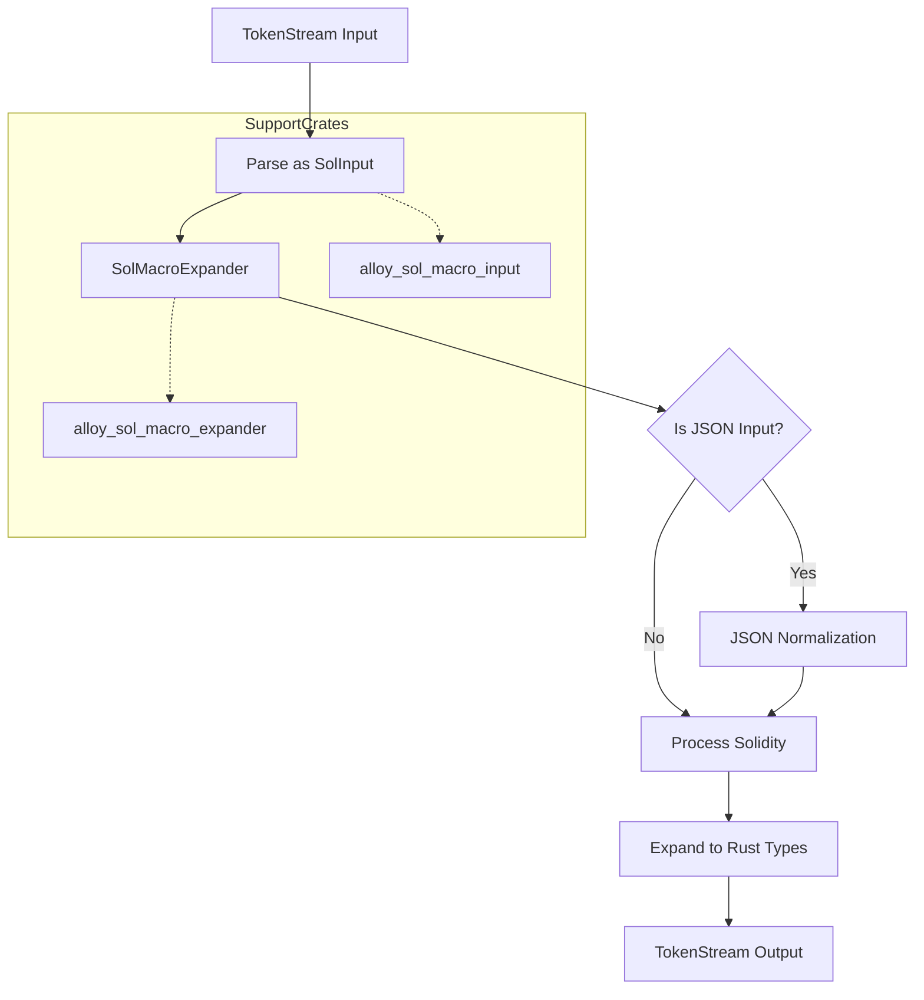

# Project Overview

**alloy-sol-macro** is a Rust procedural macro that parses Solidity syntax to generate Rust types implementing alloy-sol-types traits for type-safe ABI and EIP-712 serialization to interact with Ethereum smart contracts.

## Core Architecture



## Key Components

### 🔧 **Main Macro Entry Point**
```rust
#[proc_macro]
pub fn sol(input: TokenStream) -> TokenStream
```
- **Primary procedural macro** that processes Solidity syntax input
- Handles both **Solidity code** and **JSON ABI** inputs
- Returns generated Rust types as `TokenStream`

### 🧩 **Input Processing Structure**
```rust
struct SolInput {
    attrs: Vec<Attribute>,
    path: Option<PathBuf>,
    kind: SolInputKind,
}
```

**Input Types:**
- `SolInputKind::Sol` - Raw Solidity code parsing
- `SolInputKind::Type` - Single Solidity type expansion  
- `SolInputKind::Json` - JSON ABI processing (feature-gated)

### ⚙️ **Expansion Engine**
```rust
struct SolMacroExpander;

impl SolInputExpander for SolMacroExpander {
    fn expand(&mut self, input: &SolInput) -> syn::Result<proc_macro2::TokenStream> {
        // Core expansion logic
    }
}
```

## Important Features

### 📋 **Supported Solidity Constructs**

| **Construct** | **Rust Output** | **Key Traits** |
|---------------|-----------------|----------------|
| Structs | Rust structs | `SolStruct` |
| Enums | `#[repr(u8)]` enums | `SolEnum` |
| UDVTs | Tuple structs | Custom implementations |
| Functions | `SolCall` struct pairs | `SolCall` |
| Events | Event structs | `SolEvent` |
| Contracts | Module with enums | `SolInterface` |

### 🎛️ **Attribute System**
**`#[sol(...)]` attributes control code generation:**

| **Attribute** | **Purpose** | **Example** |
|---------------|-------------|-------------|
| `rpc` | Generate RPC client structs | `#[sol(rpc)]` |
| `abi` | Generate ABI representations | `#[sol(abi)]` |
| `bytecode` | Specify contract bytecode | `#[sol(bytecode = "0x...")]` |
| `all_derives` | Add all standard derives | `#[sol(all_derives)]` |

### 🔄 **JSON ABI Support**
```rust
#[cfg(feature = "json")]
let is_json = matches!(input.kind, SolInputKind::Json { .. });
```
- **Feature-gated JSON parsing** (`json` feature)
- Supports **contract artifacts** with ABI, bytecode, etc.
- **Normalizes JSON** to Solidity representation before expansion

## Critical Functions

### 🏗️ **Expansion Logic**
```rust
fn expand(&mut self, input: &SolInput) -> syn::Result<proc_macro2::TokenStream>
```
- **Central expansion function** handling all input types
- **Coordinates** between parser, normalizer, and code generator
- Returns **compile errors** for invalid input via `syn::Error`

### 📥 **Input Normalization**
```rust
#[cfg(feature = "json")]
let input = input.normalize_json()?;
```
- **Transforms JSON ABI** into equivalent Solidity representation
- **Preserves attribute information** during conversion
- Handles **file inclusion** via `include_bytes!` macro

### 🧠 **Type Expansion**
```rust
fn expand_type(ty: &SolType, crates: &ExternCrates) -> proc_macro2::TokenStream
```
- **Converts individual Solidity types** to Rust equivalents
- **Resolves dependency paths** from `sol` attributes
- Generates **proper type mappings** between Solidity and Rust

## Configuration & Dependencies

### 📦 **External Crate Integration**
```rust
let mut crates = crate::expand::ExternCrates::default();
crates.fill(&sol_attrs);
```
- **Configurable paths** to dependencies via attributes:
  - `alloy_sol_types = <path>`
  - `alloy_contract = <path>`
- **Automatic path resolution** for generated code

### ⚡ **Feature Flags**
- **`json`**: Enables JSON ABI parsing functionality
- **`docsrs`**: Enables documentation-specific features
- **Testing configuration**: Warns about unused dependencies in non-test builds

## Error Handling

```rust
#[proc_macro_error]
pub fn sol(input: TokenStream) -> TokenStream {
    // Error handling through proc_macro_error
}
```
- **Comprehensive error reporting** for parsing failures
- **Attribute validation** with specific error messages
- **Graceful fallback** to compiler errors for expansion failures