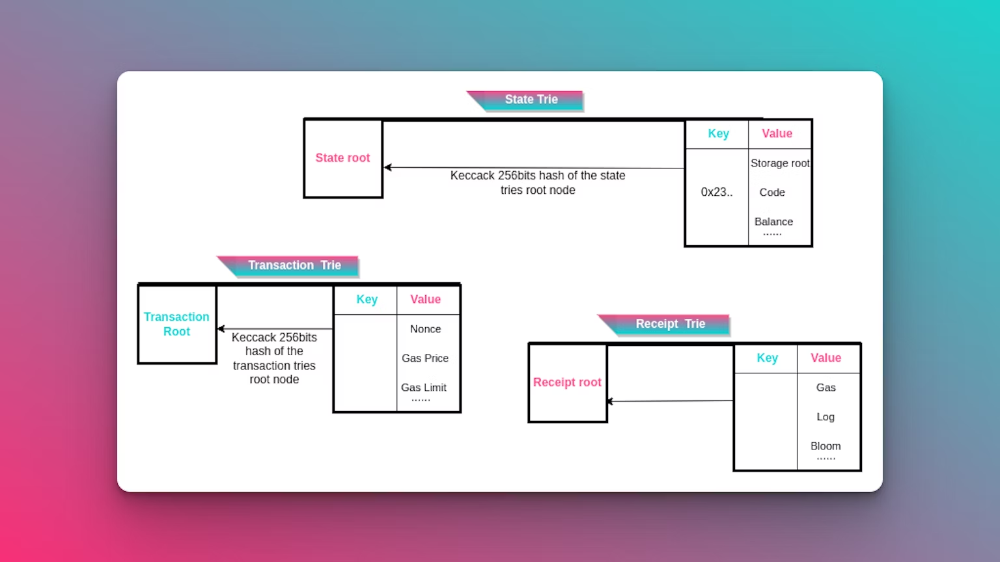
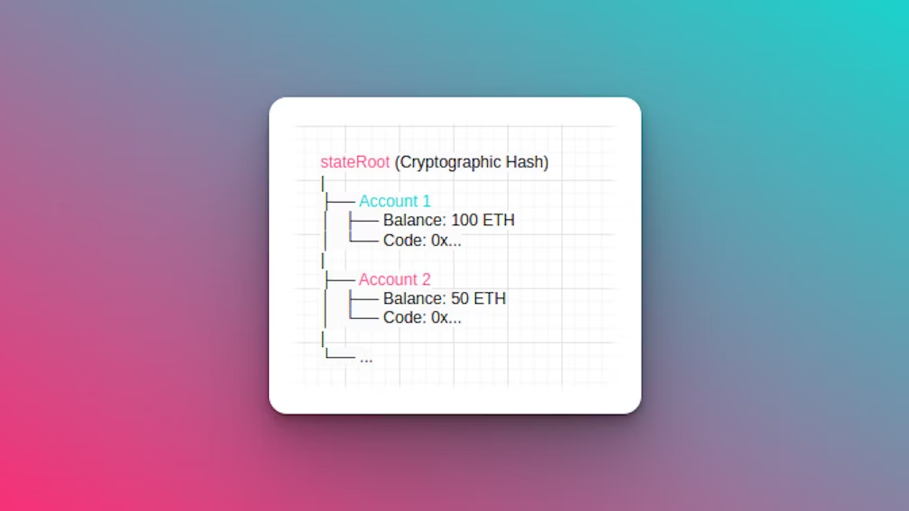
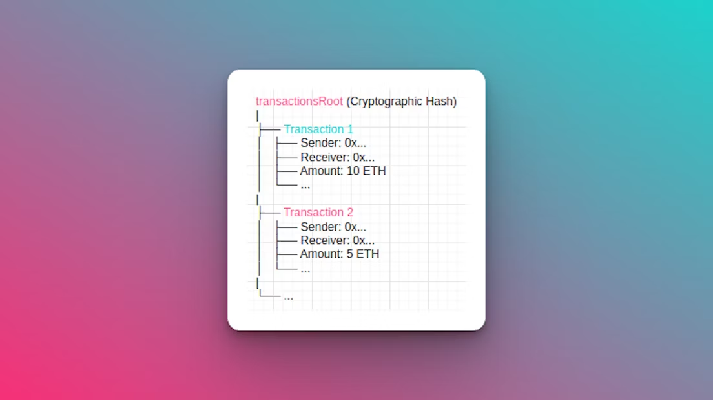
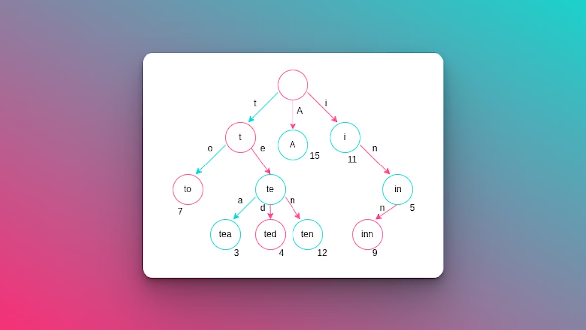
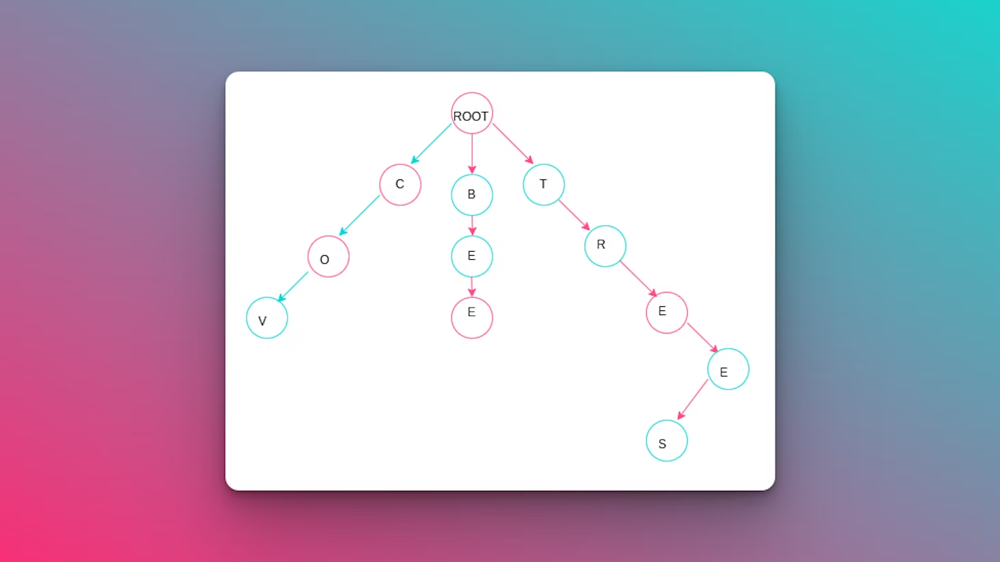
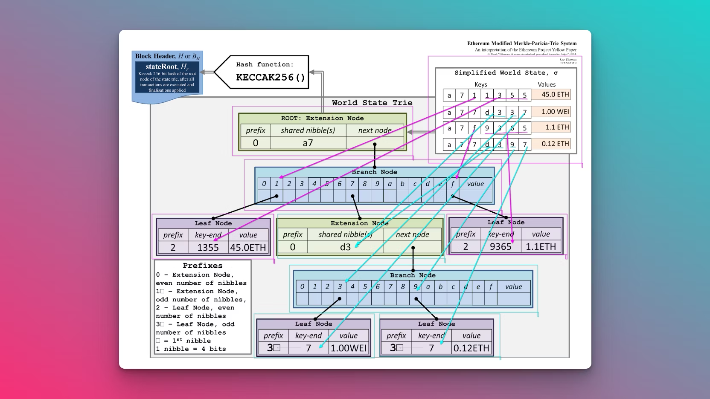

**What Exactly is the Merkle Patricia Trie?**
---------------------------------------------

Merkle Patricia Tries, often abbreviated as MPTs, are foundational data structures in blockchain technology. They play an essential role in storing and validating the integrity of data within decentralized networks.

At their essence, MPTs are a type of Patricia Trie—an advanced version of a trie (an associative data storage tree structure). MPTs are tailored for the distinct challenges of blockchain, providing an optimized method to organize and authenticate vast datasets.

Confused between Merkle Tree and Merkle Patricia Trie? Let’s delve into a brief comparison.

### **Merkle Tree (MT)**

Visualize a Merkle tree like a folder structure on your computer. The main folder, or the "root,” can contain sub-folders (or "branches"). Within these branches, you might organize photos. Each branch or folder is labeled—such as "Family," "Friends," or "Vacation."

To locate a particular photo, you would start at the root folder and navigate the appropriately labeled branches until you reach your desired photo. This structure allows for efficient data retrieval.

### **Merkle Patricia Trie (MPT)**

Conversely, a Merkle Patricia Trie resembles a more advanced tree system. Instead of mere labels, each branch has a "prefix" – think of it as the initial few letters of a label.

In an MPT, you can categorize your photos based not just on full labels but also on these **prefixes**. This fine-tuning makes data retrieval exceptionally efficient, especially when many labels share similarities.

So, the main difference is that a Merkle Patricia Trie is like a smart, **efficient** version of a regular Merkle tree, where you can organize things even more quickly based on short labels or prefixes. It's like having a super-organized way to find your stuff in a big pile of documents.

**Role of Merkle Patricia Tries in Data Integrity**
---------------------------------------------------

Data integrity—ensuring information remains unaltered and genuine—is a critical concern in decentralized networks. MPTs address this by building a tamper-evident, secure structure that facilitates swift data verification.

Every piece of data in an MPT is hashed, with these hashes structured in a tree format. This allows for quick and secure validation of data consistency. Even a minor alteration in the data would result in a completely different version of the data, making it readily apparent that something has been tampered with.

**Challenges in Data Storage and Retrieval**
--------------------------------------------

Storing and retrieving data in blockchain technology presents distinct challenges, making MPTs indispensable for maintaining both efficiency and data security in decentralized systems.

*   **Data Volume:** Blockchain networks process and record a colossal volume of data, encompassing user transactions, smart contracts, and diverse digital assets such as NFTs. Handling this immense data load efficiently is a top priority. Traditional data storage methods can quickly become impractical when dealing with data of such scale.
    
*   **Quick Verification:** In a decentralized network, the responsibility for data verification is distributed across multiple nodes. These nodes need to independently and rapidly verify the consistency of the data without the necessity of transmitting the entire dataset. This requirement for quick and efficient data validation is a central challenge.
    
*   **Dynamic Updates:** Unlike Bitcoin, where transaction storage is static, blockchains like Ethereum are dynamic, where new data is continually added and updated. To accommodate this dynamism while maintaining efficiency in data storage and retrieval is a complex task.
    

Consequently, addressing these challenges effectively is crucial to the success and viability of blockchain technology. Enter Merkle Patricia Tries: a solution that adeptly organizes data and equips users with rapid verification tools.

### **Data Integrity**

Data integrity is the bedrock upon which trust is built in decentralized networks. It ensures that the information stored in the blockchain remains true to its original form, impervious to unauthorized alterations or corruption.

The magic of Merkle Patricia Tries lies in its ability to provide tamper-evident verification. When a user or a node in the network wants to verify the integrity of a specific piece of data, they don't need to examine the entire data. Instead, they can follow a path from the Merkle root to the specific data hash in question. If the computed path leads to a different hash than expected, it signifies data tampering. This method is incredibly efficient, enabling swift verification of vast data sets - a critical requirement in blockchain systems.

### **Core Concept**

Merkle Patricia Tries blend two data structures: the radix trie and the Merkle tree. They work together to store information in the form of key-value pairs and make sure the data is genuine. This makes them great for managing and storing temporary data that might change often. How does it work under the hood? Let's have a look.

### **Tries in Ethereum**

Within Ethereum's execution layer, Merkle Patricia Tries are essential components, organizing and verifying data effectively. A single Ethereum block header yields three distinct roots from these tries, each playing a crucial role in blockchain operation: StateRoot, TransactionRoot, and ReceiptRoot.

StateRoot represents the current state of all Ethereum blockchain accounts, verifying account balances, contract codes, and other pertinent account information. It ensures that the state of all accounts is consistent and tamper-proof.

The state trie in Ethereum acts as a mapping between addresses to their respective account states. Think of it as a lookup table where you can find information about each Ethereum address, such as its current balance and contract code.

**Transaction Root** contains details of all transactions in a specific Ethereum block, enabling the verification of transaction data, including sender and receiver addresses, transaction amounts, and more.

Example:

The transaction trie in Ethereum serves as a ledger that records all transactions. Importantly, once a block is mined and added to the blockchain, the transaction trie is never altered or updated. It remains a historical record of all previous transactions.

**Receipt Root** stores transaction receipts generated by the execution of transactions within a block. Receipts provide details about the outcomes of transactions, including gas used, logs, and contract creations, ensuring the execution results of transactions are securely recorded.

### **Merkle Patricia Trie's Role**

As discussed, the Ethereum block header contains not just one Merkle tree, but three tries: Transaction, Receipt, and State, with the state trie being paramount.

The state in Ethereum functions as a key-value map, with keys being account addresses and values representing account specifics. This data is _dynamic_, which means there is a need for a tree structure that can quickly recalculate tree roots after an insert, edit, or delete operation, for instance, in case of a new account creation or balances updated.

### **Transient vs. Permanent Data**

In Ethereum:

*   **Transient data** like user account states change all the time as the user sends and receives ether and also interacts with a smart contract. Hence, this type of data is categorized as temporary data.
    
*   **Permanent data** remains unchanged, serving as a consistent historical record.
    

MPTs are perfect for handling transient data.

### **Radix Trie**

Essentially, “trie” comes from the word “retrieval.” A radix trie or a prefix tree is an ordered tree data structure that is used to store key-value mappings where the key is the actual path taken through the tree to get its corresponding value. This allows the keys that begin with the same sequence to have values that are closer together in the tree.

### **Merkle Patricia Tree**

In the Merkle Patricia Tree, nodes are referenced by their hash. Thus, the root node can act as a cryptographic fingerprint for the data structure (where Merkle comes in). Patricia is an acronym for:

_P - Practical_

_A - Algorithm_

_T - To_

_R - Retrieve_

_I - Information_

_C - Coded_

_I - In_

_A -Alphanumeric_

Let’s try to understand the Merkle Patricia Trie with an example using these words: **Tree, Trees, Cov and Bee**. A Patricia Trie storing these words will look something like this:

Here, all the nodes with value denote that the path traversed till now is a word. For instance, in the diagram above, the word **Cov** is present in the tree because if we traverse the tree, we can find it.

MPTs incorporate the following four node types for data management:

*   **Branch Nodes**: This a list of 17 in length, where the first 16 elements correspond to the 16 hexadecimal characters that can be in a key, and the last element represents the value if there is a key-value pair where the key ends at the branch node.
    
*   **Extension Nodes**: This is a key-value node where the value is the hash of another node.
    
*   **Leaf Nodes**: A standard node with a key and a value.
    
*   **Empty Nodes**: This is simply a blank node. Empty nodes are placeholders that indicate the absence of data or the end of a branch in the MPT. Instead of leaving gaps in the tree, empty nodes ensure that the tree structure remains intact and efficient.
    

Let’s understand this with the aid of a diagram:

In the top right corner, we have the **World State**, which is a key-value store that was indexed with 3 bytes, the first three chars, 6 nibbles (6 hexadecimal characters) that contain a value, in this case, an integer that represents the account balance.

Looking at the top of the tree, we have the **Root Extension Node** that goes through the different nibbles, which has the **a7** prefix, as shown in the MPT diagram. Here, we have different keys that need to be traversed. So that leads us to the **Branch Node**, which is the child of the extension node that contains 3 different keys.

If we decide to go for key **1** in the **a71** row, we end up with the **Leaf Node** that has the remaining keys. In this case, **1355**. Likewise, for the key **f** in the **a7f** row. As we traverse from the root node to the leaf, we have the keys that store the different values.

However, if we look at the second and the fourth rows, we see that the key **7** appears twice, which also proceeds with the same nibble **d3**. This creates a new extension node and a branch node to get to the leaf node.

The F**unctionality of Merkle Patricia Tries**
----------------------------------------------

Let's explore the key functionalities of MPTs:

*   **Efficient Proofs of Inclusion and Exclusion:** One of the remarkable features of the Merkle Patricia Trie is the efficiency in proving whether a specific piece of data is included or excluded from the tree. By providing a path from the root of the tree to the data in question, MPTs enable quick verification of data existence or absence. This property is crucial for validating transactions and account balances in Ethereum. Further reading:
    
    *   [Merkle proof verification for Ethereum Patricia tree](https://ouvrard-pierre-alain.medium.com/merkle-proof-verification-for-ethereum-patricia-tree-48f29658eec)
        
    *   [Verify Ethereum Account Balance with State Proof](https://medium.com/@chiqing/verify-ethereum-account-balance-with-state-proof-83b51ceb15cf)
        
*   **Storage Optimization and Eliminating Redundancy:** MPTs help optimize storage space in blockchain networks by eliminating data redundancy. Nodes with identical data share the same hash, and this data is stored only once. This feature significantly reduces the storage requirements for blockchain nodes, making it more efficient and scalable. Further reading:
    
    *   [mLSM: Making Authenticated Storage Faster in Ethereum](https://www.usenix.org/system/files/conference/hotstorage18/hotstorage18-paper-raju.pdf)