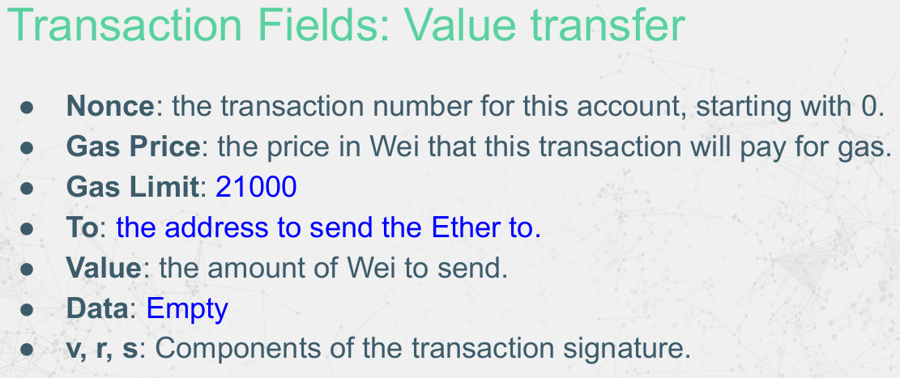
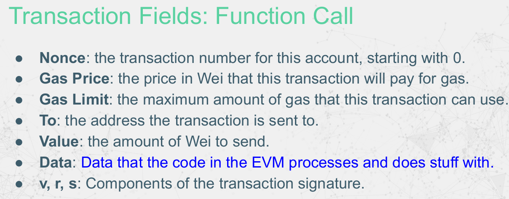

Actually, it's not mandatory to be empty. For example, if you just want to record a commitment on chain, you can send yourself a zero valued transfer with data here.
... but....
Transactions aren’t part of world state.

## Stack, Memory, Storage, Code, CallData, Logs

### The EVM can access and store information in six places:

●Stack: EVM Opcodes pop information from and push data onto the stack.

●CallData: The data field of a transaction. These are parameters to the call.

●Memory: Information store accessible for the duration of a transaction.

●Storage: Persistent data store.

●Code: Executing code and static data storage.

●Logs: Write-only logger / event output.