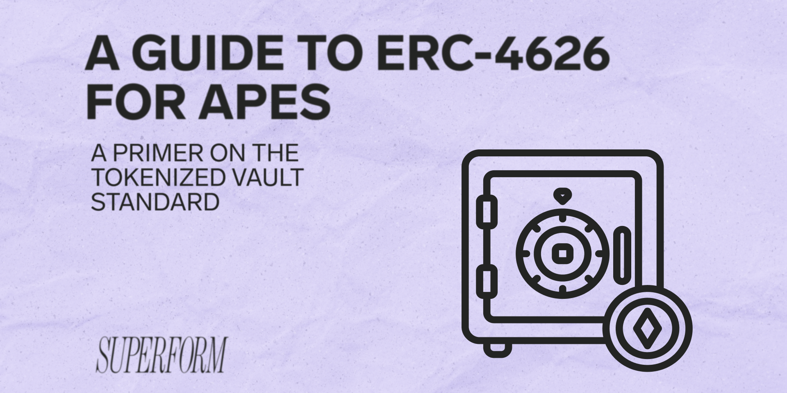

### **Core Concepts of Tokenized Vaults**

#### **Q1: What are tokenized vaults, and how do they enhance DeFi?**  
**A:** Tokenized vaults standardize the process of depositing assets into yield-generating strategies. They enhance DeFi by:  
- **Improving composability**: Standard interfaces allow protocols to integrate seamlessly.  
- **Increasing security**: Auditable code reduces risks.  
- **Enabling permissionless innovation**: Developers build strategies without reinventing the wheel.  

---

#### **Q2: What is the difference between synchronous and asynchronous vaults?**  
**A:**  
- **Synchronous (ERC-4626)**: Transactions (deposit/withdraw) execute immediately on-chain (e.g., Aave, Yearn).  
- **Asynchronous (ERC-7540)**: Requires a multi-step request lifecycle (e.g., off-chain approvals, KYC) for real-world assets (RWAs) or time-locked strategies.  

---

### **ERC-4626 Deep Dive**

#### **Q3: What are the core functions of ERC-4626?**  
**A:** Key functions include:  
- **Deposit**: Exchange assets for shares (market order).  
- **Mint**: Specify shares to receive, paying variable assets (limit order).  
- **Withdraw**: Redeem shares for a specific asset amount (limit order).  
- **Redeem**: Exchange shares for assets (market order).  

---

#### **Q4: How do `previewDeposit` and `previewMint` enhance user experience?**  
**A:** These functions simulate transactions to show users:  
- `previewDeposit`: Minimum shares received for depositing assets.  
- `previewMint`: Maximum assets required to mint shares.  
They set expectations and prevent front-end surprises.  

---

#### **Q5: What security risks are associated with ERC-4626?**  
**A:** Risks include:  
- **Rounding errors**: Improper math can lead to exploits (e.g., share inflation).  
- **Slippage**: No built-in slippage control—use routers for protection.  
- **Max deposit/withdraw limits**: Protocols must enforce caps to prevent dilution.  

---

#### **Q6: How do time-locked withdrawals work in ERC-4626?**  
**A:** Vaults like Aave implement cooldown periods. During the lock, `maxWithdraw` returns `0`, blocking withdrawals until the timer expires.  

---

### **ERC-7540 Deep Dive**

#### **Q7: Why was ERC-7540 created?**  
**A:** To support asynchronous workflows (e.g., off-chain approvals, KYC, RWAs) where immediate execution isn’t feasible.  

---

#### **Q8: Describe the request lifecycle in ERC-7540.**  
**A:**  
1. **Pending**: User submits a deposit/withdrawal request.  
2. **Claimable**: Vault operator fulfills the request off-chain (e.g., completes KYC).  
3. **Claimed**: User/controller finalizes the transaction on-chain.  

---

#### **Q9: What role does the `controller` play in ERC-7540?**  
**A:** The controller is a delegated address (e.g., protocol, smart contract) that automates claiming assets/shares after a request becomes claimable, improving UX.  

---

#### **Q10: Why do `preview` functions revert in ERC-7540?**  
**A:** Asynchronous fulfillment means asset/share ratios can’t be predicted upfront (e.g., off-chain delays change yields).  

---

### **Development Considerations**

#### **Q11: What toolkit is recommended for building ERC-4626 vaults?**  
**A:** Yearn’s **Tokenized Strategy Repo** simplifies deployment by abstracting core logic. Developers override:  
- `_deployFunds`: Allocate deposited assets.  
- `_freeFunds`: Handle withdrawals.  
- `_harvest`: Compound yields.  

---

#### **Q12: How can ERC-7540 integrate real-world assets (RWAs)?**  
**A:** Example flow:  
1. User deposits USDC into a vault.  
2. Vault operator routes funds to off-chain private credit.  
3. After RWA settlement, shares become claimable.  

---

#### **Q13: How do you handle slippage in ERC-4626?**  
**A:** Use a router contract to:  
- Calculate min shares/assets using `preview` functions.  
- Pass these values as slippage parameters in transactions.  

---

#### **Q14: What is ERC-7575, and how does it relate to vaults?**  
**A:** ERC-7575 standardizes multi-asset vaults (e.g., LP tokens). Combined with ERC-4626/7540, it supports strategies requiring multiple tokens (e.g., Uniswap V3 positions).  

---

### **Use Cases & Examples**

#### **Q15: Name protocols using ERC-4626.**  
**A:**  
- **Yearn**: Automated yield strategies.  
- **Aave**: Interest-bearing aTokens.  
- **Pendle**: Yield tokenization.  

---

#### **Q16: How does Centrifuge use ERC-7540?**  
**A:** Centrifuge tokenizes RWAs (e.g., invoices, mortgages). Users deposit stablecoins, which are lent off-chain. ERC-7540’s request lifecycle manages KYC and settlement delays.  

---

#### **Q17: Can ERC-4626 vaults be used as collateral?**  
**A:** Yes! Projects like Euler use ERC-4626 shares as collateral for loans, enabled by ERC-7575 for cross-protocol compatibility.  

---

### **Security & Edge Cases**

#### **Q18: How can vaults prevent share inflation attacks?**  
**A:**  
- Use OpenZeppelin’s `ERC4626` implementation for secure math.  
- Audit rounding logic in `convertToShares`/`convertToAssets`.  

---

#### **Q19: What happens if an ERC-7540 vault operator goes offline?**  
**A:** Assets may be stuck in “pending” state. Mitigations:  
- Implement a cancellation function.  
- Use decentralized operator networks (e.g., Chainlink Automation).  

---

#### **Q20: Why is ERC-165 support critical for ERC-7540?**  
**A:** It lets integrators detect if a vault supports asynchronous deposits/withdrawals, enabling dynamic UI/UX adjustments.  

---

### **Advanced Topics**

#### **Q21: How do you calculate APY for ERC-4626 vaults?**  
**A:** Use:  
```solidity
apy = (vault.totalAssets() - initialDeposit) / initialDeposit * (365 / periodDays)
```  
*Note:* Off-chain indexing is recommended for accuracy.  

---

#### **Q22: Can ERC-7540 support batch requests?**  
**A:** Yes! Use `requestID` to group transactions (e.g., bulk KYC approvals). However, the spec focuses on `requestID=0` for simplicity.  

---

#### **Q23: How do you handle native ETH in ERC-4626?**  
**A:** Use ERC-7535 to wrap ETH into an ERC-20 compatible format (e.g., WETH) before depositing.  

---

#### **Q24: What are “tokenized strategies”?**  
**A:** Pre-built modules (e.g., Yearn’s V3) that abstract ERC-4626 logic, letting developers focus on yield generation.  

---

### **Q&A Highlights**

#### **Q25: Why don’t ERC-4626 vaults enforce minimum deposits?**  
**A:** It’s optional. Protocols like Lido avoid spam by setting `minDeposit`, but most DeFi vaults omit this for permissionless access.  

---

#### **Q26: How does Superform integrate with these standards?**  
**A:** Superform acts as a cross-chain front end, auto-listing ERC-4626/7540 vaults. Users deposit any asset from any chain without custom UI.  

---

#### **Q27: Can ERC-7540 handle leveraged strategies?**  
**A:** Yes! Example: Deposit USDC → borrow more via Gearbox → invest in a high-yield ERC-7540 vault.  

---

#### **Q28: What’s the biggest challenge in migrating from ERC-4626 to ERC-7540?**  
**A:** Managing asynchronous state transitions (e.g., tracking pending requests) and ensuring integrators handle delayed settlements.  

---

#### **Q29: How do you audit an ERC-4626 vault?**  
**A:** Focus on:  
- Rounding consistency in `convertToShares`.  
- Reentrancy guards for `deposit`/`withdraw`.  
- Proper `max` function enforcement.  

---

#### **Q30: Are there gas optimizations for ERC-4626?**  
**A:** Batch deposits/withdrawals using multicall, and minimize storage writes in `preview` functions.  

---

### **Miscellaneous**

#### **Q31: What’s the difference between `redeem` and `withdraw`?**  
**A:**  
- `redeem`: Burn shares for *at least* `X` assets (market order).  
- `withdraw`: Get *exactly* `X` assets by burning variable shares (limit order).  

---

#### **Q32: How do oracles interact with tokenized vaults?**  
**A:** Oracles like Chainlink provide `totalAssets` data to calculate share prices for lending/borrowing platforms.  

---

#### **Q33: Can ERC-7540 vaults charge fees?**  
**A:** Yes! Fees can be applied during:  
- Request fulfillment (e.g., KYC processing fee).  
- Claiming (e.g., performance fee on yields).  

---

#### **Q34: What’s the future of tokenized vaults?**  
**A:** Trends include:  
- **Cross-chain vaults**: Using CCIP/ LayerZero.  
- **RWAs**: Bridging TradFi yields via ERC-7540.  
- **LRTs**: Liquid restaking tokens for EigenLayer.  

---

#### **Q35: How do you handle failed transactions in ERC-7540?**  
**A:** Failed fulfillments (e.g., expired KYC) require manual intervention or a cancellation function to refund users.  

---

### **Technical Nuances**

#### **Q36: Why does ERC-7540 overload the `deposit` function?**  
**A:** To include the `controller` parameter, allowing delegated claims. `redeem` doesn’t need overloading since ERC-4626 already supports it.  

---

#### **Q37: How do you test ERC-4626 vaults?**  
**A:** Use Foundry/Echidna for:  
- Fuzz testing `deposit`/`withdraw` edge cases.  
- Invariant checks for share/asset consistency.  

---

#### **Q38: What’s the role of `totalAssets()`?**  
**A:** Returns the vault’s TVL. Critical for calculating APY and share prices.  

---

#### **Q39: Can ERC-7540 support non-fungible assets?**  
**A:** No—it’s designed for fungible tokens. Use ERC-721/1155 for NFTs.  

---

#### **Q40: How do you handle share dilution in ERC-4626?**  
**A:** Protocols use `maxDeposit` to cap deposits, ensuring yields aren’t diluted by sudden inflows.  

---

### **User Experience (UX)**

#### **Q41: How do frontends display APY for ERC-7540 vaults?**  
**A:** Use historical `convertToAssets` data or off-chain indexes, as real-time APY is unreliable due to async delays.  

---

#### **Q42: What UX pitfalls exist with ERC-7540?**  
**A:** Users might not understand delayed settlements. Mitigate with clear status indicators (e.g., “Pending KYC Approval”).  

---

#### **Q43: Can users cancel ERC-7540 requests?**  
**A:** Not natively—developers must add a `cancelRequest` function. Include timelocks to prevent griefing.  

---

#### **Q44: How do wallets track ERC-7540 claimable balances?**  
**A:** Integrators query `claimableDeposit` and `claimableRedeem` functions, emitting events like `ClaimableUpdated`.  

---

### **Regulatory Considerations**

#### **Q45: How does ERC-7540 assist with compliance?**  
**A:** By separating request/fulfillment steps, it enables KYC/AML checks during the pending phase (e.g., Centrifuge’s RWA model).  

---

#### **Q46: Can ERC-7540 vaults blacklist users?**  
**A:** Yes—during the pending phase, operators can deny requests based on jurisdiction or risk factors.  

---

### **Interoperability**

#### **Q47: Can ERC-4626 and ERC-7540 vaults interact?**  
**A:** Yes! Example: Deposit into an ERC-4626 vault, then use those shares in an ERC-7540 vault for RWAs.  

---

#### **Q48: How does ERC-7540 integrate with existing DeFi?**  
**A:** Controllers can automate claiming, enabling compatibility with lending protocols (e.g., claim shares → use as collateral on Aave).  

---

### **Troubleshooting**

#### **Q49: Why would `maxWithdraw` return 0?**  
**A:** Common reasons:  
- Funds are locked (e.g., cooldown period).  
- Vault is undercollateralized (e.g., bad debt).  

---

#### **Q50: How to debug a `revert` in `previewDeposit`?**  
**A:** Check:  
- Asset approvals.  
- `maxDeposit` limits.  
- Vault liquidity (e.g., `totalAssets` > 0).