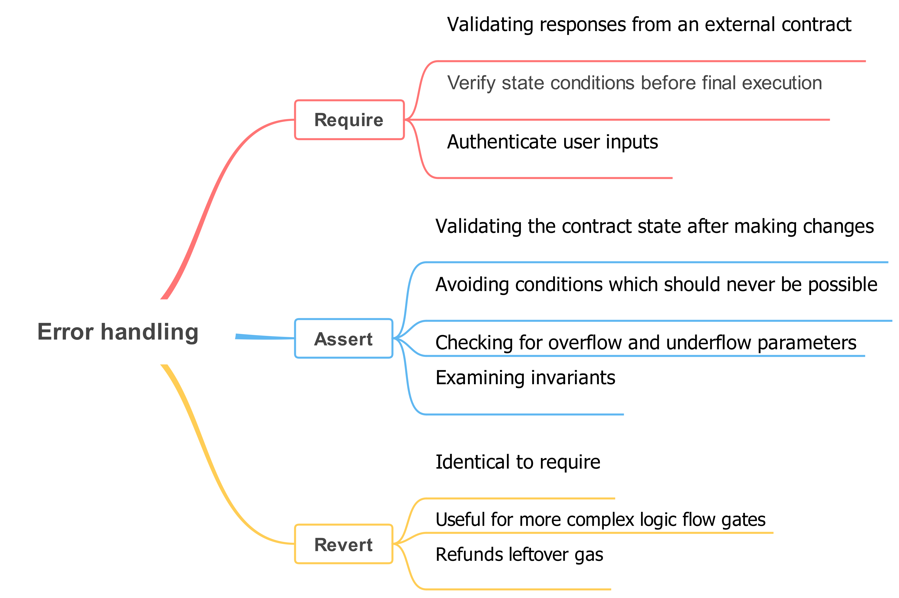

1.  **What is the difference between require and assert and revert in Solidity?**

 The main difference is the behavior when the condition fails. require and revert revert the entire transaction and undo all changes, while assert is used for internal errors and will always revert the transaction.

2.  **What are the error handling methods in Solidity?**

Solidity provides three error handling methods: require, assert, and revert. These methods are used to validate conditions and handle exceptions in smart contracts.

3.  **What is the difference between require and assert in Solidity?**

The difference lies in the behavior when the condition fails. require and assert both check conditions, but require is used for input validation and will revert the transaction, while assert is used for internal errors and will always revert the transaction.

4.  **What is the revert function in Solidity?**

revert is a function in Solidity that is used to revert the entire transaction and undo all changes made so far. It is commonly used for error handling and to revert the state back to its original state.

5.  **Why use require instead of assert?**

Use require when you want to check for input validation and ensure that certain conditions are met before proceeding with the execution of the contract. If the condition fails, require will revert the transaction and undo all changes, providing a safer way to handle errors.

6.  **Why do we use the require method?**

The require method is used to validate conditions in smart contracts. It allows you to check for certain conditions and revert the transaction if the conditions are not met. This helps ensure that the contract functions correctly and prevents unwanted behavior.

7.  **Which is better assert or verify?**

In Solidity, assert is used for internal errors that should never occur, while require is used for input validation and to check conditions that should always be true. It is generally recommended to use require for most cases as it provides a safer way to handle errors and prevents unwanted behavior.

8.  **When shouldn't you use the assert statement?**

The assert statement should not be used for input validation or checking conditions that might be false in certain cases. It is meant to be used for internal errors that should never occur. For input validation, it is recommended to use the require statement instead.

9.  **Does assert raise an error?**

Yes, when the condition provided to the assert statement evaluates to false, it will raise an error and revert the entire transaction.

10.  **What happens if assert fails?** 

If an assert statement fails, there has likely been an internal programming issue. All modifications made during the course of the transaction are undone, and the contract's execution is instantly suspended. This is done to safeguard the integrity of the contract's state and to stop any additional unexpected activity.

11. **What does require do in Solidity?**

The require keyword is used in Solidity to ensure that certain conditions are met before proceeding with the execution of a function.
If the condition specified in the require statement is true, the function will continue to execute. However, if the condition is false, the function will stop executing and revert any changes made to the state of the contract. Reverting means that any state changes made during the execution of the function (such as changes to variables or storage) will be undone, and the contract will return to its previous state.

12 **What is require vs assert in Solidity?**

Require checks if inputs and conditions are valid, while assert checks if the code itself is behaving as expected, and throws an error if something unexpected or out of place happens.

13. **Why use require instead of assert?**

It's important to use require when validating user input or external dependencies (such as whether a user's balance is sufficient), and assert to validate internal conditions that should never fail. By using both of these keywords where appropriate, [Solidity developers]can create more robust and secure contracts that are less prone to error.