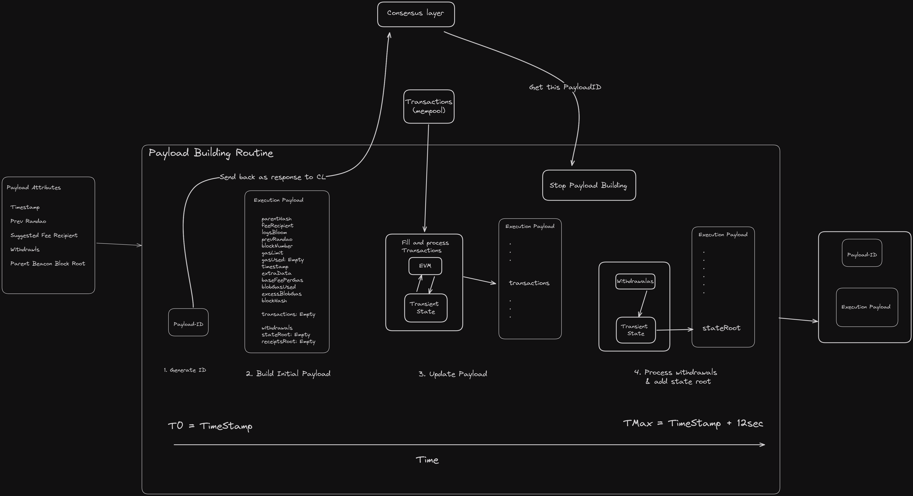

When a validator is selected to propose a block during a slot, it looks for the block produced by CL. Importantly, a validator isn't limited to broadcasting a block solely from its own EL. It can also broadcast a block produced by external builders; for details, refer to [PBS](https://ethereum.org/en/roadmap/pbs/). This article specifically explores how a block is produced by EL and the elements contributing to its successful production and transaction execution.


Payload building routine
---------------------------------------------------------------------------------------------------

A block is created when the consensus layer instructs the execution layer client to do so through the engine API's fork choice updated endpoint, which then initiates the process of constructing the block via the payload building routine.

Note: The fee recipient of the built payload may deviate from the suggested fee recipient of the payload attributes:




Nodes broadcast transactions through a peer-to-peer network using the gossip protocol. These transactions are validated against specific criteria (e.g. , checking nonce correctness, sufficient balance, and proper signatures) and stored in the mempool awaiting inclusion in a block.


Each slot has a designated block proposer, selected through a pseudo-random process by the consensus layer. When a validator is chosen as the block proposer for a slot, its consensus client initiates block construction through the **execution engine's fork choice updated** method, which provides the necessary context for building the block.


We can **simplify and emulate the process of constructing blocks**, though this approach is specific to the Go types used in geth. However, the concepts can generally be applied to different clients.

```go
func build(env environment, pool txpool.Pool, state state.StateDB) (types.Block, state.StateDB, error) { //1
    var (
        gasUsed = 0
        txs []types.Transactions
    ) //2

  for ; gasUsed < 30_000_000 || !pool.Empty(); { //3
      transaction := pool.Pop() //4
      res, gas, err := vm.Run(env, transaction, state) //5
      if err != nil { // 6
          // transaction invalid
          continue
      }
      gasUsed += gas // 7
      transactions = append(transactions, transaction)
  }
  return core.Finalize(env, transactions, state) //8
}
```

1.  We take in the environment, which contains all the necessary information (similar to the header previously), including the time stamp, block number, preceding block, base fee, and all the withdrawals that need to occur in the block. Essentially, the information originating from the consensus layer, which acts as the central decision-making entity, determines the context in which the block should be constructed. Next, we take in the transaction pool, which is a collection of transactions. For simplicity, we assume that these transactions are arranged in ascending order based on their value. This arrangement helps us construct the most profitable block for the execution client, considering the transactions observed in the network. Additionally, we also consider a state DB, representing the state over which all these transactions are executed.
    -   We return a block, a state DB that has accumulated all the transactions in the block and possibly an error.
2.  Inside build we track the gas used because there is only a finite amount of gas we can use. And, also store all the transactions that are going to go in the block.
3.  We continue adding the transactions until the pool is empty or the amount of gas consumed is greater than the gas limit, which is fixed at 30 million (about the current gas limit on the mainnet) in this example for the sake of simplicity.
4.  In order to obtain a transaction, we must query the transaction pool, which is presumed to maintain an ordered list of transactions, ensuring that we always receive the next most valuable transaction.
5.  The transaction is executed in the EVM, assuming that run requires an interface that is satisfied by both the block and the environment. We provide the environment, transaction, and state as input. This  will execute the transaction within the context defined by the environment and provide us with an updated state that will include the accumulated transaction.
6.  If the transaction execution is unsuccessful, indicated by the occurrence of an error during the run, we simply proceed without interruption. This indicates that the transaction is invalid and since there is still unused gas left in the block, we do not want to generate an error immediately. This is because no error has occurred within the block yet. However, it is highly likely that the transaction is invalid because it did something bad during execution or because the transaction pool is slightly outdated. In which case we allow ourselves to continue and try to get the next transaction from the pool into this block.
7.  Once we verify there is no error with running the transaction we add the transaction to the transactions list and we add the gas that was returned by run to the gas used. For example if the first transaction was a simple transfer, which costs 21,000 gas our gas used would go from 0 to 21,000 and we would keep doing this process steps 3-7 until the conditions of step 3 are met.
8.  We finalize our transition by taking set of transactions and relevant block information to generate a fully assembled block. The purpose of doing this is to perform certain calculations at the end. Since the header contains the transactions root, receipts root, and withdrawals root, these values must be computed by merkleizing a list and added to the block's header.
    -   We return our block, state DB and our error.