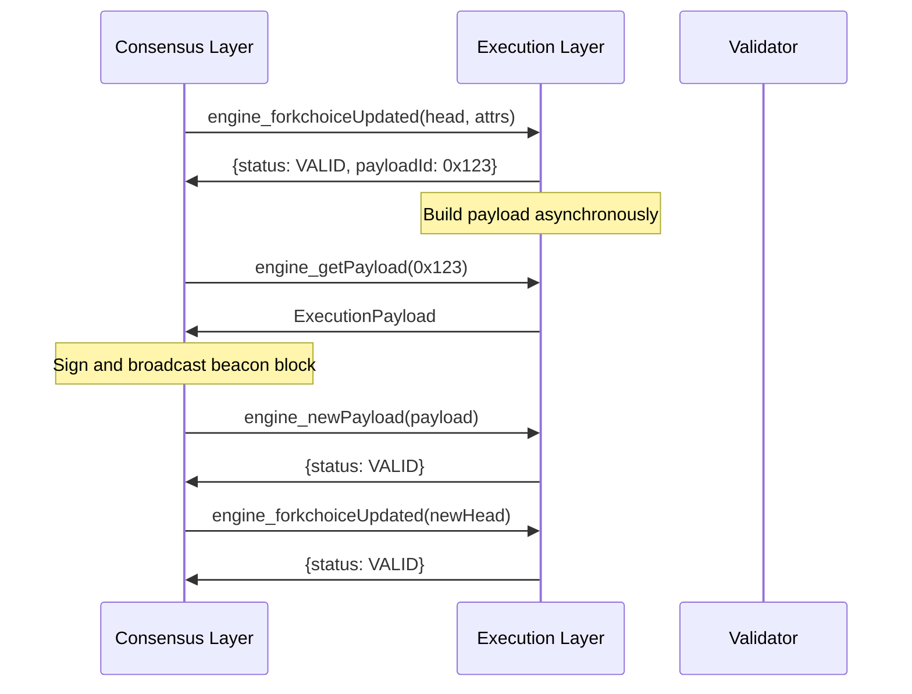

# Fork Choice Updated and New Payload in Engine API

## Foundational Concepts

The **Engine API** is a critical component of Ethereum's post-merge architecture, serving as the communication bridge between the **consensus layer** (beacon chain) and the **execution layer** (execution client). Two of its most important methods are `engine_forkchoiceUpdated` and `engine_newPayload`.

### Core Architecture

**Separation of Concerns:**
- **Consensus Layer**: Handles block finality, validator duties, and fork choice
- **Execution Layer**: Processes transactions and maintains state
- **Engine API**: Enables seamless communication between layers

## engine_forkchoiceUpdated

### Purpose and Functionality

`engine_forkchoiceUpdated` informs the execution client about the current **head of the chain** as determined by the consensus client's fork choice algorithm.

### Method Signature

```json
{
  "method": "engine_forkchoiceUpdated",
  "params": [
    {
      "headBlockHash": "0x...",
      "safeBlockHash": "0x...", 
      "finalizedBlockHash": "0x..."
    },
    {
      "timestamp": "0x...",
      "prevRandao": "0x...",
      "suggestedFeeRecipient": "0x...",
      "withdrawals": [...],
      "parentBeaconBlockRoot": "0x..."
    }
  ]
}
```

### Key Parameters Explained

**forkchoiceState:**
- **headBlockHash**: Current canonical chain head
- **safeBlockHash**: Latest safe block (justified checkpoint)
- **finalizedBlockHash**: Latest finalized block

**payloadAttributes** (optional):
- **timestamp**: Block timestamp for payload building
- **prevRandao**: Previous RANDAO value
- **suggestedFeeRecipient**: Address for block rewards
- **withdrawals**: Validator withdrawal operations
- **parentBeaconBlockRoot**: Parent beacon block root (post-Deneb)

### Response Types

```json
{
  "payloadStatus": {
    "status": "VALID|INVALID|SYNCING|ACCEPTED",
    "latestValidHash": "0x...",
    "validationError": "..."
  },
  "payloadId": "0x..."
}
```

### Implementation Example (Go)

```go
type ForkchoiceStateV1 struct {
    HeadBlockHash      common.Hash `json:"headBlockHash"`
    SafeBlockHash      common.Hash `json:"safeBlockHash"`
    FinalizedBlockHash common.Hash `json:"finalizedBlockHash"`
}

type PayloadAttributes struct {
    Timestamp             uint64        `json:"timestamp"`
    PrevRandao           common.Hash   `json:"prevRandao"`
    SuggestedFeeRecipient common.Address `json:"suggestedFeeRecipient"`
    Withdrawals          []*Withdrawal  `json:"withdrawals,omitempty"`
    ParentBeaconBlockRoot *common.Hash   `json:"parentBeaconBlockRoot,omitempty"`
}

func (api *ConsensusAPI) ForkchoiceUpdatedV3(
    ctx context.Context,
    state ForkchoiceStateV1,
    attrs *PayloadAttributes,
) (*ForkchoiceUpdatedResponse, error) {
    
    // Validate fork choice state
    if err := api.validateForkchoiceState(state); err != nil {
        return &ForkchoiceUpdatedResponse{
            PayloadStatus: PayloadStatusV1{
                Status:          "INVALID",
                ValidationError: err.Error(),
            },
        }, nil
    }
    
    // Update fork choice
    if err := api.blockchain.SetHead(state.HeadBlockHash); err != nil {
        return nil, err
    }
    
    // Build payload if requested
    var payloadId *PayloadID
    if attrs != nil {
        id, err := api.buildPayload(attrs)
        if err != nil {
            return nil, err
        }
        payloadId = &id
    }
    
    return &ForkchoiceUpdatedResponse{
        PayloadStatus: PayloadStatusV1{
            Status:          "VALID",
            LatestValidHash: &state.HeadBlockHash,
        },
        PayloadId: payloadId,
    }, nil
}
```

### Critical Edge Cases

**Orphaned Blocks:**
```go
func (api *ConsensusAPI) handleOrphanedBlock(blockHash common.Hash) error {
    // Check if block exists in canonical chain
    if !api.blockchain.HasBlock(blockHash) {
        return fmt.Errorf("unknown block: %s", blockHash.Hex())
    }
    
    // Verify block is part of canonical chain
    currentHead := api.blockchain.CurrentBlock()
    if !api.isAncestor(blockHash, currentHead.Hash()) {
        // Block is orphaned, need to reorganize
        return api.performReorg(blockHash)
    }
    
    return nil
}
```

**Sync State Handling:**
```go
func (api *ConsensusAPI) checkSyncStatus(targetHash common.Hash) string {
    if api.downloader.Synchronising() {
        return "SYNCING"
    }
    
    if !api.blockchain.HasBlock(targetHash) {
        return "SYNCING"
    }
    
    return "VALID"
}
```

## engine_newPayload

### Purpose and Functionality

`engine_newPayload` delivers a new execution payload to the execution client for validation and potential inclusion in the blockchain.

### Method Signature

```json
{
  "method": "engine_newPayload",
  "params": [
    {
      "parentHash": "0x...",
      "feeRecipient": "0x...",
      "stateRoot": "0x...",
      "receiptsRoot": "0x...",
      "logsBloom": "0x...",
      "prevRandao": "0x...",
      "blockNumber": "0x...",
      "gasLimit": "0x...",
      "gasUsed": "0x...",
      "timestamp": "0x...",
      "extraData": "0x...",
      "baseFeePerGas": "0x...",
      "blockHash": "0x...",
      "transactions": ["0x...", "0x..."],
      "withdrawals": [...],
      "blobGasUsed": "0x...",
      "excessBlobGas": "0x..."
    },
    ["0x..."],
    "0x..."
  ]
}
```

### Implementation Example (Rust)

```rust
#[derive(Debug, Clone, Serialize, Deserialize)]
pub struct ExecutionPayload {
    pub parent_hash: H256,
    pub fee_recipient: Address,
    pub state_root: H256,
    pub receipts_root: H256,
    pub logs_bloom: Bloom,
    pub prev_randao: H256,
    pub block_number: U64,
    pub gas_limit: U64,
    pub gas_used: U64,
    pub timestamp: U64,
    pub extra_data: Bytes,
    pub base_fee_per_gas: U256,
    pub block_hash: H256,
    pub transactions: Vec<Bytes>,
    pub withdrawals: Option<Vec<Withdrawal>>,
    pub blob_gas_used: Option<U64>,
    pub excess_blob_gas: Option<U64>,
}

impl EngineApi {
    pub async fn new_payload_v3(
        &self,
        payload: ExecutionPayload,
        versioned_hashes: Vec<H256>,
        parent_beacon_block_root: H256,
    ) -> Result<PayloadStatus, EngineError> {
        
        // Validate payload structure
        self.validate_payload_structure(&payload)?;
        
        // Verify parent exists
        if !self.blockchain.has_block(&payload.parent_hash) {
            return Ok(PayloadStatus {
                status: PayloadStatusEnum::Syncing,
                latest_valid_hash: None,
                validation_error: None,
            });
        }
        
        // Validate transactions
        for (i, tx_bytes) in payload.transactions.iter().enumerate() {
            match self.validate_transaction(tx_bytes) {
                Ok(_) => continue,
                Err(e) => {
                    return Ok(PayloadStatus {
                        status: PayloadStatusEnum::Invalid,
                        latest_valid_hash: Some(payload.parent_hash),
                        validation_error: Some(format!("Invalid transaction at index {}: {}", i, e)),
                    });
                }
            }
        }
        
        // Execute payload
        match self.execute_payload(&payload).await {
            Ok(executed_block) => {
                // Verify computed hash matches
                if executed_block.hash() != payload.block_hash {
                    return Ok(PayloadStatus {
                        status: PayloadStatusEnum::Invalid,
                        latest_valid_hash: Some(payload.parent_hash),
                        validation_error: Some("Block hash mismatch".to_string()),
                    });
                }
                
                // Store block temporarily
                self.blockchain.store_pending_block(executed_block)?;
                
                Ok(PayloadStatus {
                    status: PayloadStatusEnum::Valid,
                    latest_valid_hash: Some(payload.block_hash),
                    validation_error: None,
                })
            }
            Err(e) => Ok(PayloadStatus {
                status: PayloadStatusEnum::Invalid,
                latest_valid_hash: Some(payload.parent_hash),
                validation_error: Some(e.to_string()),
            }),
        }
    }
}
```

### Advanced Validation Logic

**Transaction Validation:**
```rust
fn validate_transaction(&self, tx_bytes: &Bytes) -> Result<(), ValidationError> {
    // Decode transaction
    let tx = Transaction::decode(tx_bytes)
        .map_err(|e| ValidationError::InvalidEncoding(e))?;
    
    // Validate signature
    tx.verify_signature()
        .map_err(|e| ValidationError::InvalidSignature(e))?;
    
    // Check nonce
    let account_nonce = self.state.get_nonce(&tx.from())?;
    if tx.nonce() != account_nonce {
        return Err(ValidationError::InvalidNonce {
            expected: account_nonce,
            got: tx.nonce(),
        });
    }
    
    // Validate gas limit
    if tx.gas_limit() > self.config.max_gas_limit {
        return Err(ValidationError::GasLimitTooHigh);
    }
    
    // Check balance for gas payment
    let max_fee = tx.gas_limit() * tx.max_fee_per_gas();
    let balance = self.state.get_balance(&tx.from())?;
    if balance < max_fee + tx.value() {
        return Err(ValidationError::InsufficientBalance);
    }
    
    Ok(())
}
```

**State Root Verification:**
```cpp
class StateRootValidator {
private:
    TrieDB trie_db;
    
public:
    bool validate_state_root(const ExecutionPayload& payload) {
        // Create temporary state from parent
        State temp_state = create_state_from_parent(payload.parent_hash);
        
        // Apply all transactions
        for (const auto& tx_bytes : payload.transactions) {
            Transaction tx = decode_transaction(tx_bytes);
            
            // Execute transaction
            ExecutionResult result = execute_transaction(temp_state, tx);
            if (!result.success) {
                return false;
            }
            
            // Apply state changes
            temp_state.apply_changes(result.state_changes);
        }
        
        // Apply withdrawals
        if (payload.withdrawals.has_value()) {
            for (const auto& withdrawal : payload.withdrawals.value()) {
                temp_state.add_balance(withdrawal.address, withdrawal.amount);
            }
        }
        
        // Compute state root
        Hash256 computed_root = temp_state.compute_root();
        
        return computed_root == payload.state_root;
    }
};
```

## Integration Patterns and Workflows

### Block Building Workflow



### Error Handling Strategies

**Network Partitions:**
```go
func (api *ConsensusAPI) handleNetworkPartition(ctx context.Context) error {
    // Detect partition by monitoring peer count
    if api.p2p.PeerCount() < api.config.MinPeers {
        // Enter conservative mode
        api.setConservativeMode(true)
        
        // Stop building new payloads
        api.payloadBuilder.Stop()
        
        // Only accept payloads with high confidence
        api.validationThreshold = HighConfidence
    }
    
    return nil
}
```

**Reorg Handling:**
```go
func (api *ConsensusAPI) handleReorg(
    oldHead, newHead common.Hash,
    depth int,
) error {
    log.Warn("Chain reorganization detected", 
        "oldHead", oldHead, 
        "newHead", newHead, 
        "depth", depth)
    
    // Find common ancestor
    ancestor, err := api.findCommonAncestor(oldHead, newHead)
    if err != nil {
        return err
    }
    
    // Revert to common ancestor
    if err := api.blockchain.RevertToBlock(ancestor); err != nil {
        return err
    }
    
    // Apply new chain
    return api.blockchain.ExtendChain(newHead)
}
```

## Performance Optimizations

### Payload Caching Strategy

```rust
use std::collections::HashMap;
use std::sync::{Arc, RwLock};

pub struct PayloadCache {
    cache: Arc<RwLock<HashMap<H256, CachedPayload>>>,
    max_size: usize,
}

struct CachedPayload {
    payload: ExecutionPayload,
    validation_result: PayloadStatus,
    timestamp: u64,
}

impl PayloadCache {
    pub fn get(&self, block_hash: &H256) -> Option<PayloadStatus> {
        let cache = self.cache.read().unwrap();
        cache.get(block_hash).map(|cached| cached.validation_result.clone())
    }
    
    pub fn insert(&self, payload: ExecutionPayload, status: PayloadStatus) {
        let mut cache = self.cache.write().unwrap();
        
        // Evict old entries if cache is full
        if cache.len() >= self.max_size {
            self.evict_oldest(&mut cache);
        }
        
        cache.insert(payload.block_hash, CachedPayload {
            payload,
            validation_result: status,
            timestamp: current_timestamp(),
        });
    }
    
    fn evict_oldest(&self, cache: &mut HashMap<H256, CachedPayload>) {
        if let Some(oldest_hash) = cache.iter()
            .min_by_key(|(_, cached)| cached.timestamp)
            .map(|(hash, _)| *hash) {
            cache.remove(&oldest_hash);
        }
    }
}
```

### Parallel Transaction Validation

```cpp
#include <thread>
#include <future>
#include <vector>

class ParallelValidator {
private:
    size_t thread_count;
    
public:
    struct ValidationResult {
        bool valid;
        std::string error;
        size_t tx_index;
    };
    
    std::vector<ValidationResult> validate_transactions_parallel(
        const std::vector<std::vector<uint8_t>>& transactions,
        const State& base_state
    ) {
        std::vector<std::future<ValidationResult>> futures;
        std::vector<ValidationResult> results(transactions.size());
        
        // Split transactions into chunks
        size_t chunk_size = transactions.size() / thread_count;
        
        for (size_t i = 0; i < thread_count; ++i) {
            size_t start = i * chunk_size;
            size_t end = (i == thread_count - 1) ? 
                transactions.size() : (i + 1) * chunk_size;
            
            futures.push_back(std::async(std::launch::async, [this, &transactions, &base_state, start, end]() {
                return validate_chunk(transactions, base_state, start, end);
            }));
        }
        
        // Collect results
        for (auto& future : futures) {
            auto chunk_results = future.get();
            for (const auto& result : chunk_results) {
                results[result.tx_index] = result;
            }
        }
        
        return results;
    }
    
private:
    std::vector<ValidationResult> validate_chunk(
        const std::vector<std::vector<uint8_t>>& transactions,
        const State& base_state,
        size_t start,
        size_t end
    ) {
        std::vector<ValidationResult> results;
        State local_state = base_state; // Copy for thread safety
        
        for (size_t i = start; i < end; ++i) {
            try {
                Transaction tx = decode_transaction(transactions[i]);
                bool valid = validate_transaction(tx, local_state);
                
                results.push_back({
                    .valid = valid,
                    .error = valid ? "" : "Validation failed",
                    .tx_index = i
                });
                
                if (valid) {
                    // Update local state for subsequent validations
                    apply_transaction(local_state, tx);
                }
            } catch (const std::exception& e) {
                results.push_back({
                    .valid = false,
                    .error = e.what(),
                    .tx_index = i
                });
            }
        }
        
        return results;
    }
};
```

## Advanced Topics

### MEV-Boost Integration

```go
type MEVBoostClient struct {
    relayEndpoints []string
    client        *http.Client
}

func (m *MEVBoostClient) GetHeader(
    slot uint64,
    parentHash common.Hash,
    pubkey []byte,
) (*ExecutionPayloadHeader, error) {
    
    // Request headers from multiple relays
    var bestHeader *ExecutionPayloadHeader
    var bestValue *big.Int
    
    for _, relay := range m.relayEndpoints {
        header, err := m.requestHeaderFromRelay(relay, slot, parentHash, pubkey)
        if err != nil {
            log.Warn("Failed to get header from relay", "relay", relay, "error", err)
            continue
        }
        
        if bestHeader == nil || header.Value.Cmp(bestValue) > 0 {
            bestHeader = header
            bestValue = header.Value
        }
    }
    
    return bestHeader, nil
}

func (m *MEVBoostClient) GetPayload(
    payloadId []byte,
) (*ExecutionPayload, error) {
    // Retrieve full payload after commitment
    return m.requestPayloadFromRelay(payloadId)
}
```

### Blob Transaction Handling (EIP-4844)

```rust
#[derive(Debug, Clone)]
pub struct BlobTransaction {
    pub base_tx: Transaction,
    pub blob_versioned_hashes: Vec<H256>,
    pub max_fee_per_blob_gas: U256,
}

impl BlobTransaction {
    pub fn validate_blob_hashes(&self, kzg_commitments: &[KzgCommitment]) -> Result<(), BlobError> {
        if self.blob_versioned_hashes.len() != kzg_commitments.len() {
            return Err(BlobError::HashCommitmentMismatch);
        }
        
        for (hash, commitment) in self.blob_versioned_hashes.iter().zip(kzg_commitments.iter()) {
            let computed_hash = kzg_commitment_to_versioned_hash(commitment);
            if *hash != computed_hash {
                return Err(BlobError::InvalidVersionedHash);
            }
        }
        
        Ok(())
    }
    
    pub fn calculate_blob_gas_fee(&self, excess_blob_gas: u64) -> U256 {
        let blob_base_fee = calculate_blob_base_fee(excess_blob_gas);
        let blob_count = self.blob_versioned_hashes.len() as u64;
        
        U256::from(blob_count) * blob_base_fee
    }
}

fn calculate_blob_base_fee(excess_blob_gas: u64) -> U256 {
    const MIN_BLOB_BASE_FEE: u64 = 1;
    const BLOB_BASE_FEE_UPDATE_FRACTION: u64 = 3338477;
    
    if excess_blob_gas == 0 {
        return U256::from(MIN_BLOB_BASE_FEE);
    }
    
    // Exponential calculation: base_fee = MIN_BLOB_BASE_FEE * e^(excess_blob_gas / BLOB_BASE_FEE_UPDATE_FRACTION)
    let exponent = U256::from(excess_blob_gas) / U256::from(BLOB_BASE_FEE_UPDATE_FRACTION);
    U256::from(MIN_BLOB_BASE_FEE) * exp_u256(exponent)
}
```

## Comparison with Similar Systems

### Engine API vs. JSON-RPC

| Aspect | Engine API | JSON-RPC |
|--------|------------|----------|
| **Purpose** | Consensus-execution communication | General client interaction |
| **Security** | Authenticated, internal | Public-facing |
| **Methods** | Specialized for consensus | General blockchain queries |
| **Performance** | Optimized for high-frequency calls | Optimized for user queries |
| **State** | Maintains execution context | Stateless |

### Fork Choice vs. GHOST Protocol

**Engine API Fork Choice:**
- Determined by consensus layer
- Considers attestations and finality
- Optimized for proof-of-stake

**GHOST Protocol:**
- Weight-based on proof-of-work
- Considers uncle blocks
- Optimized for proof-of-work

## Testing and Validation

### Integration Test Framework

```go
type EngineAPITestSuite struct {
    consensusClient *MockConsensusClient
    executionClient *MockExecutionClient
    testChain      *TestChain
}

func (suite *EngineAPITestSuite) TestForkchoiceUpdate() {
    // Setup test chain
    chain := suite.testChain.BuildChain(10) // 10 blocks
    
    // Test normal fork choice update
    resp, err := suite.executionClient.ForkchoiceUpdated(
        ForkchoiceState{
            HeadBlockHash:      chain.Head().Hash(),
            SafeBlockHash:      chain.Block(8).Hash(),
            FinalizedBlockHash: chain.Block(5).Hash(),
        },
        nil,
    )
    
    assert.NoError(suite.T(), err)
    assert.Equal(suite.T(), "VALID", resp.PayloadStatus.Status)
    
    // Test with invalid head
    resp, err = suite.executionClient.ForkchoiceUpdated(
        ForkchoiceState{
            HeadBlockHash:      common.Hash{0x99}, // Invalid hash
            SafeBlockHash:      chain.Block(8).Hash(),
            FinalizedBlockHash: chain.Block(5).Hash(),
        },
        nil,
    )
    
    assert.NoError(suite.T(), err)
    assert.Equal(suite.T(), "SYNCING", resp.PayloadStatus.Status)
}

func (suite *EngineAPITestSuite) TestNewPayloadValidation() {
    // Test valid payload
    payload := suite.testChain.GenerateValidPayload()
    status, err := suite.executionClient.NewPayload(payload)
    
    assert.NoError(suite.T(), err)
    assert.Equal(suite.T(), "VALID", status.Status)
    
    // Test payload with invalid state root
    invalidPayload := payload
    invalidPayload.StateRoot = common.Hash{0x99}
    
    status, err = suite.executionClient.NewPayload(invalidPayload)
    assert.NoError(suite.T(), err)
    assert.Equal(suite.T(), "INVALID", status.Status)
    assert.Contains(suite.T(), status.ValidationError, "state root")
}
```

## Security Considerations

### Authentication and Authorization

```rust
pub struct EngineApiAuth {
    jwt_secret: Vec<u8>,
}

impl EngineApiAuth {
    pub fn verify_jwt_token(&self, token: &str) -> Result<Claims, AuthError> {
        let key = DecodingKey::from_secret(&self.jwt_secret);
        let validation = Validation::new(Algorithm::HS256);
        
        let token_data = decode::<Claims>(token, &key, &validation)
            .map_err(|e| AuthError::InvalidToken(e.to_string()))?;
        
        // Verify timestamp
        let now = SystemTime::now()
            .duration_since(UNIX_EPOCH)
            .unwrap()
            .as_secs();
            
        if token_data.claims.exp < now {
            return Err(AuthError::TokenExpired);
        }
        
        Ok(token_data.claims)
    }
}

#[derive(Debug, Serialize, Deserialize)]
struct Claims {
    iat: u64, // Issued at
    exp: u64, // Expiration
}
```

### Rate Limiting and DoS Protection

```cpp
#include <chrono>
#include <unordered_map>

class RateLimiter {
private:
    struct ClientInfo {
        size_t request_count;
        std::chrono::steady_clock::time_point window_start;
    };
    
    std::unordered_map<std::string, ClientInfo> clients;
    size_t max_requests_per_window;
    std::chrono::seconds window_duration;
    
public:
    RateLimiter(size_t max_requests, std::chrono::seconds window) 
        : max_requests_per_window(max_requests), window_duration(window) {}
    
    bool allow_request(const std::string& client_id) {
        auto now = std::chrono::steady_clock::now();
        auto& client = clients[client_id];
        
        // Reset window if expired
        if (now - client.window_start >= window_duration) {
            client.request_count = 0;
            client.window_start = now;
        }
        
        // Check if within limit
        if (client.request_count >= max_requests_per_window) {
            return false;
        }
        
        client.request_count++;
        return true;
    }
};
```

The **Engine API** represents a sophisticated communication protocol that enables Ethereum's dual-layer architecture. Understanding `engine_forkchoiceUpdated` and `engine_newPayload` is crucial for anyone working with post-merge Ethereum infrastructure, as these methods form the foundation of consensus-execution coordination in the modern Ethereum ecosystem.