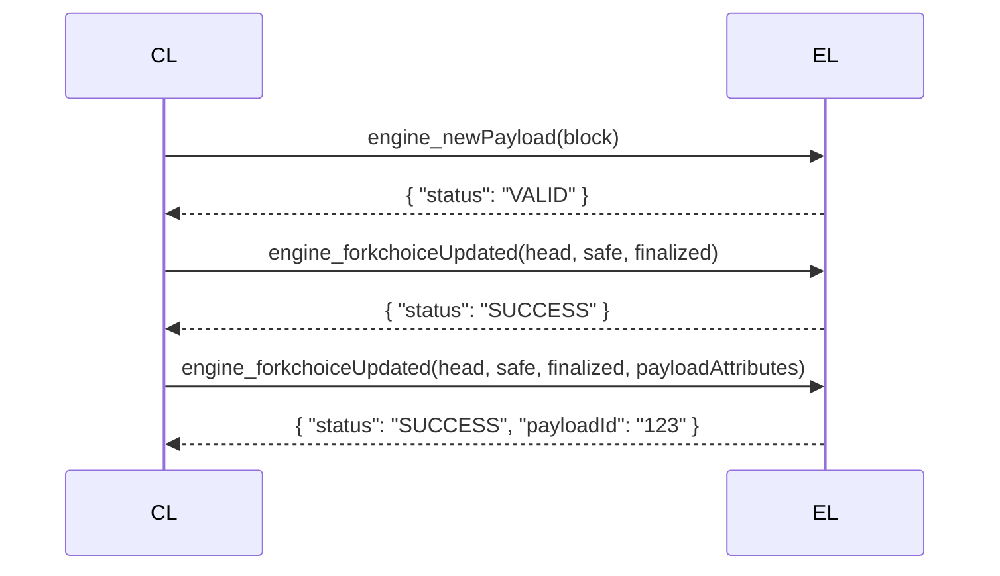

# **Fork Choice and New Payload in Ethereum's Engine API**

## **1. Introduction to Engine API**
The **Engine API** is a critical component of Ethereum's transition to Proof-of-Stake (PoS). It facilitates communication between the **Execution Layer (EL)** and the **Consensus Layer (CL)**. Two key methods in this API are:
- **`engine_forkchoiceUpdated`**  
- **`engine_newPayload`**

These methods ensure that the EL and CL remain synchronized regarding the **canonical chain** and **block execution**.

---

## **2. Fork Choice Mechanism**
The **fork choice rule** determines the **head of the chain** based on:
- **Latest justified block**  
- **Latest finalized block**  
- **Attestations from validators**  

### **Key Concepts**
1. **Head Block** – The block at the tip of the canonical chain.  
2. **Justified Block** – A block with sufficient attestations to be considered valid.  
3. **Finalized Block** – A block that is irreversible (cannot be reorged).  

### **Fork Choice Algorithm (LMD-GHOST)**
- **Latest Message Driven Greediest Heaviest Observed SubTree (LMD-GHOST)**  
- Chooses the chain with the **highest attestation weight**.  

---

## **3. `engine_forkchoiceUpdated`**
This method updates the fork choice and optionally triggers block production.

### **Parameters**
| Field | Type | Description |
|-------|------|-------------|
| `headBlockHash` | `Hash` | Desired chain head. |
| `safeBlockHash` | `Hash` | Last safe block (for reorg protection). |
| `finalizedBlockHash` | `Hash` | Last irreversible block. |
| `payloadAttributes` | `Object` (Optional) | Triggers block building if provided. |

### **Response**
- **Success**: `{ "status": "SUCCESS", "payloadId": "<id>" }`  
- **Error**: `{ "status": "INVALID", "latestValidHash": "<hash>" }`  

### **Use Cases**
1. **Updating Fork Choice Without Payload**  
   ```json
   {
     "jsonrpc": "2.0",
     "method": "engine_forkchoiceUpdated",
     "params": [{
       "headBlockHash": "0xabc...",
       "safeBlockHash": "0xdef...",
       "finalizedBlockHash": "0x123..."
     }],
     "id": 1
   }
   ```
2. **Triggering Block Production**  
   ```json
   {
     "jsonrpc": "2.0",
     "method": "engine_forkchoiceUpdated",
     "params": [{
       "headBlockHash": "0xabc...",
       "safeBlockHash": "0xdef...",
       "finalizedBlockHash": "0x123...",
       "payloadAttributes": {
         "timestamp": "0x5f5e100",
         "prevRandao": "0x1234...",
         "suggestedFeeRecipient": "0xabcd..."
       }
     }],
     "id": 1
   }
   ```

### **Edge Cases**
- **Reorg Handling**: If `finalizedBlockHash` conflicts with local chain, reject update.  
- **Invalid Head Block**: If `headBlockHash` is unknown, return `INVALID`.  

---

## **4. `engine_newPayload`**
This method informs the Execution Layer about a new block.

### **Parameters**
| Field | Type | Description |
|-------|------|-------------|
| `block` | `ExecutionPayload` | The block to be validated. |

### **Response**
- **Valid**: `{ "status": "VALID" }`  
- **Invalid**: `{ "status": "INVALID", "latestValidHash": "<hash>" }`  
- **Syncing**: `{ "status": "SYNCING" }`  

### **Use Case**
```json
{
  "jsonrpc": "2.0",
  "method": "engine_newPayload",
  "params": [{
    "parentHash": "0xabc...",
    "feeRecipient": "0xdef...",
    "stateRoot": "0x123...",
    "receiptsRoot": "0x456...",
    "logsBloom": "0x789...",
    "prevRandao": "0x012...",
    "blockNumber": "0x1",
    "gasLimit": "0x1c9c380",
    "gasUsed": "0x0",
    "timestamp": "0x5f5e100",
    "extraData": "0x",
    "baseFeePerGas": "0x7",
    "blockHash": "0xabc...",
    "transactions": []
  }],
  "id": 1
}
```

### **Edge Cases**
- **Invalid Block**: If block fails execution, return `INVALID`.  
- **Unknown Parent**: If parent block is missing, return `SYNCING`.  

---

## **5. Interaction Between `forkchoiceUpdated` and `newPayload`**
1. **CL sends `newPayload`** → EL validates block.  
2. **CL sends `forkchoiceUpdated`** → EL updates chain head.  
3. **If `payloadAttributes` provided** → EL starts building next block.  

### **Example Flow**


---

## **6. Advanced Topics**
### **Reorg Handling**
- If a **new fork** has higher weight, `forkchoiceUpdated` triggers a **reorg**.  
- EL must **re-execute** transactions if necessary.  

### **Optimistic Sync**
- **CL may send blocks before full validation**.  
- EL marks them as **"optimistic"** until verified.  

### **Performance Considerations**
- **Frequent `forkchoiceUpdated` calls** can slow down EL.  
- **Batched payloads** improve efficiency.  

---

## **7. Code Examples (Rust)**
### **Handling `forkchoiceUpdated`**
```rust
use ethereum_engine_api::EngineApi;

fn handle_forkchoice_updated(
    head: H256,
    safe: H256,
    finalized: H256,
    payload_attrs: Option<PayloadAttributes>,
) -> Result<PayloadId, EngineError> {
    let status = EngineApi::validate_forkchoice(head, safe, finalized)?;
    if let Some(attrs) = payload_attrs {
        let payload_id = EngineApi::start_payload(attrs)?;
        Ok(payload_id)
    } else {
        Ok(PayloadId::zero())
    }
}
```

### **Handling `newPayload`**
```rust
fn handle_new_payload(payload: ExecutionPayload) -> Result<PayloadStatus, EngineError> {
    if EngineApi::is_known_block(payload.parent_hash) {
        let validation_result = EngineApi::execute_block(payload)?;
        match validation_result {
            Valid => Ok(PayloadStatus::valid(payload.block_hash)),
            Invalid => Ok(PayloadStatus::invalid(payload.parent_hash)),
        }
    } else {
        Ok(PayloadStatus::syncing())
    }
}
```

---

## **8. Comparison with Similar Concepts**
| Concept | `engine_forkchoiceUpdated` | `engine_newPayload` | Traditional PoW Mining |
|---------|----------------------------|---------------------|------------------------|
| **Purpose** | Update chain head | Validate new block | Extend longest chain |
| **Trigger** | CL consensus rules | New block from CL | Miner finds nonce |
| **Finality** | Supports finality | Depends on fork choice | Probabilistic |

---

## **9. Best Practices**
1. **Validate payloads before `forkchoiceUpdated`**.  
2. **Handle reorgs gracefully** (rollback state if needed).  
3. **Optimize block execution** for low-latency environments.  

---

## **10. Conclusion**
You now understand:
- The **role of `forkchoiceUpdated` and `newPayload`** in Ethereum PoS.  
- **How fork choice and block execution interact**.  
- **Edge cases and optimizations** for high-performance clients.  

Mastery of these concepts ensures **correct and efficient Ethereum node operation**.