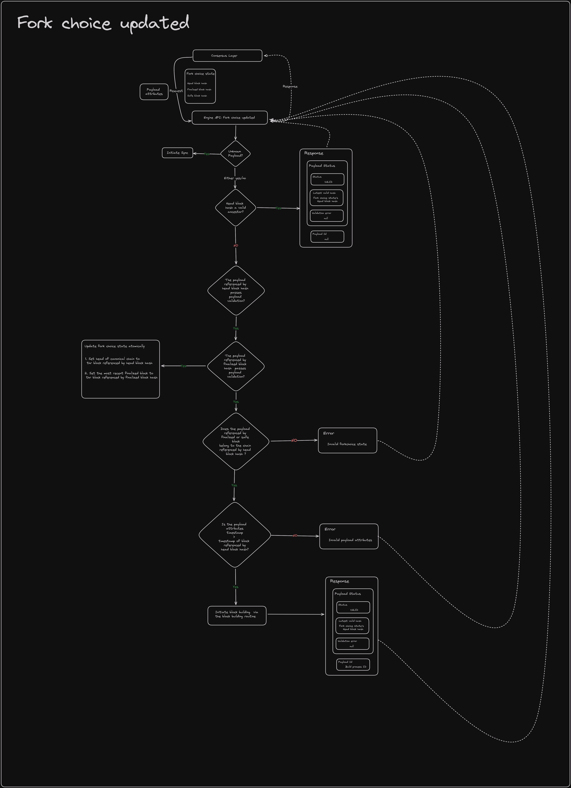

Validates the payload that was built earlier by the payload building routine.

### Fork choice updated

Proof-of-stake LMD-GHOST fork choice rule & payload building routine instantiation.

### Internal Consensus engines
The execution layer has its own consensus engine to work with its own copy of the beacon chain. The execution layer consensus engine is known as ethone and has about half the functionality of the full fledged consensus engine of the consensus layer.

### [Downloader](https://epf.wiki/#/wiki/EL/el-architecture?id=downloader)

### [Transaction Pools](https://epf.wiki/#/wiki/EL/el-architecture?id=transaction-pools)

In Ethereum two primary types of transaction pools are recognized:

1.  **Legacy Pools**: Managed by execution client, these pools employ price-sorted heaps or priority queues to organize transactions based on their price. Specifically, transactions are arranged using two heaps: one prioritizes the effective tip for the upcoming block, and the other focuses on the gas fee cap. During periods of saturation, the larger of these two heaps is selected for the eviction of transactions, optimizing the pool's efficiency and responsiveness. [urgent and floating heaps](https://github.com/ethereum/go-ethereum/blob/064f37d6f67a012eea0bf8d410346fb1684004b4/core/txpool/legacypool/list.go#L525)

2.  **Blob Pools**: Unlike legacy pools, blob pools maintain a priority heap for transaction eviction but incorporate distinct mechanisms for operation. Notably, the implementation of blob pools is well-documented, with an extensive comments section available for review [here](https://github.com/ethereum/go-ethereum/blob/064f37d6f67a012eea0bf8d410346fb1684004b4/core/txpool/blobpool/blobpool.go#L132). A key feature of blob pools is the use of logarithmic functions in their eviction queues.

Note that these examples are using go-ethereum, specific naming and implementation details might differ in various clients while main principles stays the same.

### [EVM](https://epf.wiki/#/wiki/EL/el-architecture?id=evm)

[Wiki - EVM](https://epf.wiki/#/wiki/EL/evm) TODO: Move relevant code from specs into EVM

### [DevP2P](https://epf.wiki/#/wiki/EL/el-architecture?id=devp2p)

[Wiki - DevP2P](https://epf.wiki/#/wiki/EL/devp2p)

### [Data structures](https://epf.wiki/#/wiki/EL/el-architecture?id=data-structures)

More details in the page on [EL data structures](https://epf.wiki/#/wiki/EL/data-structures).

### [Storage](https://epf.wiki/#/wiki/EL/el-architecture?id=storage)

Blockchain and state data processed by execution client need to be stored in the disk. These are necessary to validate new blocks, verify history and to serve peers in the network. Client stores historical data, also called the ancient database, which include previous blocks. Another database of trie structure contains the current state and small number of recent states. In practice, clients keep various databases for different data categories. Each client can implement a different backend to handle this data, e.g. leveldb, pebble, mdbx.

**Leveldb**

TODO

**Pebble**

TODO

**MDBX**.

Read more about its [features](https://github.com/erthink/libmdbx#features). Additionally, boltdb has a page on comparisons with other databases such as leveldb, [here](https://github.com/etcd-io/bbolt#comparison-with-other-databases). The comparative points mentioned on bolt are applicable to mdbx.

### [Resources and References](https://epf.wiki/#/wiki/EL/el-architecture?id=resources-and-references)

-   [Engine Api Spec](https://github.com/ethereum/execution-apis/blob/main/src/engine/paris.md#payload-validation) - [archived](https://web.archive.org/web/20250318111700/https://github.com/ethereum/execution-apis/blob/main/src/engine/paris.md#payload-validation)
-   [Engine API: A Visual Guide](https://hackmd.io/@danielrachi/engine_api) - [archived](https://web.archive.org/web/20241006232802/https://hackmd.io/@danielrachi/engine_api)
-   [Engine API | Mikhail | Lecture 21](https://youtu.be/fR7LBXAMH7g)
-   ["Snapping Snap Sync: Practical Attacks on Go Ethereum Synchronising Nodes" (ETH Zurich)](https://appliedcrypto.ethz.ch/content/dam/ethz/special-interest/infk/inst-infsec/appliedcrypto/research/TavernaPaterson-SnappingSnapSync.pdf)
-   [Geth Docs -- Sync Modes](https://geth.ethereum.org/docs/fundamentals/sync-modes?utm_source=chatgpt.com) - [archived](https://web.archive.org/web/20240505050000/https://geth.ethereum.org/docs/fundamentals/sync-modes)
-   [YouTube -- "How to Sync an Ethereum Node with Snap Sync"](https://www.youtube.com/watch?v=fk50UbUgkMM)
-   [Ethereum.org -- Execution Layer Sync Modes](https://ethereum.org/en/developers/docs/nodes-and-clients/#execution-layer-sync-modes) - [archived](https://web.archive.org/web/20240507022042/https://ethereum.org/en/developers/docs/nodes-and-clients/#execution-layer-sync-modes)