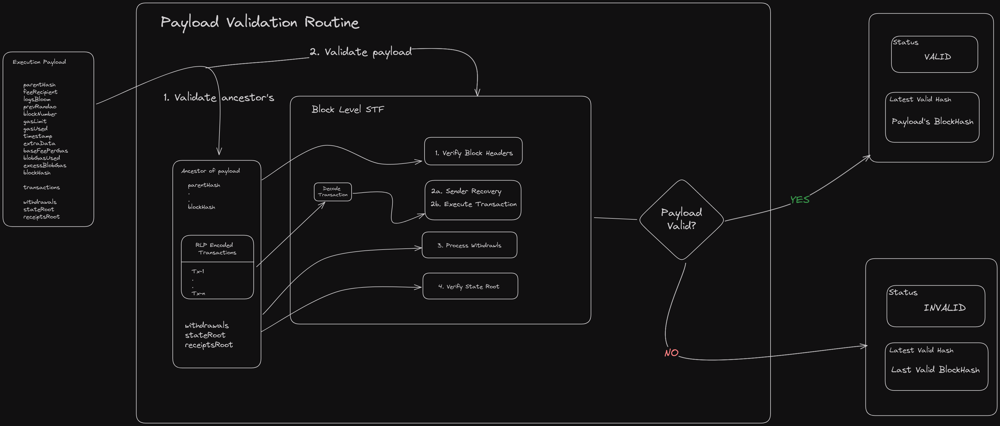

The client's architecture is built around a variety of specific standards, each of which plays a unique role in the overall functionality. The execution engine is located at the top, driving the execution layer, which in turn is driven by the consensus layer. The execution layer runs on top of **DevP2P**, the networking layer, which is initialized by providing legitimate boot nodes that provide an initial access point into the network. When we call one of the engine API methods, such as fork choice updated, we can download blocks from peers by subscribing to topics like our preferred mode of sync.

### [Exchange of Capabilities](https://epf.wiki/#/wiki/EL/el-architecture?id=exchange-of-capabilities)

Before regular operation begins, the CL and EL perform a capability exchange via the `engine_exchangeCapabilities` method. This step negotiates the supported Engine API method versions between the clients, ensuring that both parties operate using a common protocol version (e.g., V1, V2, V3). This exchange is critical to ensure compatibility and to enable new features while maintaining backward compatibility.

**Happy Path Flow -- Node Startup and Validator Operation:**

1.  **Node Startup:**

    -   The CL calls `engine_exchangeCapabilities` to share a list of supported Engine API methods and versions with the EL.
    -   The EL responds with its own list of supported methods.
    -   Next, the CL sends an initial `engine_forkchoiceUpdated` call (with no payload attributes) to inform the EL of the current fork choice.
    -   If the EL is still catching up, it returns a status of SYNCING. Once caught up, it responds with VALID.
2.  **Validator Operation:**

    -   In every slot, the CL sends an `engine_forkchoiceUpdated` call to update the EL's state.
    -   When the validator is assigned to propose a block, the CL includes payload attributes in the fork choice update to trigger block building.
    -   The EL returns a payload status along with a `payloadId` that the CL later uses with `engine_getPayload` to retrieve the built execution payload.
    -   Separately, when the validator receives a beacon block from the network (proposed by another validator), the CL extracts the execution payload and calls `engine_newPayload` on the EL to validate the payload.

    #### [Routines](https://epf.wiki/#/wiki/EL/el-architecture?id=routines)

##### [Payload validation](https://epf.wiki/#/wiki/EL/el-architecture?id=payload-validation)

Payload is validated with respect to the block header and execution environment rule sets:

With the merge, the function of the execution layer has been altered within the Ethereum network. Previously, it was tasked with the responsibility of managing the consensus of the blockchain, ensuring the correct order of blocks, as well as handling reorganizations. However, after the merge, these tasks have been delegated to the consensus layer, resulting in a significant simplification of the execution layer. Now, we can conceptualize the execution layer as primarily carrying out the state transition function.

During *process execution payload* , we begin by conducting several high-level checks, including verifying the accuracy of the parent hash and validating the timestamp. Additionally, we perform various lightweight verifications. Subsequently, we transmit the payload to the execution layer, where it undergoes block verification. The notify payload function, is the lowest level function that serves as the interface between the consensus layer and the execution engine. It contains only the function's signature, without any implementation details. Its sole purpose is to transmit the execution payload to the execution engine, which acts as the client for the execution layer. The execution engine then carries out the actual state transition function, which involves verifying the accuracy of block headers and ensuring that transactions are correctly applied to the state. The execution engine will ultimately return a boolean value indicating whether the state transition was successful or not. From the standpoint of the consensus layer, this is simply the validation of blocks.

This is a simplified description of the block level state transition function (stf) in go. The stf is a crucial component of the block validation and insertion pipeline. Although the example is specific to Geth, it represents the functioning of the stf in other clients as well. It is worth mentioning that the state transition function is rarely referred to by its name in the code of different clients, save for the EELS python spec client. This is because its real operations are divided across many components of the client's architecture.

##### Transaction Execution in Geth

Geth, like other Ethereum execution clients, processes transactions by verifying signatures, checking nonces, deducting gas fees, and updating the state. Transactions first enter the mempool, where they wait to be included in a block. Once picked up, Geth executes them, modifying account balances, contract storage, and other state data.

🔗 [Transaction Execution Specs Code](https://github.com/ethereum/execution-specs/blob/0f9e4345b60d36c23fffaa69f70cf9cdb975f4ba/src/ethereum/shanghai/fork.py#L542)

#### Block Processing & State Updates

Every new block contains multiple transactions that Geth processes in order. Once all transactions are executed, the final state is committed, and a state root hash is stored to ensure consistency. This process follows a defined set of rules to maintain network integrity.

🔗 [State Transition Code](https://github.com/ethereum/execution-specs/blob/0f9e4345b60d36c23fffaa69f70cf9cdb975f4ba/src/ethereum/shanghai/fork.py#L145)

#### Networking & Peer-to-Peer Communication
Ethereum nodes communicate using DevP2P, a protocol that allows execution clients to exchange transactions and blocks. When a new transaction is sent, it propagates across the network through peer-to-peer connections, ensuring all nodes remain in sync. Each recipient verifies the transaction before forwarding it, preventing spam and invalid state transitions.

🔗[DevP2P Specification](https://github.com/ethereum/devp2p/blob/master/caps/eth.md)