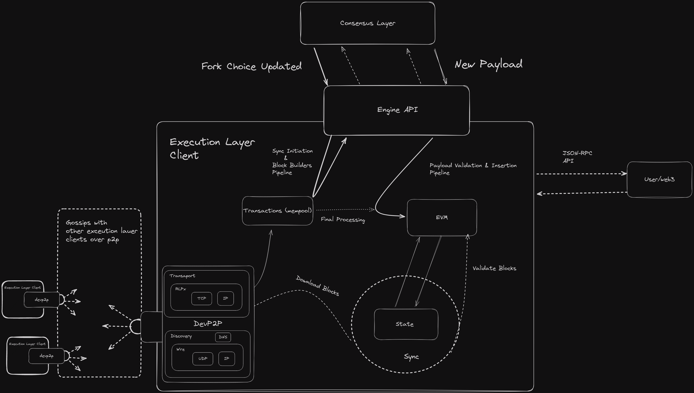

The client's architecture is built around a variety of specific standards, each of which plays a unique role in the overall functionality. The execution engine is located at the top, driving the execution layer, which in turn is driven by the consensus layer. The execution layer runs on top of **DevP2P**, the networking layer, which is initialized by providing legitimate boot nodes that provide an initial access point into the network. When we call one of the engine API methods, such as fork choice updated, we can download blocks from peers by subscribing to topics like our preferred mode of sync.

### [Exchange of Capabilities](https://epf.wiki/#/wiki/EL/el-architecture?id=exchange-of-capabilities)

Before regular operation begins, the CL and EL perform a capability exchange via the `engine_exchangeCapabilities` method. This step negotiates the supported Engine API method versions between the clients, ensuring that both parties operate using a common protocol version (e.g., V1, V2, V3). This exchange is critical to ensure compatibility and to enable new features while maintaining backward compatibility.

**Happy Path Flow -- Node Startup and Validator Operation:**

1.  **Node Startup:**

    -   The CL calls `engine_exchangeCapabilities` to share a list of supported Engine API methods and versions with the EL.
    -   The EL responds with its own list of supported methods.
    -   Next, the CL sends an initial `engine_forkchoiceUpdated` call (with no payload attributes) to inform the EL of the current fork choice.
    -   If the EL is still catching up, it returns a status of SYNCING. Once caught up, it responds with VALID.
2.  **Validator Operation:**

    -   In every slot, the CL sends an `engine_forkchoiceUpdated` call to update the EL's state.
    -   When the validator is assigned to propose a block, the CL includes payload attributes in the fork choice update to trigger block building.
    -   The EL returns a payload status along with a `payloadId` that the CL later uses with `engine_getPayload` to retrieve the built execution payload.
    -   Separately, when the validator receives a beacon block from the network (proposed by another validator), the CL extracts the execution payload and calls `engine_newPayload` on the EL to validate the payload.

    #### [Routines](https://epf.wiki/#/wiki/EL/el-architecture?id=routines)

##### [Payload validation](https://epf.wiki/#/wiki/EL/el-architecture?id=payload-validation)

Payload is validated with respect to the block header and execution environment rule sets: