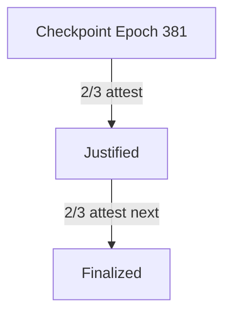

# **Ethereum Consensus Layer – Complete Reference**

---

## **Overview**

The Consensus Layer (CL) is responsible for ensuring Ethereum's nodes agree on the current state of the blockchain. Since Ethereum’s transition from Proof of Work (PoW) to Proof of Stake (PoS) via *The Merge*, the CL now governs block proposals, attestations, finality, validator rewards/penalties, and fork choice.

---

## **Core Concepts**

### **1. Proof of Stake (PoS)**

* Validators are randomly selected to propose blocks and attest to blocks.
* Security is guaranteed by economic penalties (slashing, inactivity leaks).
* Introduced in Ethereum via the Beacon Chain.

```plaintext
Consensus = Execution Layer (EL) + Consensus Layer (CL)
```

---

## **2. Beacon Chain**

The Beacon Chain is the backbone of Ethereum’s consensus. It tracks:

* Validators & balances
* Epochs & slots
* Finality checkpoints

### **Data Structures**

* **Slot** (12s): A time unit in which one validator is selected to propose a block.
* **Epoch** (32 slots): A batch of slots (6.4 minutes).

```go
// Beacon Block (simplified)
struct BeaconBlock {
    Slot slot;
    ValidatorIndex proposer_index;
    BeaconBlockBody body;
}
```

---

## **3. Validator Lifecycle**

### **Lifecycle Stages**

1. **Deposit** on the Execution Layer (32 ETH).
2. **Activation** in the CL (after inclusion and delay).
3. **Attesting/Proposing** duties.
4. **Exit** (voluntary or penalized).
5. **Withdrawal** (partial or full).

### **Real-world command with Lighthouse:**

```bash
lighthouse account validator deposit --amount 32 --network mainnet
```

---

## **4. Attestations**

* Validators vote on the head of the chain and finality checkpoints.
* Contains:

  * `source` (justified checkpoint)
  * `target` (epoch)
  * `head` (current best block)

```json
{
  "attestation": {
    "aggregation_bits": "...",
    "data": {
      "slot": 123456,
      "index": 0,
      "beacon_block_root": "0xabc...",
      "source": { "epoch": 380, "root": "0x..." },
      "target": { "epoch": 381, "root": "0x..." }
    },
    "signature": "0x..."
  }
}
```

---

## **5. Fork Choice Rule**

### **LMD GHOST (Latest Message Driven – Greediest Heaviest Observed SubTree)**

* Uses most recent attestations from validators.
* Finds the head with the most support.

```text
O(n) where n = number of validators
```

---

## **6. Finality: Casper FFG**

### **Justification and Finalization**

* Two-thirds of validators must attest to a checkpoint for it to be justified.
* If two consecutive checkpoints are justified, the first is finalized.



---

## **7. Rewards and Penalties**

| **Event**        | **Effect**             |
| ---------------- | ---------------------- |
| Block Proposal   | + Rewards              |
| Attestation      | + Rewards              |
| Incorrect Vote   | - Penalty              |
| Missed Duties    | - Penalty              |
| Slashing Offense | - Major Penalty & Exit |

```bash
# Check validator performance
beacon-chain-client validator status
```

---

## **8. Slashing**

Occurs when:

* Double voting (attesting two different blocks in same slot).
* Surround voting (attesting to blocks that contradict prior votes).

### **Slashing Penalty**

* Immediate large ETH loss.
* Ejection from validator set.
* Broadcast to peers.

---

## **9. Inactivity Leak**

When finality halts (e.g. 33% go offline), penalties increase over time to force liveness.

```text
Penalty = base_penalty × inactivity_score
```

---

## **10. Synchronization Mechanisms**

* **Sync Committees**: Help light clients sync efficiently with signatures over block roots.
* **Weak Subjectivity**: Clients need trusted checkpoint to avoid long-range attacks.

---

## **11. Clients & Diversity**

### **Consensus Clients**

* **Lighthouse** (Rust)
* **Prysm** (Go)
* **Teku** (Java)
* **Nimbus** (Nim)
* **Lodestar** (TypeScript)

```bash
# Start Lighthouse Beacon Node
lighthouse bn --network mainnet
```

### **Execution Layer Clients**

* **Geth**, **Nethermind**, **Besu**, **Erigon**

**→ You must run both EL + CL clients + Engine API connection**

---

## **12. MEV & Proposer-Builder Separation (PBS)**

* MEV = Maximum Extractable Value.
* **PBS** decouples block proposal and block building to reduce centralization.

### Real-World Project:

* **Flashbots' MEV-Boost**

```bash
mev-boost --relay https://your-relay.com
```

---

## **13. Real-World Events**

| **Event**        | **Date**      | **Impact**                           |
| ---------------- | ------------- | ------------------------------------ |
| The Merge        | Sept 15, 2022 | PoW → PoS                            |
| Shapella Upgrade | Apr 12, 2023  | Enabled withdrawals                  |
| Deneb-Cancun     | 2024/2025     | Adds EIP-4844 (blob txs for rollups) |

---

## **14. Debugging / Monitoring**

* **Prometheus/Grafana** for metrics
* Logs: `journalctl -u beacon-node`
* **Block explorers**: BeaconScan, beaconcha.in

---

## **15. Comparisons**

### **PoS vs PoW**

| Feature        | Proof of Stake              | Proof of Work      |
| -------------- | --------------------------- | ------------------ |
| Energy Usage   | Low                         | High               |
| Finality       | Probabilistic + Checkpoints | Probabilistic only |
| Security Model | Economic stake              | Computational work |
| Centralization | Potentially higher          | Hardware dependent |
| Attack Vector  | Long-range + Slashing       | 51% attack         |

---

## **Edge Cases**

* **Long-range attacks**: Mitigated with weak subjectivity.
* **Finality delays**: Inactivity leaks kick in.
* **Time drift**: Clients reject out-of-bound timestamps.
* **Slashing collateral damage**: Network partition or client bug.

---

## **Code: Beacon Block JSON Sample**

```json
{
  "slot": "10051234",
  "proposer_index": "2392",
  "parent_root": "0xabc...",
  "state_root": "0xdef...",
  "body": {
    "randao_reveal": "0x...",
    "eth1_data": {...},
    "proposer_slashings": [],
    "attester_slashings": [],
    "attestations": [...],
    "deposits": [...],
    "voluntary_exits": []
  }
}
```

---

## **Complexity Analysis**

| Component               | Complexity       |
| ----------------------- | ---------------- |
| Fork Choice (LMD-GHOST) | `O(n)`           |
| Attestation Inclusion   | `O(n)`           |
| Finality Tracking       | `O(1)` per epoch |
| Validator Rotation      | `O(log n)`       |

---

## **Pros and Cons of PoS (Ethereum)**

| **Pros**                     | **Cons**                           |
| ---------------------------- | ---------------------------------- |
| Energy efficient             | Higher barrier to decentralization |
| Encourages economic security | Slashing complexity                |
| Rapid finality (12 mins)     | Long-range attacks                 |
| Reduced hardware needs       | Requires uptime for validators     |

---

## **Real-World Tools & Projects**

* **Lighthouse** – consensus client
* **Flashbots / MEV-Boost** – PBS relays
* **Diva Staking / Rocket Pool** – decentralized staking
* **Grafana Dashboards** – validator monitoring

---

## **Next Steps Suggestion**

→ **Advanced Topic**:
**“Proposer-Builder Separation (PBS) and MEV on Ethereum”**
Explore the architecture, role of relays/builders, censorship resistance, implementation details, and future directions (e.g., inclusion lists, enshrined PBS).


