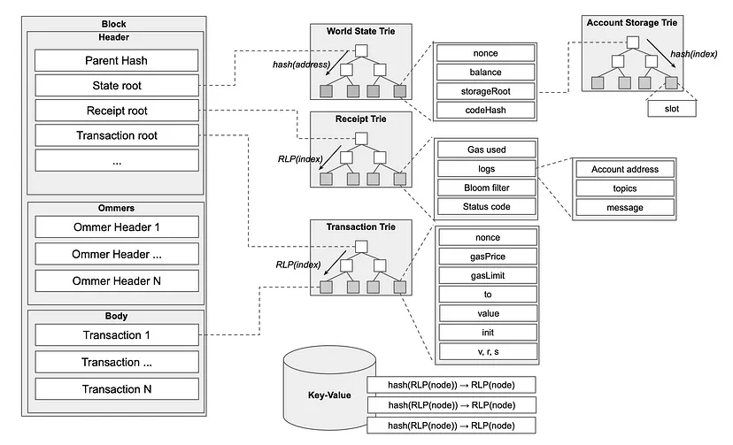
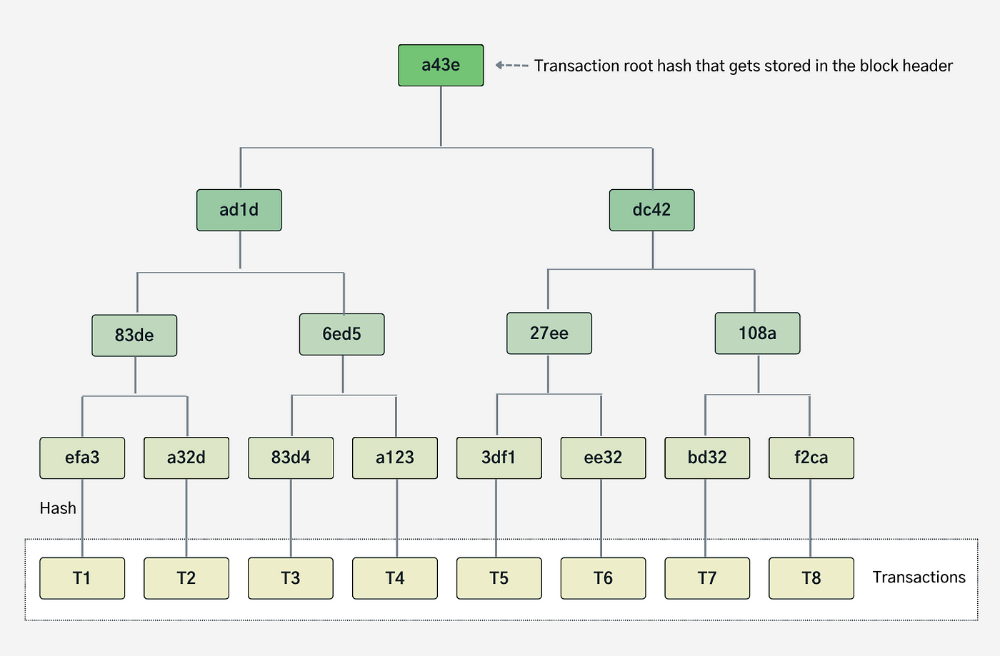
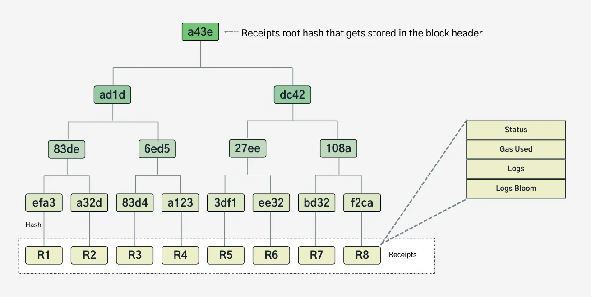
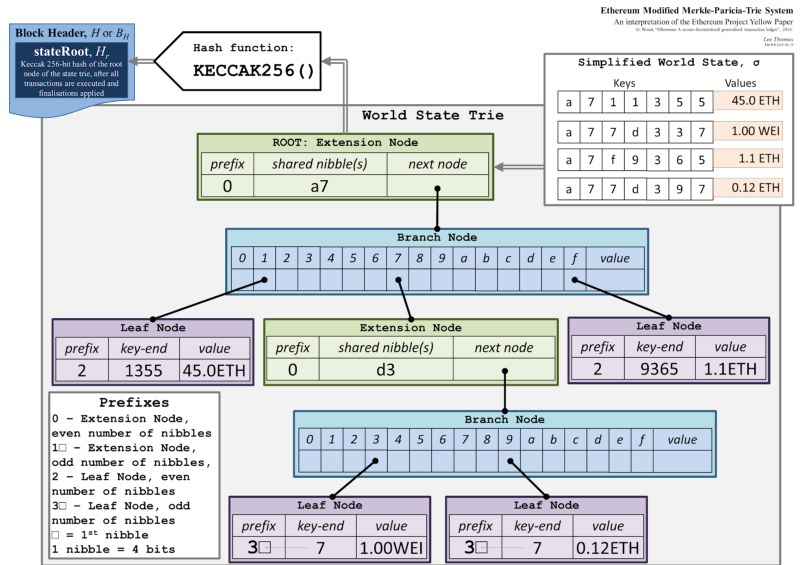

Ethereum state is stored in four different modified Merkle Patricia Tries (MMPTs):

-   Transaction Trie
-   Receipt Trie
-   World State Trie
-   Account State Trie

At each block there is one transaction, receipt, and state trie which are referenced by their root hashes in the block Header. For every contract deployed on Ethereum there is a storage trie used to hold that contract's persistent variables, each storage trie is referenced by their root hash in the state account object stored in the state trie leaf node corresponding to that contract's address.

Transaction Trie
----------------------------------------------------------------------------------

The Transaction Trie is a data structure responsible for storing all the transactions within a specific block. Every block has its own Transaction Trie, corresponding to the respective transactions that are included in that block. Ethereum is a transaction based state machine. This means every action or change in Ethereum is due to a transaction. Every block is made up of a block header and a transaction list(among other things). Thus, once a transaction is executed and a block is finalized the transaction trie for that block can never be changed.(in contrast to the World State trie).

A transaction is mapped in the trie so that the key is a transaction index and the value is the transaction T . Both the transaction index and the transaction itself are RLP encoded. It compose a key-value pair, stored in the trie: `𝑅𝐿𝑃 (𝑖𝑛𝑑𝑒𝑥) → 𝑅𝐿𝑃 (𝑇)`

The structure `T` consists of the following:

-   **Nonce**: For every new transaction submitted by the same sender, the nonce is increased. This value allows for tracking order of transactions and prevents replay attacks.
-   **maxPriorityFeePerGas** \- The maximum price of the consumed gas to be included as a tip to the validator.
-   **gasLimit**: The maximum amount of gas units that can be consumed by the transaction.
-   **maxFeePerGas** \- the maximum fee per unit of gas willing to be paid for the transaction (including baseFeePerGas and maxPriorityFeePerGas).
-   **from** -- The address of the sender, that will be signing the transaction. This must be an externally-owned account as contract accounts cannot send transactions.
-   **to**: Address of an account to receive funds, or zero for contract creation.
-   **value**: amount of ETH to transfer from sender to recipient.
-   **input data**: optional field to include arbitrary data.
-   **data**: Input data for a message call together with the message signature.
-   **(v, r, s)**: Values encoding signature of a sender. Serves as identifier of the sender.

Receipt Trie
--------------------------------------------------------------------------

The Receipt Trie is similar to the Transaction Trie in that it is a block level data structure, and each leaf of the trie represents some RLP-encoded data related to the transaction. However, the Receipt Trie is used to verify that the instructions in each transaction were actually executed. This verification data is held in the leaf node and contains a few fields, which are described in the [transaction anatomy](https://epf.wiki/#/wiki/EL/transaction?id=receipts) section of the wiki.

In this section, we will focus on the `Receipt Trie` itself.

The `ReceiptRoot` of the `Receipt Trie` is the keccak 256-bit hash of the root node.

Here is a simple diagram of a Receipt Trie, which follows the Merkle Patricia Trie flow for value lookups.

If you know the index of a transaction in a block, you can easily find it's corresponding receipt in the `Receipt Trie`. This is because the transaction's position (index) in a block is used as the key in the `Receipt Trie`'s leaf node containing the receipt for that transaction. Using the transaction's index as the receipt's key provides some nice benefits such as avoiding needing to calculate or look up transaction hashes to locate receipts in the trie.

The primary role of the receipts trie is to provide a canonical, authenticated record of transaction results, primarily used for indexing historical data without having to re-execute transactions. During snap sync, full nodes download block bodies --- which contain both transactions and their corresponding receipts --- and locally reconstruct the receipt trie for each block. The reconstructed trie is then validated against the receiptsRoot in the block header. Snap sync avoids the need for full nodes to re-execute historical transactions solely to regenerate receipts, significantly accelerating the sync process.

While receipts enable light clients to verify transaction outcomes via Merkle proofs against the receiptsRoot, this is a secondary use. Since light clients only store block headers, they rely on full nodes to query for these proofs and `receiptsRoot`. This structure allows light clients to independently verify the legitimacy of the data without storing the full transaction history.

World State Trie
----------------------------------------------------------------------------------

The **World State Trie** is the core data structure that represents Ethereum's current state. It maps the keccak-256 hashed 20 byte account addresses to their RLP encoded states utilizing a **Merkle Patricia Trie** where the key-value pairs are stored as byte arrays to byte arrays in the leaves of the trie.

Accounts can be categorized as either smart contract accounts with code or Externally Owned Accounts (EOAs) associated with private keys. EOAs are used to initiate transactions with other EOAs or smart contract accounts, triggering the execution of the associated contract code.

Each account consists of the following fields:

-   **Nonce**: A scalar value identifying the number of transactions successfully sent from this account.
-   **Balance**: The amount of ETH in Wei owned by this account.
-   **Code Hash**: The hash of the EVM code if it's a contract account. For EOAs, it's the keccak-256 hash of an empty string `(keccak256(''))`, which uniquely identifies the account as an EOA.
-   **Storage Root Hash**: The 32 byte hash that points to the root of the account's ***Storage Trie***, which would be an empty trie for an EOA.

The **World State Trie** is not stored in the chain, but the 32-byte keccak-256 **state root** of the trie is stored in every block header after all transactions in a block have been processed. The **state root** is used as a cryptographic commitment for the entire system state since it's cryptographically dependent on all the data in the trie. For example, a node can prove an account's existence given the **state root** and a **Merkle proof** containing the account and it's sibling nodes needed to recreate the **state root**. Furthermore, the **state root** in each block anchors Ethereum's consensus: any node can independently compute or verify this root by applying the block's transactions to the previous state trie.

Below is a simplified diagram of the ***World State Trie***.

Let's traverse the trie to find the account with a **45 ETH** balance. The key for this account is shown as `a711355`, meaning these seven hex digits direct us from the root node down to the leaf node.

> This short key `a711355` is just for demonstration. Actual addresses in Ethereum get hashed (32 bytes) and thus typically yield up to 64 nibbles in the trie. But the traversal steps are the same---each nibble selects the next branch/extension node until we arrive at the leaf node storing the final account data.

1.  **Key to Nibbles**

    -   The key string `a711355` represents seven hex digits: `a`, `7`, `1`, `1`, `3`, `5`, `5`.
    -   Each digit is a nibble (4 bits), so the entire key is a sequence of seven nibbles.
2.  **Path Through the Trie**

    -   **Extension node** at the root might store a prefix like `a7`, consuming the first two nibbles.
    -   **Branch node** follows, allowing navigation by each subsequent nibble (`1`, `1`, `3`, `5`, `5`).
3.  **Leaf Node**

    -   Consuming all nibbles brings us to the **leaf node**. In our simplified example, its stored value is **"45 ETH"**.
    -   In Ethereum's real MPT, this leaf node actually holds the RLP-encoded account object `[nonce, balance, storageRoot, codeHash]`.

### [Persistent Storage](https://epf.wiki/#/wiki/EL/data-structures?id=persistent-storage)

The **World State Trie** is a living structure that evolves with each block, unlike the transaction and receipt tries which are rebuilt from scratch for every block. Ethereum operates as a state machine, where the current state is updated by executing transactions in a block. Each node must track this current state to verify transactions and update it accordingly. Therefore, intermediate states exist during block processing, but nodes retain only the final post-block state. A full node will keep track of the current state of the **World State Trie** and enough trie nodes required to rewind during a re-org. Archival nodes will keep track of all previous states since genesis.

In summary, Ethereum's world state is a secure and verifiable representation of the current state of all accounts at a given block height.

Storage Trie
--------------------------------------------------------------------------

In the previous section, we described how each account leaf in the **World State Trie** contains a `storageRoot`, which is the keccak-256 hash of the root node of a separate Merkle Patricia Trie, the **Storage Trie**. This trie is not embedded in the **World State Trie** but referenced via the `storageRoot`, enabling storage to be updated and proven independently while still contributing to the global state root.

The **Storage Trie** represents a contract's persistent state as a mapping of 256-bit storage slots indices (keys) to 256-bit RLP-encoded values. Each such key-value pair is referred to as a storage slot. Like the **World State Trie**, it uses a secure key scheme where each slot index is hashed with keccak-256 before insertion. This prevents attackers from crafting keys that cause long traversal paths or highly unbalanced trie structures, which could otherwise be exploited for DOS attacks by inducing excessive computation during trie lookups or updates.

> While high-level languages (e.g., Solidity) define how contract variables are laid out across storage slots, this layout abstraction originates in the language itself. The execution layer merely implements this abstraction. At the EL layer level, the trie treats all slots as uniform key-value entries.

Each account has its own **Storage Trie**, which starts as an empty trie. The trie is modified via the `SSTORE` opcode and read via `SLOAD` during contract execution. For EOAs, the storage trie remains empty and is never accessed. These opcodes are defined in the EVM and described further in the [EVM documentation's storage section](https://epf.wiki/#/wiki/EL/evm?id=evm-data-locations).

To retrieve the value of a storage slot (e.g., index `0x00`) from the leaf of **Storage Trie**:

1.  RLP-encode the slot index and keccak-256 hash the result.
2.  Use the resulting hash as a key to traverse the trie, starting at `storageRoot`.
3.  Follow the path using the nibbles of the hash to reach the corresponding leaf node.
4.  Extract and decode the RLP-encoded value stored at the leaf.

Proofs can be constructed from the nodes along this path to verify a slot's value against the `storageRoot`.

In summary, the **Storage Trie** is fundamental to Ethereum's account model, providing each contract with its own isolated and verifiable storage space. Unlike the **World State Trie**, which maps addresses to account metadata, the **Storage Trie** maintains contract-specific key-value state across blocks.