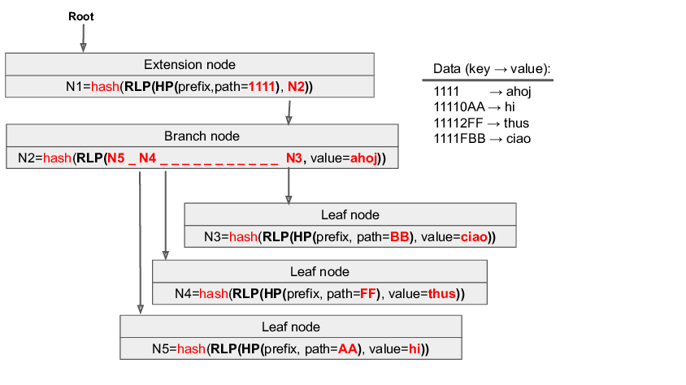

Now that we have a fair understanding of both Merkle Trees and Patricia Tries, we can dive into Ethereum's primary data structure for storing the execution layer state, the **Merkle Patricia Trie** (pronounced "try"). It is named so, since it is a Merkle tree that uses features of PATRICIA (Practical Algorithm To Retrieve Information Coded in Alphanumeric), and because it is designed for efficient data retrieval of items that comprise the Ethereum state.

-   From Merkle Trees, it inherits the cryptographic verification properties where each node contains hashes of its children.
-   From Patricia Tries, it inherits efficient key-value storage and retrieval capabilities through prefix-based node organization.

There are three types of nodes within the MPT:

-   **Branch Nodes**: A branch node consists of a 17-element array, which includes one node value and 16 branches. This node type is the primary mechanism for branching and navigating through the trie.
-   **Extension Nodes**: These nodes function as optimized nodes within the MPT. They come into play when a branch node has only one child node. Instead of duplicating the path for every branch, the MPT compresses it into an extension node, housing both the path and the child's hash.
-   **Leaf Nodes**: A leaf node represents a key-value pair. The value is the MPT node's content, while the key is the node's hash. Leaf nodes store specific key-value data.

Every single node has a hash value. The node's hash is calculated as the SHA-3 hash value of its contents. This hash also acts as a key to refer that specific node. Nibbles serve as the distinguishing unit for key values in the MPT. It represents a single hexadecimal digit. Each trie node can branch out to as many as 16 offshoots, ensuring a concise representation and efficient memory usage.

The following diagram illustrates how traversal and hashing work together in the MPT. As an example of data retrieval from a leaf node, let's obtain the value `hi` using the key `11110AA`.

### 1. Start at the Root (Extension Node in this Scenario)

-   The key we are searching for is `11110AA`.
-   The root node is an **extension node** because all keys in this trie share the common prefix `1111`.
    -   Instead of storing `1111` across multiple branch nodes, it is compressed into a single edge, making the lookup more efficient.
-   The extension node's hash is the root hash and is computed as: `N1 = hash(RLP(HP(prefix, path=1111), N2))`.
    -   Since `N1` depends on `N2`, any change in `N2` would alter the root hash.

### [**2\. Navigate to the Branch Node (N2)**](https://epf.wiki/#/wiki/EL/data-structures?id=_2-navigate-to-the-branch-node-n2)

-   After `1111`, the next hex character in our key (`11110AA`) is `0`, so we take the `0` branch from `N2`, which leads us to **leaf node (`N5`)**.
-   The branch node's hash is computed as: `N2 = hash(RLP(N5, ...))`.
    -   Since `N2` depends on `N5`, any modification to `N5` affects `N2`, which in turn affects `N1`.

### [**3\. Arrive at the Leaf Node (N5)**](https://epf.wiki/#/wiki/EL/data-structures?id=_3-arrive-at-the-leaf-node-n5)

-   `N5` is a **leaf node** where the search ends.
-   The leaf node stores:
    -   **Prefix**: `AA` (the remaining unique part of the key after `11110`).
    -   **Value**: `"hi"`.

> This [excellent post](https://easythereentropy.wordpress.com/2014/06/04/understanding-the-ethereum-trie/) explains PATRICIA trie in detail along with a [python implementation](https://github.com/ebuchman/understanding_ethereum_trie) for practice.