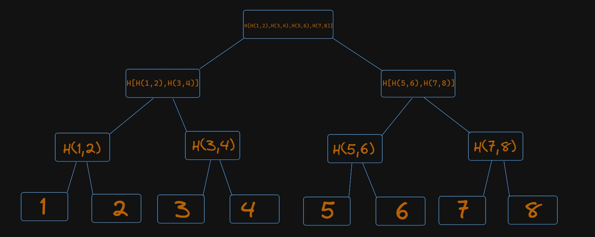

Merkle tree is a hash-based data structure which is very efficient at data integrity and verification. It is a tree based structure where the leaf nodes hold the data values and each non-leaf node is a hash of its child nodes.

A Merkle tree stores all the transactions in a block by producing a digital fingerprint of the entire set of transactions. It allows the user to verify whether a transaction is included in a block or not. Merkle trees are created by repeatedly calculating hashing pairs of nodes until there is only one hash left. This hash is called the **Merkle Root**, or the Root Hash. The Merkle Trees are constructed in a bottom-up approach.

It is important to note that Merkle trees are in a **binary tree**, so it requires an even number of leaf nodes. If there is an odd number of transactions, the last hash will be duplicated once to create an even number of leaf nodes.

Merkle Trees provide a tamper-proof structure to store transaction data. Hash functions have an Avalanche Effect i.e. a small change in the data will result in a huge change in the resulting hash. Hence, if the data in the leaf nodes are ever modified, the Root Hash will not match the expected value. You can try out [SHA-256](https://emn178.github.io/online-tools/sha256.html) hashing function yourself as well. To learn more about Hashing, you may refer to [this](https://github.com/ethereumbook/ethereumbook/blob/develop/04keys-addresses.asciidoc).

Merkle Root is stored in the **Block Header**. Read more about the structure of a Block inside Ethereum (*will be linked this to relevant doc once its ready*)

The main parent node is called Root, hence the hash inside is Root Hash. There is an infinitesimally small chance(1 in 1.16x10^77 for a single SHA-256 hash) to create two different states with the same root hash, and any attempt to modify state with different values will result in a different state root hash.

The image below depicts a simplified version of the working of a Merkle Tree:

-   The leaf nodes contain the actual data(for simplicity, we have taken numbers).
-   Every non-leaf node is a hash of its children.
-   The first level of non-leaf nodes contains the Hash of its child leaf nodes. `Hash(1,2)`
-   The same process continues till we reach the top of the tree, which the Hash of all the previous Hashes. `Hash[Hash[Hash(1,2),Hash(3,4)],Hash[Hash(5,6),Hash(7,8)]]`

More on [Merkle Trees in Ethereum](https://blog.ethereum.org/2015/11/15/merkling-in-ethereum)

