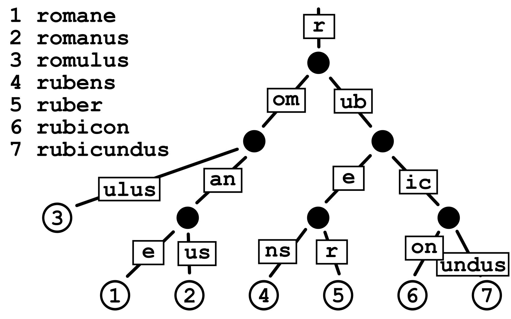

Patricia Tries (also called Radix tree) are n-ary trees that, unlike Merkle Trees, are used for efficient storage of data instead of verification.

Simply put, Patricia Tries is a tree data structure where:

-   The number of children of each node is at most the radix r of the radix trie, where r = 2^x for some integer x ≥ 1.
-   Unlike regular trees, edges can be labeled with sequences of characters, making the structure much more space-efficient.
-   Each node that is the only child is merged with its parent, which is also more space efficient compared to a Merkle Tree for example.

A simple diagram will display how Patricia Trie traversal works. Suppose we are searching for the value associated with the key "romulus". The value will be held at the leaf node.

-   Unlike a regular trie, where data might be stored in intermediary nodes, Patricia Tries store values only in leaf nodes. This improves space efficiency and makes cryptographic verification easier.

1.  Start at the root node, which serves as the entry point, and contains "r", which will be the starting prefix for all stored keys.
2.  Follow the edge labels (compressed path representation) such as "om". Patricia Trie merges common prefixes into a single edge instead of how standard tries store each character in a separate node. This prefix compression makes the trie more compact leading to storage efficiency and efficient lookups.
3.  Continue traversing until a leaf node for the key "romulus" is reached to obtain the value.