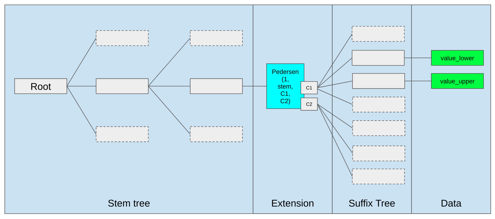

[Verkle Trees](https://epf.wiki/#/wiki/EL/data-structures?id=verkle-trees)
--------------------------------------------------------------------------

[Verkle tree](https://verkle.info/) is a new data structure that is being proposed to replace the current Merkle Patricia Trie. Named by combining the "Vector commitment" and "Merkle Tree", it is designed to be more efficient and scalable than the current MPT. It is a trie-based data structure that replaces the heavy witness used in the MPT with a lightweight witness. Verkle trees are the key part of The Verge upgrade of [Ethereum Roadmap](https://ethereum.org/en/roadmap/#what-about-the-verge-splurge-etc). They can enable [stateless](https://ethereum.org/en/roadmap/statelessness/#statelessness) clients to be more efficient and scalable.

### [Structure of Verkle Tree](https://epf.wiki/#/wiki/EL/data-structures?id=structure-of-verkle-tree)

The layout structure of a Verkle tree is just like a MPT but with different base of the tree i.e. number of children. Just like [MPT](https://ethereum.org/en/developers/docs/data-structures-and-encoding/patricia-merkle-trie/#optimization) it has root node, inner nodes, extension nodes and leaf nodes. There a slight difference in the key size, on which the tree is made. MPT uses 20 byte key which Verkle tree uses 32 byte key in which the 31 bytes are used as a stem of the tree while last 1 byte is used for storage with almost the same stem address or neighboring code chunks (opening the same commitment is cheaper). Also due to the fact that while computing the witness data the algorithms take 252 bit as field element so it is convenient to use 31 bytes as a suffix of the tree. Using this, the stem data can commit to two difference commitments ranging from 0-127 and 128-255, aka lower value and upper value of the same key, thus covering the whole suffix space. For more on this refer [here](https://blog.ethereum.org/2021/12/02/verkle-tree-structure).

### [Key differences between MPT and Verkle Tree](https://epf.wiki/#/wiki/EL/data-structures?id=key-differences-between-mpt-and-verkle-tree)

A Merkle/MP tree has a lot of depth since the tree structure is binary (2/16-ary tree) at every node. This means that the witness data for a leaf node is the path from the root to the leaf. Due to the fact that sibling hash data is also required at each level, this makes the witness data very large for a large tree. A Verkle tree has a lot of width since the tree structure is n-ary at every node. This means that the witness data for a leaf node is the path from the leaf to the root. This can be very small for a large tree. Currently the Verkle tree is proposed to have 256 children per node. More on this [here](https://ethereum.org/en/roadmap/verkle-trees/)

The intermediate nodes of Merkle/MP tree are hashes of the children. The nodes of a Verkle tree carry a special type of hash called "vector commitments" to commit to their children. This means that the witness data for a leaf node in a Verkle tree is the commitment of the children of the path from the leaf to the root. On top of this a proof is computed by aggregating the commitments which makes the verification process very compact. More on [Proof System](https://dankradfeist.de/ethereum/2021/06/18/pcs-multiproofs.html?ref=hackernoon.com).

### [Why Verkle Trees?](https://epf.wiki/#/wiki/EL/data-structures?id=why-verkle-trees)

To make a client stateless it is essential that to validate a block, client should not have to store the entire/previous blockchain state. The incoming block should be able to provide the client with the necessary data to validate the block. This extra proof data are called *witness* enabling a stateless client validating the data without the full state. Using the information inside the block, client should also be able to maintain/grow a local state with each incoming block. Using this a client guarantees that for the current block (and succeeding ones that it validates) the state transition is correct. It doesn't guarantee that the state is correct for the previous blocks that the current block refers to because block producer can build on an invalid or non-canonical block.

Verkle trees are designed to be more efficient in terms of storage and communication cost. For a 1000 leaves/data, a binary Merkle Tree takes around 4MB of witness data, Verkle tree reduces it to 150 kB. If we include the witness data in the block then it will not impact the blocksize that much but it would enable the stateless clients to be more efficient and scalable. Using this the stateless client will be able to trust the computation done without having to store the entire state.

The transition to new verkle tree database poses a major challenge. To securely create the new verkle data, clients needs to generate them from the existing MPT which takes a lot of computation and space. Distribution and verification of the verkled database is currently being researched.

[Resources](https://epf.wiki/#/wiki/EL/data-structures?id=resources)
--------------------------------------------------------------------

-   [Merkle in Ethereum](https://blog.ethereum.org/2015/11/15/merkling-in-ethereum)
-   [More on Merkle Patricia Trie](https://ethereum.org/developers/docs/data-structures-and-encoding/patricia-merkle-trie)
-   [More on Verkle Tree](https://notes.ethereum.org/@vbuterin/verkle_tree_eip#Simple-Summary)
-   [Verge transition](https://notes.ethereum.org/@parithosh/verkle-transition)
-   [Implementing Merkle Tree and Patricia Trie](https://medium.com/coinmonks/implementing-merkle-tree-and-patricia-trie-b8badd6d9591) - [archived](https://web.archive.org/web/20210118071101/https://medium.com/coinmonks/implementing-merkle-tree-and-patricia-trie-b8badd6d9591)
-   [Radix Trie](https://en.wikipedia.org/wiki/Radix_tree#) - [archived](https://web.archive.org/web/20250105072609/https://en.wikipedia.org/wiki/Radix_tree)
-   [Radix Trie Diagram](https://samczsun.com/content/images/2021/05/1920px-Patricia_trie.svg-1-.png) - [archived](https://web.archive.org/web/20231209235318/https://samczsun.com/content/images/2021/05/1920px-Patricia_trie.svg-1-.png)
-   [Merkle Patricia Trie Diagram](https://www.researchgate.net/publication/353863430/figure/fig2/AS:1056193841741826@1628827643578/Ethereum-Encoded-Merkle-Patricia-Trie.png)
-   [Merkle Patricia Trie Diagram Explanation](https://www.researchgate.net/publication/353863430_Ethereum_Data_Structures)
-   [Receipts Trie Including Diagram](https://medium.com/coinmonks/ethereum-data-transaction-receipt-trie-and-logs-simplified-30e3ae8dc3cf) - [archived](https://web.archive.org/web/20250000000000/https://medium.com/coinmonks/ethereum-data-transaction-receipt-trie-and-logs-simplified-30e3ae8dc3cf)
-   [Ethereum Data Structures](https://arxiv.org/pdf/2108.05513/1000) - [archived](https://web.archive.org/web/20240430050355/https://arxiv.org/pdf/2108.05513/1000)
-   [DevP2P Wire Protocol](https://github.com/ethereum/devp2p/blob/master/caps/eth.md) - [archived](https://web.archive.org/web/20250328095848/https://github.com/ethereum/devp2p/blob/master/caps/eth.md)
-   [Snap Sync](https://geth.ethereum.org/docs/fundamentals/sync-modes) - [archived](https://web.archive.org/web/20250228111146/https://geth.ethereum.org/docs/fundamentals/sync-modes)
-   [More on Merkle Patricia Trie](https://ethereum.org/developers/docs/data-structures-and-encoding/patricia-merkle-trie)
-   [Ethereum Yellow Paper](https://ethereum.github.io/yellowpaper/paper.pdf) - [archived](https://web.archive.org/web/20250228142704/https://ethereum.github.io/yellowpaper/paper.pdf)
-   [State Trie Keys](https://medium.com/codechain/secure-tree-why-state-tries-key-is-256-bits-1276beb68485#:~:text=This%20is%20because%20when%20Ethereum,the%20secure%20tree%20in%20Ethereum) - [archived](https://web.archive.org/web/20230524084537/https://medium.com/codechain/secure-tree-why-state-tries-key-is-256-bits-1276beb68485)