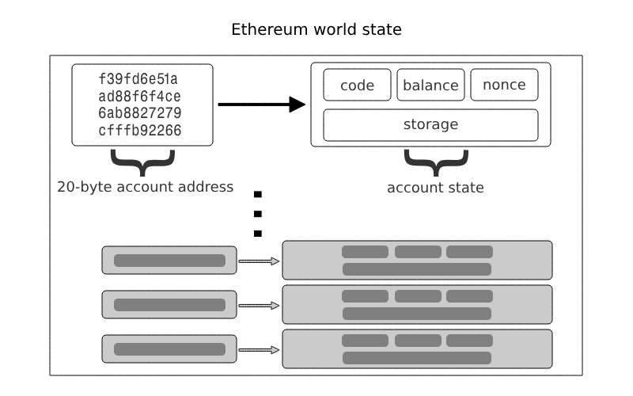
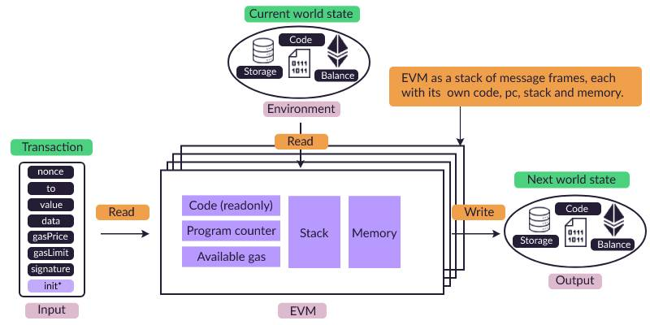
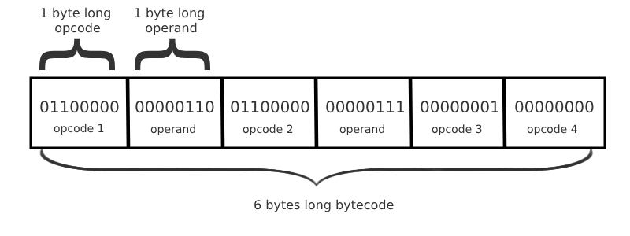
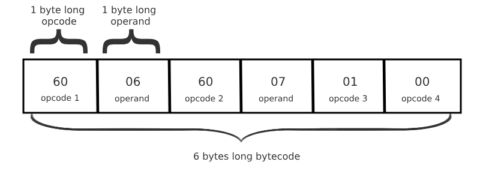
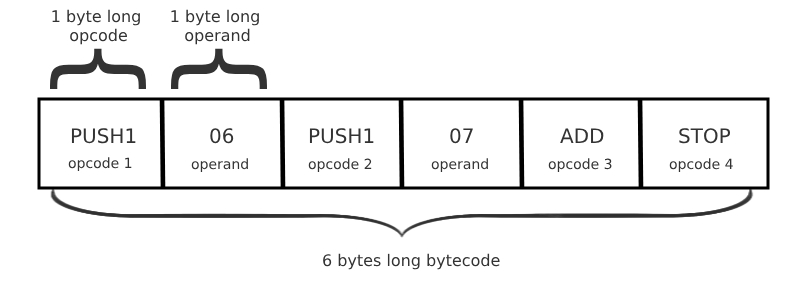
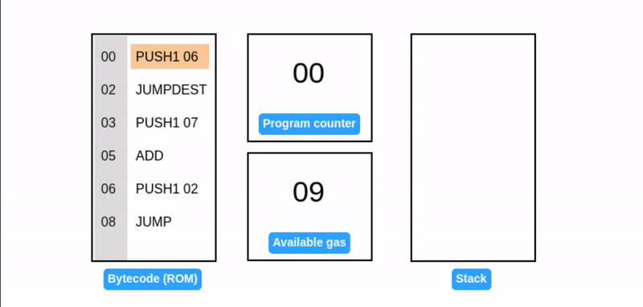

EVM is the state transition function of the Ethereum state machine. It determines how Ethereum transitions into a new (world) state based on input (transactions) and current state.

In Ethereum, the world state is essentially a mapping of 20-byte addresses to account states.

Ethereum has two kinds of accounts:

-   **External account:** An account [controlled by an associated private key](https://epf.wiki/#/wiki/Cryptography/ecdsa) and empty EVM code.
-   **Contract account:** An account controlled by an associated non-empty EVM code. The EVM code as part of such an account is colloquially known as a *smart contract.*

EVM
--------------------------------------------

The virtual machine concept serves as an abstraction. Ethereum Virtual Machine (EVM) is a *specific* software implementation of this abstraction. The anatomy of the EVM is described below:

In computer architecture, a word refers to a fixed-size unit of data that the CPU can process at once. EVM has a word size of **32 bytes**.

*or clarity, the figure above simplifies the Ethereum state. The actual state includes additional elements like Message Frames and Transient Storage.*

[EVM bytecode](https://epf.wiki/#/wiki/EL/evm?id=evm-bytecode)
--------------------------------------------------------------

EVM bytecode is a representation of a program as a sequence of [**bytes** (8 bits).](https://en.wikipedia.org/wiki/Byte) Each byte within the bytecode is either:

-   an instruction known as **opcode**, or
-   input to an opcode known as **operand**.

For brevity, EVM bytecode is commonly expressed in hexadecimal notation:

To further enhance comprehension, opcodes have human-readable mnemonics. This simplified bytecode, called **EVM assembly**, is the lowest human-readable form of EVM code:

Identifying opcodes from operands is straightforward. Currently, only `PUSH*` opcodes have operands (this might change with [EOF](https://eips.ethereum.org/EIPS/eip-7569)). `PUSHX` defines operand length (X bytes after PUSH).

Select Opcodes used in this discussion:

| Opcode | Name | Description |
| --- |  --- |  --- |
| 60 | `PUSH1` | Push 1 byte on the stack |
| --- |  --- |  --- |
| 01 | `ADD` | Add the top 2 values of the stack |
| 02 | `MUL` | Multiply the top 2 values of the stack |
| 39 | `CODECOPY` | Copy code running in current environment to memory |
| 51 | `MLOAD` | Load word from memory |
| 52 | `MSTORE` | Store word to memory |
| 53 | `MSTORE8` | Store byte to memory |
| 59 | `MSIZE` | Get the byte size of the expanded memory |
| 54 | `SLOAD` | Load word from storage |
| 55 | `SSTORE` | Store word to storage |
| 56 | `JUMP` | Alter the program counter |
| 5B | `JUMPDEST` | Mark destination for jumps |
| f3 | `RETURN` | Halt execution returning output data |
| 35 | `CALLDATALOAD` | Copy 32 bytes from calldata to stack |
| 37 | `CALLDATACOPY` | Copy input data from calldata to memory |
| 80--8F | `DUP1--DUP16` | Duplicate Nth stack item to top |
| 90--9F | `SWAP1--SWAP16` | Swap top with N+1th stack item |

Refer [Appendix H of Yellow Paper](https://ethereum.github.io/yellowpaper/paper.pdf) for a comprehensive list.

EVM Data Locations
==========================================================================

The EVM has four main places to store data during execution:

-   **Stack**
-   **Memory**
-   **Storage**
-   **Calldata**

Let's explore each of these data stores more in depth.

[Stack](https://epf.wiki/#/wiki/EL/evm?id=stack)
------------------------------------------------

Stack is a simple data structure with two operations: **PUSH** and **POP**. Push adds an item to top of the stack, while pop removes the top-most item. Stack operates on Last-In-First-Out (LIFO) principle - the last element added is the first removed. If you try to pop from an empty stack, a **stack underflow error** occurs.

Since the stack is where most opcodes operate, it is responsible for holding the values used to read from and write to **memory** and **storage**, which we'll detail later.

The primary utility of the stack by the EVM is to store intermediate values in computations and to supply arguments to opcodes.

### Program counter

Recall that the bytecode is a flat array of bytes with each opcode being a 1 byte. The EVM needs a way to track what is the next byte (opcode) to execute in the bytecode array. This is where the EVM **program counter** comes in. It will keep track of the next opcode's offset, which is the location in the byte array of the next instruction to execute on the stack.

In the example above, the values on the left of the assembly code represent the byte offset (starting at 0) of each opcode within the bytecode:

| Bytecode | Assembly | Length of Instruction in bytes | Offset in hex |
| --- |  --- |  --- |  --- |
| 60 06 | PUSH1 06 | 2 | 00 |
| --- |  --- |  --- |  --- |
| 60 07 | PUSH1 07 | 2 | 02 |
| 01 | ADD | 1 | 04 |

Notice how the table above doesn't include offset 01. This is because the operand 06 takes position of offset 01, and the same concept applies for operand 07 taking position of offset 03.

Essentially, the **program counter** ensures the EVM knows the position of each next instruction to execute and when to stop executing as illustrated in the example below.

