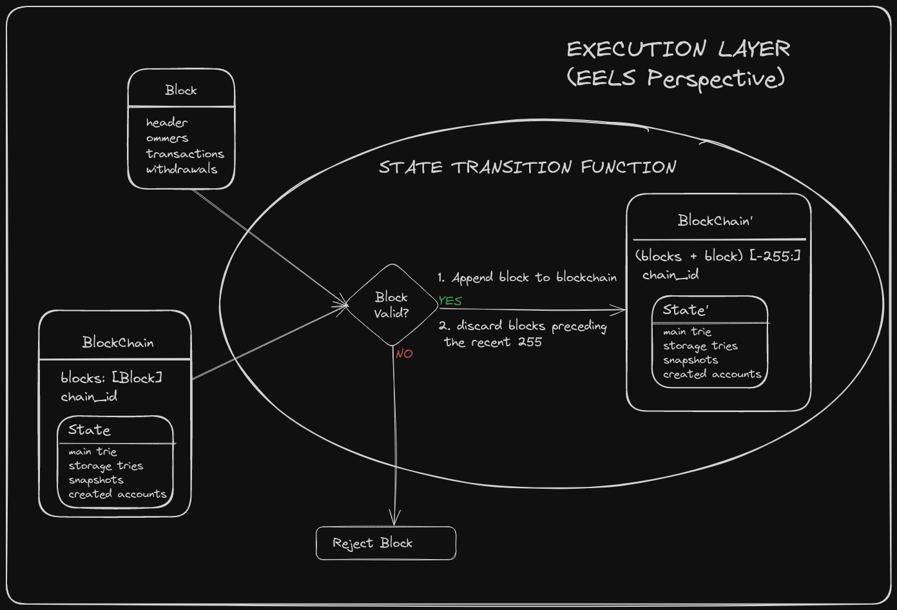
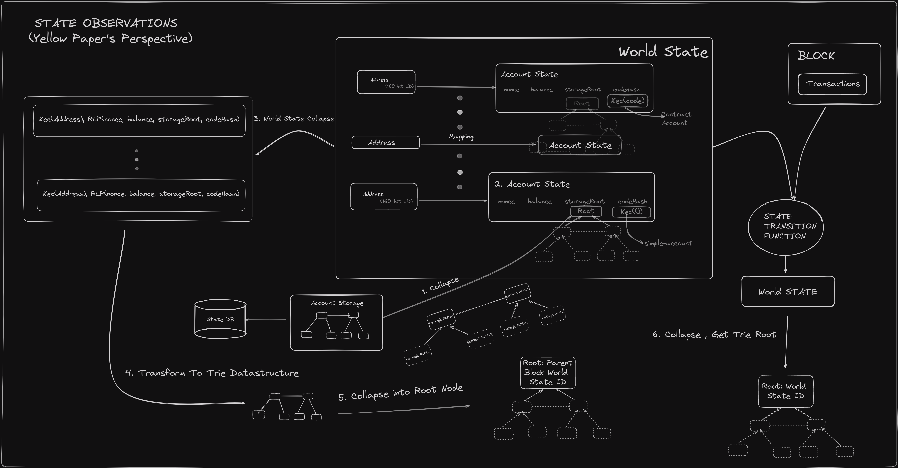

https://epf.wiki/#/wiki/EL/el-specs

-   Is it possible to append the block to the end of the blockchain?
-   How does the state change as a result?

----------------

$$
\sigma_{t+1} \equiv \Pi(\sigma_t, B)
$$

In the equation, each symbol represents a specific concept related to the blockchain state transition:

---
https://github.com/ethereum/execution-specs/blob/0f9e4345b60d36c23fffaa69f70cf9cdb975f4ba/src/ethereum/shanghai/fork.py#L145

### **1. $\sigma_{t+1}$**

* **Greek letter sigma**: $\sigma$ is commonly used to denote **state**.
* **Subscript $t+1$**: Refers to the **next point in time**.
* So, $\sigma_{t+1}$ means the **new state of the blockchain** after applying the current block.

---

### **2. $\equiv$**

* This symbol denotes **"is defined as"** or **"is equivalent to by definition"**.
* It’s stronger than just an equals sign; it implies **a definition or identity**.

---

### **3. $\Pi(\sigma_t, B)$**

* $\Pi$: This Greek capital letter pi denotes the **block-level state transition function**. It is responsible for processing the block and updating the state.
* $\sigma_t$: The **state at time $t$**, i.e., the **previous or current state** before applying block $B$.
* $B$: The **current block** that’s being applied to the state.

---

### **Putting it all together:**

This formula means:

> The new state of the blockchain ($\sigma_{t+1}$) is defined as the result of applying the block-level state transition function ($\Pi$) to the current state ($\sigma_t$) and the new block ($B$).

In simpler terms:

> **New State = TransitionFunction(Old State, New Block)**

This is a **fundamental concept** in blockchain systems like Ethereum, where the state changes deterministically as each block is applied.

1.  **Block Execution**: Execute the transactions within the block, which yields the following outputs:
    -   **Gas Used**: The total gas consumed by executing all transactions in the block.
    -   **Trie Roots**: The roots of the tries for all transactions and receipts contained in the block.
    -   **Logs Bloom**: A bloom filter of logs from all transactions within the block.
    -   **State**: The state, as specified in the python execution specs, after executing all transactions.

1.  **Pruning Old Blocks**: Remove blocks that are older than the most recent 255 blocks from the blockchain.