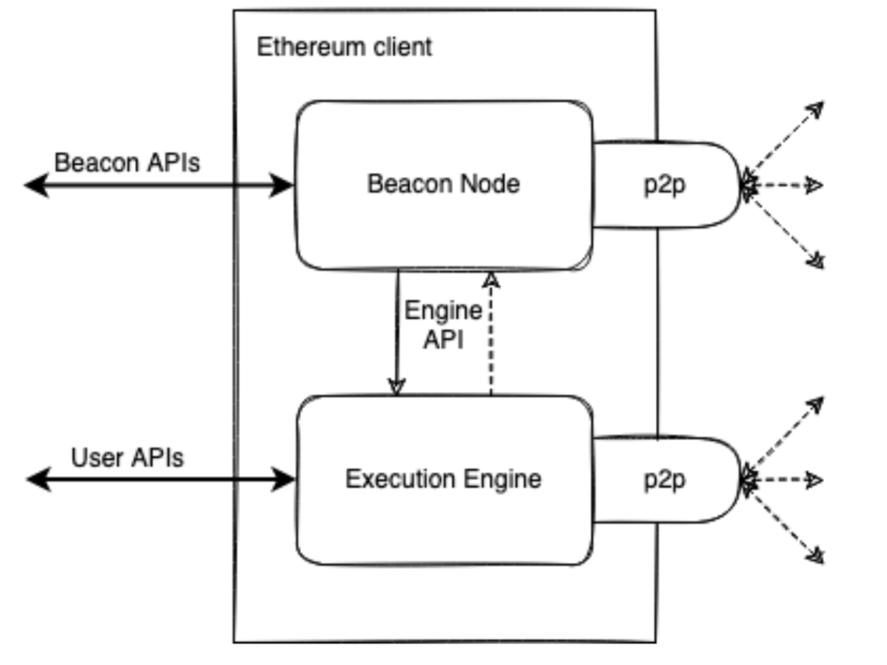

The protocol consists of 2 main parts - 
- Execution 
- Consensus layer.

  The execution layer (EL) handles the actual transactions and user interactions, it's where the global computer executes its programs. The consensus layer (CL) provides the proof-of-stake consensus mechanism - a cryptoeconomic security making sure all nodes follow the same tip and drives the canonical chain of execution layer.

In practice, these layers are implemented in its **own clients connected via API**. Each have their own p2p network handling different kind of data.

Looking under the hood of each client, they consists of many fundamental functions:

