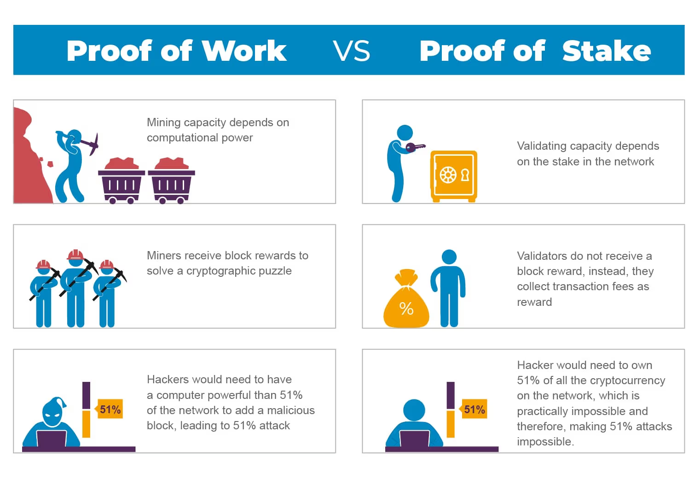

Unlike the Ethereum Mainnet, the Beacon Chain does **not handle** transactions or [smart contracts]. Instead, it coordinates the entire Ethereum network by managing its stakers (who validate the proof of stake blocks) and shard chains (split-up chains of the main network).

In comparison, PoS solves this by **semi-randomly  selecting** only a few "validators" at a time to validate the transactions in the next block and propose that block to the blockchain. This is called "**minting**" blocks, as compared to "mining" in PoW.

**Slots and Epochs**
--------------------

The Beacon Chain provides the heartbeat to Ethereum's consensus. Each slot is 12 seconds and an epoch is 32 slots: 6.4 minutes.

### **How do you become a validator?**

To [become a validator], a node needs to deposit a certain amount of ETH into the Ethereum network. This is called "staking," similar to a collateral or security deposit. For the upgrade, one has to stake a minimum of 32 ETH on the main Ethereum chain to run a validator node.

The size of the stake determines the chance that a validator will be selected for minting in a linear fashion. For example, if Alice stakes 320 ETH (wowza!) and Bob stakes 32 ETH, Alice's node will have a 10 times higher chance of being chosen to mint the next block. Hence, the selection process is not completely random. 

When a validator is chosen to validate the next block, they will first verify if all the transactions in the block are valid or not. Once everything looks good, the validator will change the state of the blockchain by writing that block onto the blockchain.

This information is then confirmed by a "committee" of at least 128 other validators in a process called attestation. If the block checks out, the initially chosen validator will receive a staking reward, which is made up of the fees that are associated with the validated transactions.

### **How are validators kept honest?**

Trusting that stakers will behave as honest validators is crucial for PoS to function successfully, and there are several ways this is accomplished.

First, if validators approve fraudulent transactions, then they will lose a part of their stake, or get "slashed." 

This is partly why the stake is so high (32 ETH). If the stake is always higher than the staking reward, a staker will have no financial incentive to become a dishonest node because they will lose more money than they can potentially gain.

In addition, if a node wishes to exit its role as a validator, there is a delay of around 25 minutes before its stake and staking rewards can be withdrawn. Within this lock-up period, the validator may still be slashed, should the network find that they approved fraudulent blocks.