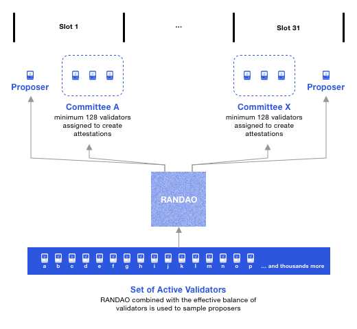

Unlike the Ethereum Mainnet, the Beacon Chain does **not handle** transactions or [smart contracts]. Instead, it coordinates the entire Ethereum network by managing its stakers (who validate the proof of stake blocks) and shard chains (split-up chains of the main network).

In comparison, PoS solves this by **semi-randomly  selecting** only a few "validators" at a time to validate the transactions in the next block and propose that block to the blockchain. This is called "**minting**" blocks, as compared to "mining" in PoW.

**Slots and Epochs**
--------------------

The Beacon Chain provides the heartbeat to Ethereum's consensus. Each slot is 12 seconds and an epoch is 32 slots: 6.4 minutes.

A slot is a chance for a block to be added to the Beacon Chain. Every 12 seconds, one block is added when the system is running optimally. Validators do need to be roughly [synchronized with time.](https://ethresear.ch/t/network-adjusted-timestamps/4187)

A slot is like the block time, but slots can be empty. The Beacon Chain genesis block is at Slot 0.

**Validators and Attestations**
-------------------------------

While proof-of-work is associated with miners, Ethereum's validators are proof-of-stake "virtual miners". Validators run Ethereum's consensus. Their incentives are discussed later in [Staking Rewards and Penalties](https://ethos.dev/beacon-chain#staking-rewards-and-penalties).

A block **proposer** is a validator that has been pseudorandomly selected to build a block.

Most of the time, validators are **attesters** that vote on blocks.  These votes are recorded in the Beacon Chain and determine the head of the Beacon Chain.

At every epoch, a validator is pseudorandomly assigned to a slot.

An **attestation** is a validator's vote, weighted by the validator's balance.  Attestations are broadcasted by validators in addition to blocks.

Validators also police each other and are rewarded for reporting other validators that make conflicting votes, or propose multiple blocks.

The contents of the Beacon Chain is primarily a registry of validator addresses, the state of each validator, and attestations.  Validators are activated by the Beacon Chain and can transition to states,

### Staking validators: semantics

Validators are *virtual* and are activated by stakers.  In PoW, users buy hardware to become miners. In Ethereum, users stake ETH to activate and control validators.

It is clearer to associate stakers with a stake, and validators with a **balance**.  Each validator has a maximum balance of 32 ETH, but stakers can stake all their ETH.  For every 32 ETH staked, one validator is activated.

Validators are executed by ***validator clients*** that make use of a beacon (chain) node.  A **beacon node** has the functionality of following and reading the Beacon Chain. A validator client can implement beacon node functionality or make calls into beacon nodes. One validator client can execute many validators.

**Committees**
--------------

A committee is a group of validators.  For security, each slot has committees of at least 128 validators.  An attacker has less than a [one in a trillion](https://medium.com/@chihchengliang/minimum-committee-size-explained-67047111fa20) probability of controlling ⅔ of a committee.

The concept of a randomness beacon that emits random numbers for the public, lends its name to the Ethereum Beacon Chain. The Beacon Chain enforces consensus on a pseudorandom process called RANDAO.

At every epoch, a pseudorandom process RANDAO selects proposers for each slot, and shuffles validators to committees.

Proposers are selected by RANDAO with a weighting on the validator's balance.  It's possible a validator is a proposer and committee member for the same slot, but it's not the norm. The probability of this happening is 1/32 so we'll see it about once per epoch. The sketch depicts a scenario with less than 8,192 validators, otherwise there would be at least two committees per slot.

### **How do you become a validator?**

To [become a validator], a node needs to deposit a certain amount of ETH into the Ethereum network. This is called "staking," similar to a collateral or security deposit. For the upgrade, one has to stake a minimum of 32 ETH on the main Ethereum chain to run a validator node.

The size of the stake determines the chance that a validator will be selected for minting in a linear fashion. For example, if Alice stakes 320 ETH (wowza!) and Bob stakes 32 ETH, Alice's node will have a 10 times higher chance of being chosen to mint the next block. Hence, the selection process is not completely random. 

When a validator is chosen to validate the next block, they will first verify if all the transactions in the block are valid or not. Once everything looks good, the validator will change the state of the blockchain by writing that block onto the blockchain.

This information is then confirmed by a "committee" of at least 128 other validators in a process called attestation. If the block checks out, the initially chosen validator will receive a staking reward, which is made up of the fees that are associated with the validated transactions.

### **How are validators kept honest?**

Trusting that stakers will behave as honest validators is crucial for PoS to function successfully, and there are several ways this is accomplished.

First, if validators approve fraudulent transactions, then they will lose a part of their stake, or get "slashed." 

This is partly why the stake is so high (32 ETH). If the stake is always higher than the staking reward, a staker will have no financial incentive to become a dishonest node because they will lose more money than they can potentially gain.

In addition, if a node wishes to exit its role as a validator, there is a delay of around 25 minutes before its stake and staking rewards can be withdrawn. Within this lock-up period, the validator may still be slashed, should the network find that they approved fraudulent blocks.