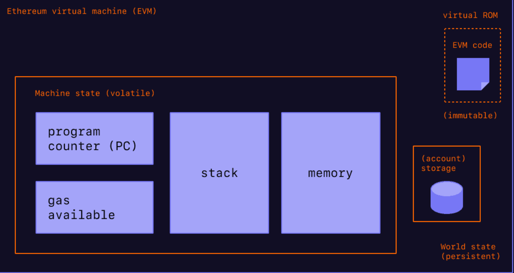
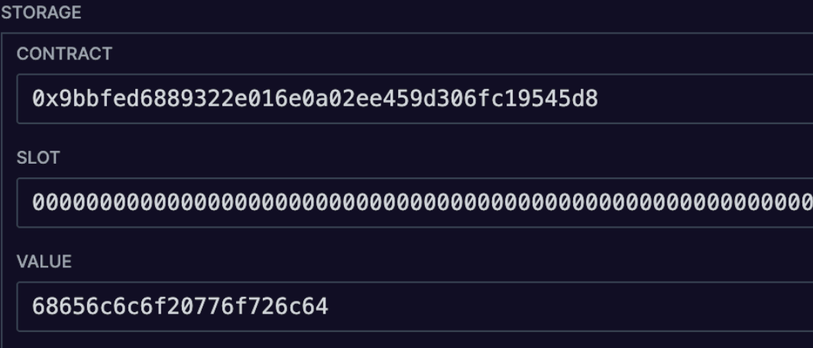
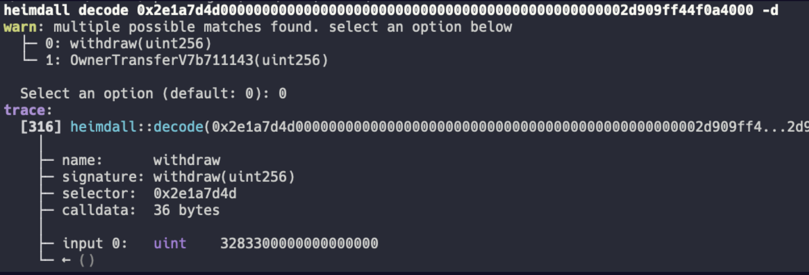
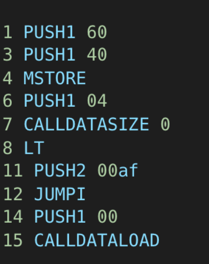

https://www.evm.codes/

# EVM Internals & Smart Contract Design Patterns


## EVM Overview: The Anatomy

  * **Volatile Machine State:**
      * Persists only until the end of a transaction.
      * Examples: Program Counter, Gas Available, etc. (to be detailed later).
  * **EVM Code (Bytecode):**
      * *Immutable* in most cases (can sometimes be redeployed or self-destructed, but old code might still exist in state).
      * The actual instructions the EVM executes.
  * **Account Storage:**
      * *Persistent* key-value store (32-byte slot to 32-byte value).
      * Used for storing long-term data like:
          * ERC20 balances
          * NFT owners
          * Contract state variables (e.g., `owner`, `symbol`)
          * Mappings

## The Stack

  * **Core Component:** The EVM is a *stack-based virtual machine*.
  * **Word Size:** **256 bits** (32 bytes).
      * This means the largest integer is $2^{256}-1$.
      * Operations deal with 32-byte words.
      * *"That number is so big you're never really going to need anything bigger than that... bigger than the amount of atoms in the universe."*
  * **Behavior:** *Last-In, First-Out (LIFO)*.
      * Example: `PUSH 0`, `PUSH 1`, `PUSH 2` results in a stack:
        ```
        2  <- Top
        1
        0
        ```
  * **Maximum Depth:** **1024 words**.
  * **Access Limitation:** Only the **top 16 words** are directly accessible by opcodes like `DUP` and `SWAP`.
      * This is a technical limitation due to the design of these specific opcodes (e.g., `DUP1` to `DUP16`, `SWAP1` to `SWAP16`).
      * Leads to *"stack too deep"* errors in Solidity if too many local variables or complex operations require deeper stack access.
      * *A potential EVM improvement idea: `DUP <n>` to access the nth item.*

## Memory


-   Sometimes you need to store information longer than 256 bits

-   Despite its name, does NOT persist and is lost at the end of a transaction

-   Is simply a long bytearray, but you can also think of it as a Vec<u8> or hex string

-   Used for revert data, return data, strings, RLP, etc


  * **Purpose:** Used for storing data that might be:
      * Longer than 256 bits (32 bytes).
      * Needed temporarily during a transaction.
  * **Persistence:** *Memory is volatile*; it **does not persist** after the transaction ends.
  * **Structure:** A *linearly addressable byte array*.
      * Can be thought of as a `Vec<u8>` (Rust) or a hex string.
      * Expands dynamically as needed, but incurs gas costs for expansion.
  * **Internal Solidity/EVM Uses:**
      * Returning data from functions (`returndata`).
      * Revert messages.
      * Strings.
      * Arrays in memory.
      * Complex types.
      * Recursive Length Prefix (RLP) encoding/decoding.

## Storage



-   This information does persist across transactions

-   Can be thought of as a mapping from SLOT to VALUE (or KEY=>VALUE)

-   Can be used to store immutables, balances, ownership information, etc.


  * **Purpose:** To *persist information forever* on the blockchain within a contract.
  * **Structure:** A key-value store, mapping 256-bit keys (slots) to 256-bit values.
      * Analogy: A *mapping*, *hash map*, or a simple *JSON-like structure*.
      * Example: `slot[0] -> "Hello World"` (conceptually)
  * **Internal Uses:**
      * Storing contract state variables defined in Solidity (e.g., `uint public myNumber;`).
      * Immutable variables like `symbol` or `name` (if not hardcoded).
      * Ownership information.
      * ERC20 token balances.
      * NFT ownership.
      * Mappings.

## Call Data
**

-   When you send a contract-interaction on Ethereum, you're actually sending calldata (and optionally some ether) to the contract

-   This calldata contains all the instructions the program needs to execute and carry out your operation

**
  * **Definition:** *The data payload sent with a transaction when interacting with a contract.*
      * It's a read-only byte array.
  * **Content:** Contains all the instructions and arguments the program needs to execute.
      * The EVM uses this data to determine which function to call and with what parameters.
  * **Example:**
    ```
    0x2e1a7d4d0000000000000000000000000000000000000000000000000000000000032833
    ```
    This is an example of call data for Blur's token contract.

## Reading Call Data: Signatures and Selectors

  * **Function Selector:** The **first 4 bytes** of the call data.
      * Example from above: `0x2e1a7d4d`
  * **Derivation:**
    1.  Take a human-readable function signature (e.g., `withdraw(uint256)`).
    2.  Hash it using **Keccak-256**.
    3.  The first 4 bytes of the resulting hash are the function selector.
        *Example:*
        `keccak256("withdraw(uint256)")` = `0x2e1a7d4d...` (first 4 bytes match the example)
  * **Purpose:** Used by the EVM's *dispatcher* to identify which function is being called.
  * **Reversing/Decoding Call Data:**
      * Possible by using a database of known function signature/selector pairings.
      * **Etherface** is a large, open-source database of such selectors.
          * It uses scrapers to find ABIs in GitHub repos and update its list.
          * Can be self-hosted.
      * Tools like **Heimdall** use these databases to decode arbitrary call data without needing the contract's ABI.
  * **Heimdall Decoding Example:**
    The call data `0x2e1a7d4d...32833` when put into Heimdall's decode module:
      * Finds matches like `withdraw(uint256)` and `ownerTransfer(address,uint256,...)` (hypothetical second match).
      * Decodes it as a call to `withdraw(32833)` (interpreting the remaining bytes as the argument).

## Bytecode and Assembly



-   On top is the program bytecode, the raw representation that the EVM works off of.

-   It's essentially another bytearray, with each byte in the bytearray corresponding to either an OPCODE or information to PUSH to the stack.

-   The lower image is the assembly representation of the bytecode above

-   On the left we have the program counter (PC), which is the index in the bytecode for that operation.

-   Then we have the actual OPCODE name itself, such as PUSH1, MSTORE, LT, etc.

-   PUSH operations have data associated with them, and this information is added onto the top of the stack

-   You can produce this assembly representation using a tool like heimdall's disassemble module


  * **Bytecode:** The low-level machine code that the EVM executes. It's a sequence of bytes.
      * Example (start of Wrapped Ether bytecode): `60806040...`
  * **Assembly:** A human-readable representation of bytecode, where opcodes are represented by mnemonics.
  * **Disassembly Example (Heimdall output for Wrapped Ether):**
    ```assembly
    // PC  Opcode    Arg
    0000  PUSH1     0x80  // 60 is PUSH1, next byte is 0x80
    0002  PUSH1     0x40  // 60 is PUSH1, next byte is 0x40
    0004  MSTORE          // 52 is MSTORE
    ...
    ```
  * **Program Counter (PC):**
      * A register that holds the address (offset in the bytecode) of the next instruction to be executed.
      * Starts at `0`.

## EVM Opcodes

*An overview of common EVM instructions. For detailed explanations and examples, refer to resources like [evm.codes](https://www.evm.codes/).*

### Stop and Arithmetic Operations

  * `STOP` (0x00): Halts execution.
  * `ADD` (0x01): Addition.
  * `MUL` (0x02): Multiplication.
  * `SUB` (0x03): Subtraction.
  * `DIV` (0x04): Unsigned division.
  * `SDIV` (0x05): Signed division.
  * `MOD` (0x06): Unsigned modulo.
  * `SMOD` (0x07): Signed modulo.
  * `ADDMOD` (0x08): `(a + b) % N`.
  * `MULMOD` (0x09): `(a * b) % N`.
  * `EXP` (0x0a): Exponentiation.
  * `SIGNEXTEND` (0x0b): Extend length of two's complement signed integer.

### Comparison Operations

  * `LT` (0x10): Less than (unsigned).
  * `GT` (0x11): Greater than (unsigned).
  * `SLT` (0x12): Signed less than.
  * `SGT` (0x13): Signed greater than.
  * `EQ` (0x14): Equal.
  * `ISZERO` (0x15): Checks if a value is zero. (Returns `1` if zero, `0` otherwise).
      * *Note: Often used in conditional logic: `value ISZERO JUMPI`.*

### Bitwise Operations

  * *Important: These are bitwise, not logical (boolean) operations.*
  * `AND` (0x16): Bitwise AND.
  * `OR` (0x17): Bitwise OR.
  * `XOR` (0x18): Bitwise XOR.
  * `NOT` (0x19): Bitwise NOT.
  * `BYTE` (0x1a): Retrieve a single byte from a 32-byte word. `BYTE(i, x)` gets the i-th byte of x.
  * `SHL` (0x1b): Shift Left.
  * `SHR` (0x1c): Logical Shift Right.
  * `SAR` (0x1d): Arithmetic Shift Right (preserves sign).

### Cryptographic Operations

  * `SHA3` (0x20) / `KECCAK256`: Computes Keccak-256 hash.
      * *Opcode names can vary slightly across tools, but the underlying operation is the same.*

### Environmental Information

  * `ADDRESS` (0x30): Get address of currently executing account.
  * `BALANCE` (0x31): Get balance of a given account.
  * `ORIGIN` (0x32): Get `tx.origin` (original EOA that initiated the transaction). *Use with caution due to potential security implications.*
  * `CALLER` (0x33): Get `msg.sender` (immediate caller).
  * `CALLVALUE` (0x34): Get `msg.value` (ETH sent with the call).
  * `CALLDATALOAD` (0x35): Get 32 bytes of call data starting from a given offset.
  * `CALLDATASIZE` (0x36): Get size of call data in bytes.
  * `CALLDATACOPY` (0x37): Copy call data to memory.
  * `CODESIZE` (0x38): Get size of the current account's code in bytes.
  * `CODECOPY` (0x39): Copy current account's code to memory.
  * `GASPRICE` (0x3a): Get `tx.gasprice`.
  * `EXTCODESIZE` (0x3b): Get size of an external account's code.
  * `EXTCODECOPY` (0x3c): Copy an external account's code to memory.
      * Used in patterns like `CREATE2` library deployment or data storage in bytecode (e.g., `StoreSOUL`).
  * `RETURNDATASIZE` (0x3d): Get size of data returned by the last external call.
      * *Interesting optimization: If no external call was made, `RETURNDATASIZE` returns 0. This was used as a cheaper way to push 0 to the stack before `PUSH0` existed.*
  * `RETURNDATACOPY` (0x3e): Copy data returned by the last external call to memory.
  * `EXTCODEHASH` (0x3f): Get Keccak-256 hash of an external account's code.

### Block Information

  * `BLOCKHASH` (0x40): Get hash of a specific block (only for recent 256 blocks, excluding current).
  * `COINBASE` (0x41): Get current block's beneficiary address (miner/validator).
  * `TIMESTAMP` (0x42): Get current block's timestamp.
  * `NUMBER` (0x43): Get current block number.
  * `DIFFICULTY` (0x44) / `PREVRANDAO` (0x44 after "The Merge"): Previous block's randomness (formerly proof-of-work difficulty).
  * `GASLIMIT` (0x45): Get current block's gas limit.
  * `CHAINID` (0x46): Get current chain ID.
  * `SELFBALANCE` (0x47): Get balance of the current account in wei.
  * `BASEFEE` (0x48): Get current block's EIP-1559 base fee per gas.

### Stack, Memory, Storage, and Flow Operations

#### Stack Operations

  * `POP` (0x50): Remove item from stack.
  * `PUSH0` (0x5f) to `PUSH32` (0x7f): Push 0 to 32 bytes onto the stack.
      * `PUSH0` was added in the Shanghai upgrade; previously `PUSH1 0x00` was used.
  * `DUP1` (0x80) to `DUP16` (0x8f): Duplicate 1st to 16th stack item.
  * `SWAP1` (0x90) to `SWAP16` (0x9f): Swap 1st with 2nd to 17th stack item.
      * *The limitation of DUP/SWAP to 16 items is why "stack too deep" errors occur.*

#### Memory Operations

  * `MLOAD` (0x51): Load 32 bytes from memory. Takes offset from stack.
    ```assembly
    PUSH1 0x42  // Value to store
    PUSH1 0x00  // Memory offset 0
    MSTORE      // Memory[0:32] = 0x42...
    PUSH1 0x00  // Memory offset 0
    MLOAD       // Pushes Memory[0:32] (0x42...) onto stack
    ```
  * `MSTORE` (0x52): Save 32 bytes to memory. Takes offset and value from stack.
  * `MSTORE8` (0x53): Save a single byte to memory. Takes offset and value (only last byte used) from stack.
  * `MSIZE` (0x59): Get current size of memory in bytes.

#### Storage Operations

  * `SLOAD` (0x54): Load 32 bytes from storage. Takes storage slot (key) from stack.
    ```assembly
    PUSH1 0x42  // Value to store
    PUSH1 0x00  // Storage slot 0
    SSTORE      // Storage[0] = 0x42...
    PUSH1 0x00  // Storage slot 0
    SLOAD       // Pushes Storage[0] (0x42...) onto stack
    ```
  * `SSTORE` (0x55): Save 32 bytes to storage. Takes storage slot (key) and value from stack. *Gas intensive.*

#### Flow Control Operations

  * `JUMP` (0x56): Unconditionally jump to a new program counter (PC) location. Destination must be a `JUMPDEST` instruction.
  * `JUMPI` (0x57): Conditionally jump. Takes destination and a condition value from stack. Jumps if condition is non-zero. Destination must be a `JUMPDEST`.
      * *Fundamental for `if` statements, loops.*
  * `PC` (0x58): Get current program counter.
  * `JUMPDEST` (0x5b): Marks a valid jump destination. If `JUMP` or `JUMPI` target an instruction that isn't `JUMPDEST` (or is outside code), execution reverts.

### Logging Operations

  * `LOG0` (0xa0) to `LOG4` (0xa4): Emit a log/event.
      * `LOG0`: Emits data only.
      * `LOG1` - `LOG4`: Emit data and 1 to 4 indexed topics (32-byte values).
      * Takes memory offset, size, and topics (for `LOG1-4`) from stack.
      * *Events in Solidity compile to these opcodes.*
      * Topics allow for efficient searching/filtering of logs.
          * Topic 0 is often `keccak256` of the event signature (e.g., `keccak256("Transfer(address,address,uint256)")`).
      * Logs are stored in the transaction receipt, not directly in contract storage, making them cheaper for broadcasting information than `SSTORE`.
          * *Question: "Where logs are stored?" -\> They are part of the transaction receipt, linked to the block, and queryable via the Ethereum state/history.*

### System Operations

  * `CREATE` (0xf0): Create a new contract. Takes value, memory offset (for init code), and size. Returns new contract address (or 0 on failure).
  * `CALL` (0xf1): Message-call into an account. Transfers ETH, executes code.
  * `CALLCODE` (0xf2): *Largely deprecated.* Message-call into this account with an alternative account's code. Context (storage, `msg.sender`, `msg.value`) is of the caller.
  * `RETURN` (0xf3): Halt execution and return data from memory.
  * `DELEGATECALL` (0xf4): Message-call into this account with an alternative account's code, but *preserving the current contract's context* (storage, `msg.sender`, `msg.value`).
      * Crucial for proxy patterns (upgradeable contracts).
  * `CREATE2` (0xf5): Create a new contract with an address that can be predetermined based on sender, salt, and init code hash.
      * Takes value, memory offset (for init code), size, and a salt.
      * Allows for counterfactual deployment and vanity addresses (e.g., addresses with leading zeros like `0x000...`).
          * Mining vanity addresses: Trying different salts until a desired address pattern is found.
  * `STATICCALL` (0xfa): Like `CALL`, but the called contract cannot make state changes.
  * `REVERT` (0xfd): Halt execution, revert state changes, and return data (e.g., an error message).
  * `INVALID` (0xfe): An invalid instruction; consumes all gas and halts execution.
  * `SELFDESTRUCT` (0xff): Halt execution and mark account for deletion. Sends remaining ETH to a designated address.
      * *Dangerous and largely deprecated or behaviorally changed in newer Ethereum upgrades due to its potential to lock funds or break contract assumptions.*
      * Discussion: Its deprecation in Solidity vs. existence as an opcode. It's being phased out. EIP-4758 aimed to disable it, and EIP-6780 (Shanghai) significantly limited its effects.

## Program Execution and Control Flow Graph (CFG)

  * **Control Flow Graph (CFG):** A visual representation of all possible execution paths a program can take. Nodes are basic blocks of instructions, and edges represent jumps or sequential flow.
  * **Generating CFG:** Tools like **Heimdall** can generate CFGs from bytecode.

### Example: Wrapped Ether (WETH) Contract Execution Flow

1.  **Free Memory Pointer Setup (Solidity boilerplate):**

    ```assembly
    PUSH1 0x80  // Often used as initial free memory pointer
    PUSH1 0x40
    MSTORE      // memory[0x40] = 0x80
    ```

      * Solidity reserves memory slot `0x40` to store the pointer to the next available free memory.

2.  **Call Data Size Check:**

    ```assembly
    PUSH1 0x04      // Minimum expected call data size (for a selector)
    CALLDATASIZE
    LT              // Is CALLDATASIZE < 4?
    PUSH    <fallback_addr> // Address of fallback/receive logic
    JUMPI           // If size < 4, jump to fallback
    ```

      * If call data is less than 4 bytes, it cannot contain a function selector, so execution typically jumps to a fallback or receive function.
      * WETH's fallback for empty call data (or just receiving ETH) is often a `deposit()` function.

3.  **Function Dispatcher (The "Router"):**

      * If call data size is \>= 4 bytes:

    <!-- end list -->

    ```assembly
    PUSH1 0x00
    CALLDATALOAD        // Load first 32 bytes of call data (stack: [call_data_word])
    PUSH  0xe0          // 224 (decimal)
    SHR                 // Shift right by 224 bits to isolate top 4 bytes (selector)
                        // Alternative: PUSH 0xffffffff0000... , AND
    // Now the function selector is at the top of the stack
    ```

      * The contract then compares this extracted selector with known selectors for its public functions:

    <!-- end list -->

    ```assembly
    DUP1                // Duplicate the selector for the next comparison
    PUSH4 0x06fdde03    // Selector for 'name()'
    EQ
    PUSH  <name_func_addr>
    JUMPI               // If selector == 0x06fdde03, jump to name()

    DUP1                // Use the duplicated selector
    PUSH4 0x70a08231    // Selector for 'totalSupply()'
    EQ
    PUSH  <totalSupply_func_addr>
    JUMPI               // If selector == 0x70a08231, jump to totalSupply()

    // ... and so on for all public functions
    ```

      * This sequence of `DUP, PUSH4 <selector>, EQ, PUSH <dest>, JUMPI` is the *function dispatcher*.
      * Heimdall can detect these patterns to identify function selectors and build an ABI.

4.  **Function Execution:**

      * If a match is found, the `JUMPI` directs execution to the start of that function's bytecode block.
      * If no match is found after checking all selectors, execution typically jumps to a `payable` fallback or `revert`.

### Dynamic Jumps

  * A `JUMP` or `JUMPI` where the destination address is calculated at runtime (e.g., loaded from storage or call data) rather than being a hardcoded `PUSH <dest>`.
  * Makes static analysis and decompilation much harder.
  * Not typically generated by standard Solidity/Vyper compilers but can be handcrafted in assembly, often for obfuscation.
    ```assembly
    PUSH1 0x20        // offset in call data
    CALLDATALOAD      // load jump destination from call data
    JUMP              // DYNAMIC JUMP!
    ```

## How Solidity/EVM Represents Types

### Bitwise Masking for Type Sanitization

  * The EVM operates on 256-bit words. Smaller types need to be handled correctly.
  * **Bitwise `AND` masks** are used to truncate or isolate the relevant bits for a specific type.
  * **Address Type (20 bytes / 160 bits):**
    When an address is loaded (e.g., `CALLER`), it's a 256-bit word with leading zeros. To ensure it's treated as an address and to clear any potential garbage in higher bits (though `CALLER` is clean), Solidity might apply a mask:
    ```assembly
    CALLER          // Pushes address (e.g., 0x00...00[20_byte_addr])
    PUSH20 0xffffffffffffffffffffffffffffffffffffffff // 20 bytes of 0xFF
    AND             // Result: 0x00...00[20_byte_addr] (ensures upper bits are zero)
    ```
      * Seeing a mask like `0x...FF` (20 FFs) strongly suggests an `address` type is being handled.
      * *WETH example showed this mask being applied (sometimes redundantly).*

### Heuristics for Identifying Types from Opcodes

  * **Bytes Types (`bytes1` to `bytes32`):**
      * Operations like `BYTE`, `SHL`, `SHR`, `SAR` (when not clearly arithmetic on numbers).
      * Bitwise operations (`AND`, `OR`, `XOR`, `NOT`) when not clearly for boolean flags or masking known types.
  * **Numeric Types (`uintN`, `intN`):**
      * Arithmetic operations: `ADD`, `MUL`, `SUB`, `DIV`, `MOD`, `SDIV`, `SMOD`, `EXP`, `ADDMOD`, `MULMOD`.
      * Comparison operations: `LT`, `GT`, `SLT`, `SGT`, `EQ`.
  * **Boolean Type (`bool`):**
      * Often results from `ISZERO`, `EQ`, `LT`, `GT`, etc.
      * Typically consumes 1 byte in storage but is manipulated as a 256-bit word on the stack (0 or 1).
      * Masked with `0x...01` (`PUSH1 0x01, AND`) if stored packed.
  * **Strings, Dynamic Arrays, Structs:**
      * Typically stored in **memory** (if temporary or part of calldata/returndata) or **storage** (if state variables).
      * Involve `MLOAD`, `MSTORE`, `SLOAD`, `SSTORE`.
      * Dynamic arrays and strings in storage have their length stored at one slot and data starting at `keccak256(slot)`.
      * Often involve **Recursive Length Prefix (RLP)** encoding/decoding when passed around or returned, especially complex data.

## How EVM Represents Mappings

  * **Solidity Declaration:**
    ```solidity
    mapping(KeyType => ValueType) public myMap;
    ```
  * **Storage Layout:** Mappings themselves don't "store" anything at a single slot. Instead, the slot for each *value* is calculated.
  * **Key Calculation:**
      * Let `p` be the storage slot assigned to the mapping declaration by the compiler (e.g., `0`, `1`, etc., based on order of state variable declaration).
      * Let `k` be the key provided to access the mapping.
      * The storage slot for `myMap[k]` is `keccak256(h(k) . h(p))`, where `.` is concatenation and `h()` is a function that pads the item to 32 bytes.
          * More simply: `keccak256(abi.encodePacked(k, p))`
  * **Example:** If `myMap` is at slot `0` (`p = 0x0...0`), and we access `myMap[0x01]` (`k = 0x0...1`):
    1.  `k_padded = 0x0000...0001` (32 bytes)
    2.  `p_padded = 0x0000...0000` (32 bytes)
    3.  `concat = 0x0000...00010000...0000` (64 bytes)
    4.  `slot_for_value = keccak256(concat)`
    5.  The value is then `SLOAD`ed from or `SSTORE`d to this `slot_for_value`.
  * **Benefits:**
      * Ensures effectively zero chance of collision between different keys or different mappings.
      * Allows mappings to be "infinitely" large without pre-allocating storage.

## Recursive Length Prefix (RLP) Encoding

  * **Purpose:** A standard way to *serialize and deserialize* data in Ethereum, especially for:
      * Transactions
      * Receipts
      * State data
      * Complex data structures in memory (like strings or arrays being returned or logged).
  * **Mechanism:** Encodes items (strings/byte arrays or lists of items) by prefixing them with their length or the total length of the list's payload.
      * Single byte `0x00-0x7f`: represents itself.
      * Short string `0-55 bytes long`: `0x80 + length`, then string.
      * Long string `>55 bytes long`: `0xb7 + length_of_length`, then `length`, then string.
      * Short list `0-55 byte payload`: `0xc0 + payload_length`, then concatenated RLP of items.
      * Long list `>55 byte payload`: `0xf7 + length_of_payload_length`, then `payload_length`, then concatenated RLP of items.
  * **Use in EVM/Solidity:**
      * Solidity uses it internally for certain operations involving dynamic types in memory, especially when encoding/decoding data for external calls or returns.
      * Visible when decompiling contracts that return `string` or `bytes` or arrays.
  * **Complexity:** The rules are specific and detailed. For an in-depth understanding, refer to the [ethereum.org RLP specification](https://ethereum.org/en/developers/docs/data-structures-and-encoding/rlp/).

## Helpful Tools and Resources

  * **Heimdall Toolkit:**
      * EVM toolkit for reversing, decompiling, decoding call data, viewing contract storage, CFG generation, and more.
      * Excellent for working with unverified contracts (no source code/ABI needed).
  * **evm.codes (by [ETH Shanghai community](https://www.google.com/search?q=https://github.com/comity)):**
      * Comprehensive EVM opcode reference with examples, edge cases, and gas costs.
      * Interactive EVM playground for testing assembly snippets.
      * Precompiled contract information.
  * **Foundry:**
      * Fast, portable, and Solidity-focused development toolkit.
      * Includes **Cast** for sending raw transactions and interacting with contracts.
  * **ethereum.org:**
      * Official Ethereum documentation, with extensive resources on the EVM, RLP, and core concepts.
  * **Etherface ([etherface.io](https://www.etherface.io/)):**
      * Large, open-source database of function and event selectors.
      * Useful for identifying functions/events from raw selectors.
  * **revm (by [bluealloy](https://github.com/bluealloy/revm)):**
      * A Rust-based, fast, and correct EVM implementation.
      * Reading its source code can provide a deep understanding of EVM internals.
      * Heimdall's internal VM is geared towards symbolic execution, whereas `revm` is a more direct implementation.

## Heimdall Decompilation Example

  * **Challenge:** Raw assembly is very hard to read and understand for non-trivial contracts.
  * **Heimdall's Decompiler:** Uses heuristics, pattern matching (like for function dispatchers), and symbolic execution to convert EVM bytecode into more human-readable, Solidity-like pseudocode.
  * **Process:**
    1.  Identifies all possible function selectors through symbolic execution of the dispatcher.
    2.  Resolves selectors to human-readable signatures using databases (like Etherface).
    3.  Resolves event topics to event signatures.
    4.  Reconstructs control flow and variable usage into higher-level constructs.
  * **Output:**
      * An ABI for the contract.
      * Solidity-like code.
      * *(Example: WETH decompilation)*
        ```solidity
        // Decompiled output (simplified)
        contract WETH {
            string public name; // Found via name() selector, SLOAD from slot 0
            uint256 public totalSupply; // Found via totalSupply(), returns address(this).balance
            // ... other functions

            function name() public view returns (string memory) {
                // rlp_decoded_storage[0];
                return "Wrapped Ether"; // Assuming storage slot 0 contains RLP encoded "Wrapped Ether"
            }

            function deposit() public payable {
                // ... logic involving msg.sender, msg.value, mapping updates, emit event
                balances[msg.sender] += msg.value;
                emit Deposit(msg.sender, msg.value);
            }
        }
        ```
      * This is significantly easier to understand than raw bytecode or assembly.

## Specific Q\&A Insights

### Self-Destruct

  * **Status:** Being deprecated/phased out. EIP-6780 (Shanghai upgrade) changed its behavior: `SELFDESTRUCT` only has its original effect if invoked in the same transaction the contract was created. Otherwise, it only sends funds but doesn't delete code/storage.
  * Still exists as an opcode in the EVM, but its usage in Solidity is discouraged and behavior altered.

### Jump Destination Hardcoding

  * In standard compiled Solidity/Vyper code, `JUMP` and `JUMPI` destinations (the program counter values) are **hardcoded** by the compiler. They are pushed onto the stack as immediate values before the `JUMP`/`JUMPI` opcode.
  * The CFG shows these fixed jump destinations.

### Stopping Deposits in an ERC4626 Vault (or similar contract)

  * If a contract (like an ERC4626 vault) doesn't have a `selfdestruct` or a built-in pausing mechanism, you generally can't stop deposits externally without upgrading the contract (if it's upgradeable).
  * **Recommended Pausing Mechanism:** Implement an `owner`-controlled boolean flag in storage (e.g., `isPaused`).
    ```solidity
    bool public depositsPaused;

    modifier whenNotPaused() {
        require(!depositsPaused, "Deposits are paused");
        _;
    }

    function deposit(...) public payable whenNotPaused {
        // ... deposit logic
    }

    function setPauseDeposits(bool _paused) public onlyOwner {
        depositsPaused = _paused;
    }
    ```
      * When `depositsPaused` is true, attempts to call `deposit` will revert. ETH sent would be returned to the caller.
  * Sending ETH to a contract without a `payable fallback` or `receive` function that handles it will generally revert, unless it's to the `SELFDESTRUCT` beneficiary (which is a niche case). If it has a generic `payable fallback`, it might accept ETH without depositing into the vault logic.


### INTERNAL CONTRACT DESIGN (TYPES)


-   How does solidity represent different types?

-   Bitwise masking allows for the EVM to only include a subset of bits from the whole word on the stack.

-   How can we tell the difference between types?

-   If a bitwise operation (other than a mask) is performed on a word, it's likely a bytes type.

-   If an arithmetic operation is performed on a word, it's likely a uint or other number type.

-   Strings, dynamic types (bytes, arrays, etc) are stored in memory, typically in RLP format.

-   How are mappings represented?

-   Concatenate a key and the mapping slot in a 64-byte memory array (key 1 slot 0):

-   00000000000000000000000000000000000000000000000000000000000000010000000000000000000000000000000000000000000000000000000000000000

-   SSTORE(SHA3(memory\[..\]), value)

-   Why?

### RLP

**

-   Recursive Length Prefix (RLP) is a data encoding scheme used in Ethereum, primarily used for serializing and deserializing data structures and dynamic types

-   RLP is fairly complex, for a full understanding check out: [ethereum.org's docs](https://ethereum.org/en/developers/docs/data-structures-and-encoding/rlp/).

-   Simply put:

-   RLP is used to encode lists, strings, arrays, and other data types in a way that the EVM can understand

-   RLP encoding involves prefixing data with the length of the data and recursively encoding nested structures

**