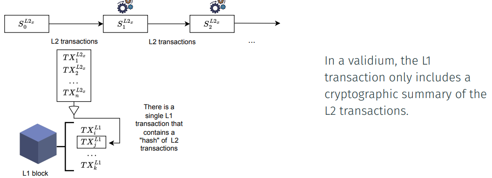
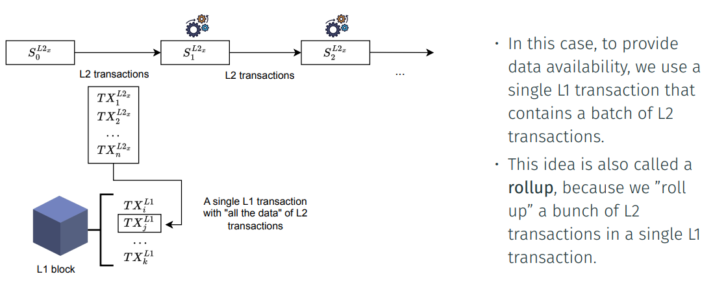
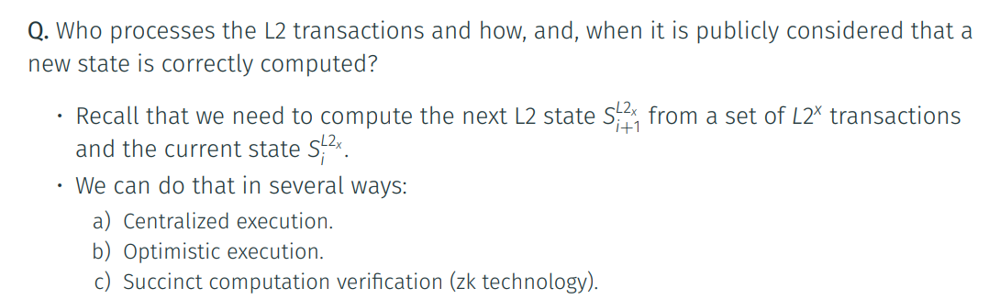
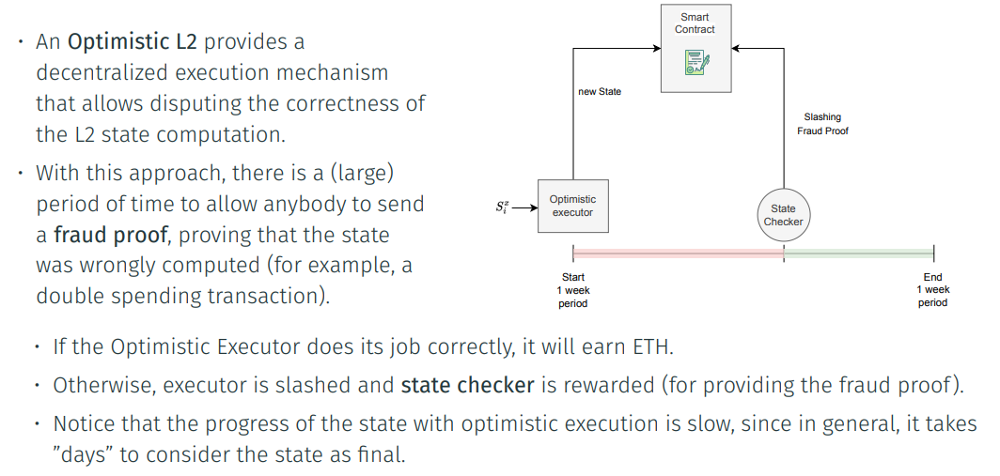
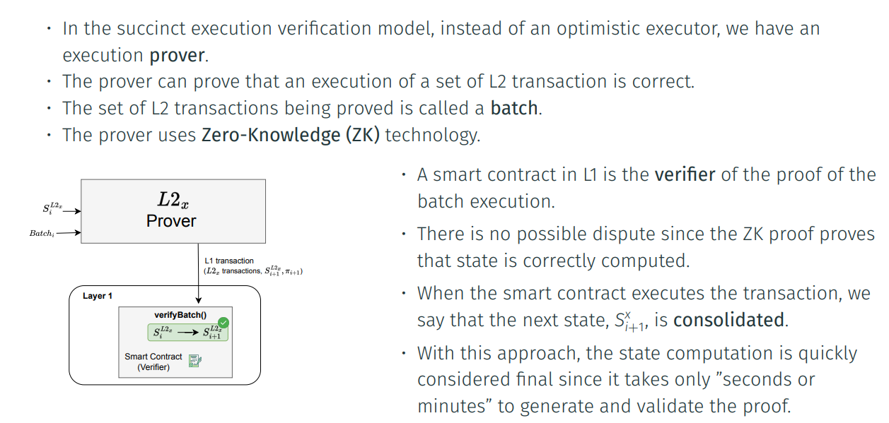
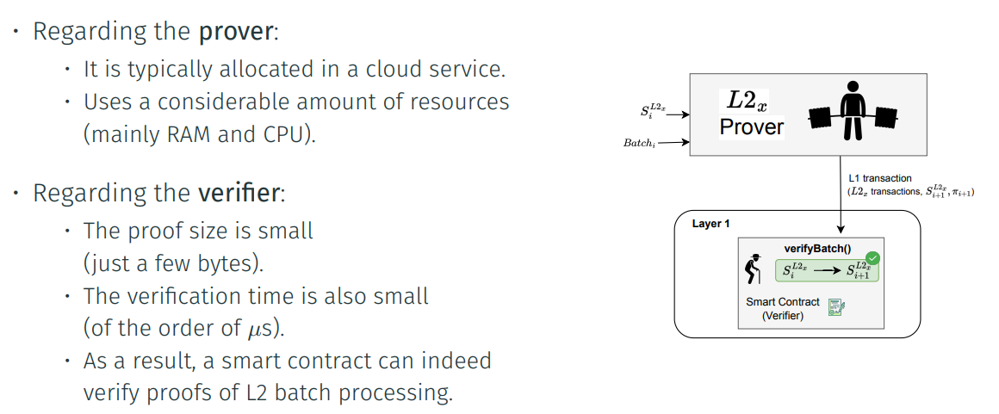
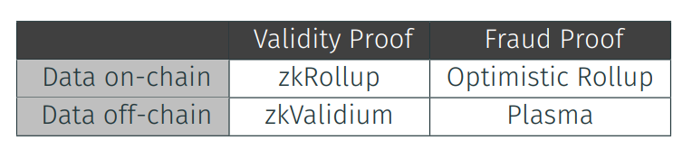

## Validiums

## L2 Rollups

## Layer 2 Design: State Computation

## Optimistic Execution

## Succinct Execution Verification (zk* Systems)

 In zkValidium, instead of
posting all the batch data
back to L1, only a
cryptographic summary (a
hash) of it is posted.
• This means that a user
cannot retrieve the L2
transactions from L1.
• Instead, the user must ask a
reliable L2 operator (data
manager) for these data.

In case the operators do not provide the data to the user, still the ZK processing assures
that the transactions included in the batch are always correctly processed.
This means that, for example:
• No one can steal your funds.
• You might see an increase in your L2 balance, but you might not know which
concrete L2 transaction produced this increase.

-----
### Are we Scaling with zkRollups?

Q. A last natural question is if we are scaling with rollups based on succinct verification. The answer is yes, because the smart contract execution resources for verifying a proof are much lower than executing individual transactions within a batch. In fact, the majority of the cost comes from the data availability, but we can work on improve the costs of data availability. Addressing data availability costs: 
• Succinct verification of compressed data (for example, transaction digital signature). 
• EIP 4884 Proto-Danksharing:
 • Data shards are much cheaper than writing in L1 execution layer. 
• Remark that the L1 execution layer (smart contracts) will have access to blobs in data shards

------
