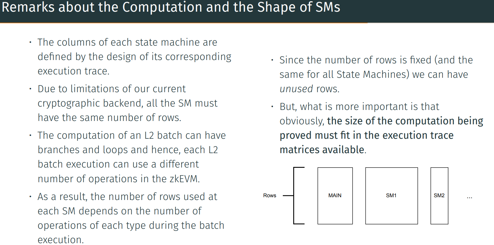

# The PIL of the zkEVM

•	Recall that there is a PIL compiler that reads a PIL specification file and compiles it to an output file with the list of constraints and a format that can be consumed by the prover.
•	In the PIL language, the state machines (subexecution matrices) are called namespaces.
•	In the zkevm-proverjs repository, you can find the PIL specification of the zkEVM under the pil directory.

## PIL Evolution: PIL2 (WIP)

•	Currently, we are under the development of a new version of PIL called PIL2.
•	PIL2 is designed to operate with a more powerful cryptographic backend that is able to generate as many subexecution traces as required by the batch processing so that we never run out of rows.
•	We are also agreeing with the rest of the ”zk projects” at Polygon a format for the PIL output file called "pilout"