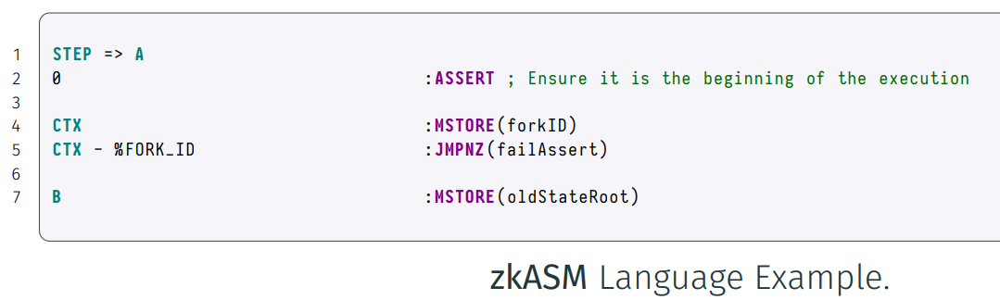
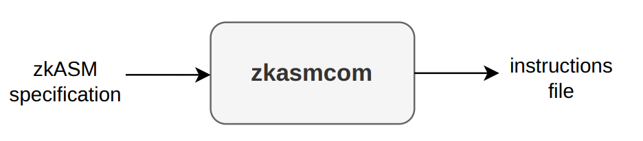

Assembly Language for the zkEVM

• zkASM is the language developed by the team that is used to write the program that
a compiler will build and the executor will interpret in order to build the execution
trace.

In the repository zkasmcom-vscode there is a syntax highlighter for VSCode.

We have implemented a zkASM compiler that reads a zkASM specification file and
compiles it to an output file with the list steps and instructions which the executor will
consume in order to compute the execution trac

## ROM-based Executor
•	We need a general-computation executor because:
•	Our implementation of the EVM evolves.
•	The EVM itself also evolves.
•	An architecture with assembly programs is faster to develop, test and audit than a specific implementation.
•	We call the Ethereum program that processes EVM transactions the EVM ROM (Read Only Memory) or simply the ROM.

## forkId

. By changing the ROM, we make our L2 zkEVM more and more closer to the L1 EVM.
· So we have versions of the zkEVM ROM.
· Each of these versions will be denoted with an identifier called forkId.
. Another advantage of using a ROM-based approach is that we can test small parts of
the assembly program in isolation.
· Finally, mention that:
· We are also developing a native executor (we will see why later).
. Having the two approaches allows us to check that execution traces generated match.