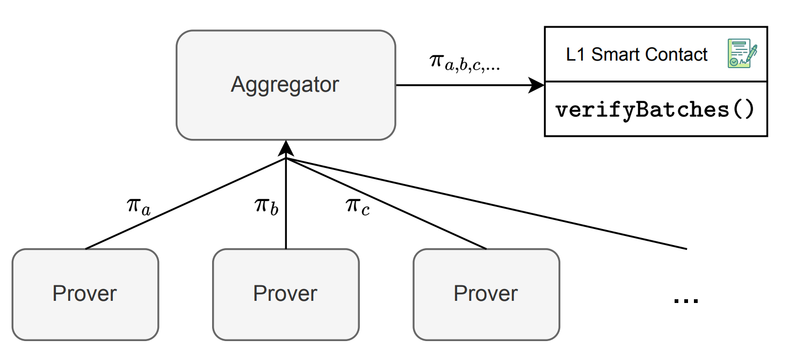
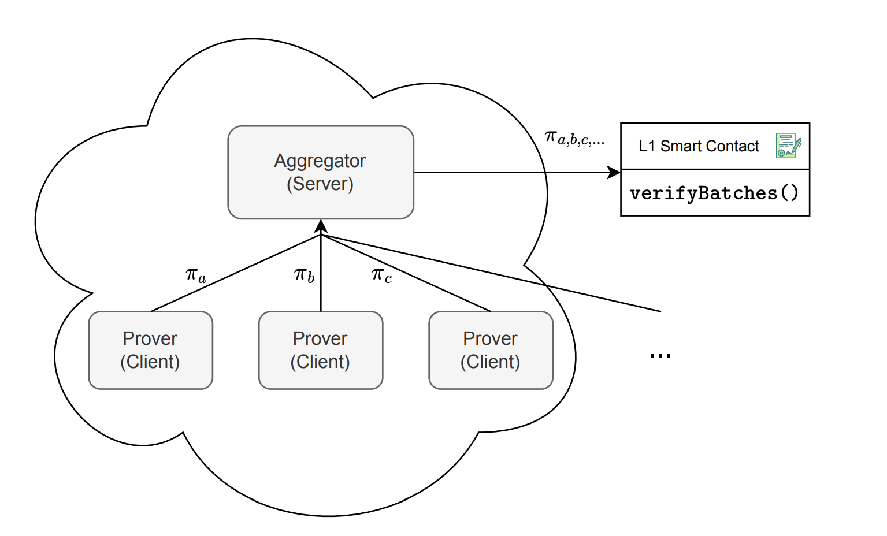
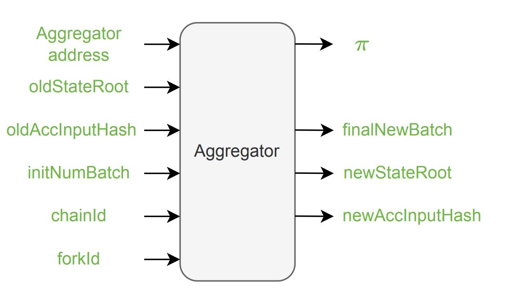
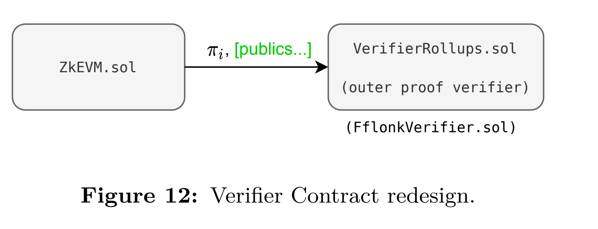
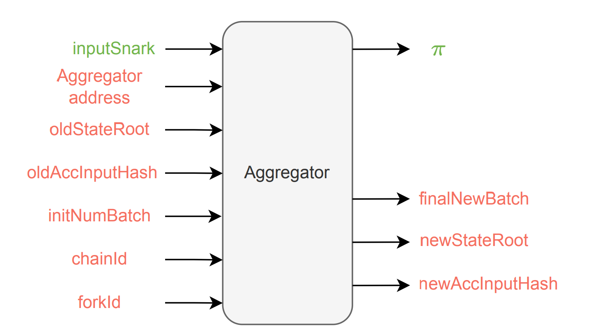
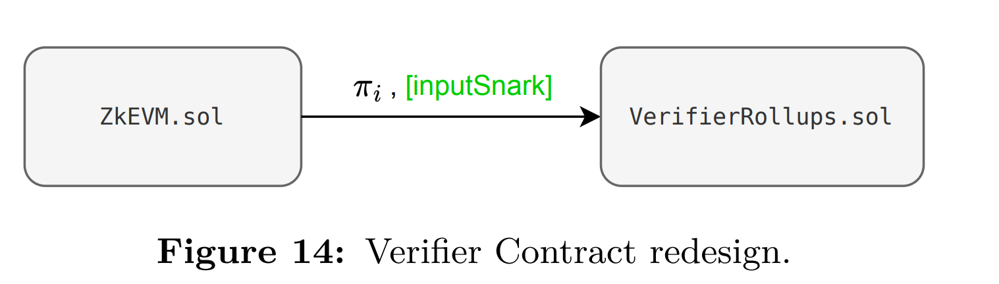

## Introducing the Aggregator
The aggregator is the component within the zkEVM architecture that will be in charge of
performing the proof aggregation schema. The aggregator invokes the verifyBatches()
function (See Figure 9) on the smart contract, passing parameters such as the initial batch
number **initNumBatch**, the final batch number (**finalNewBatch**), the **newStateRoot**, and
the **aggregated proof π**. The previous root is stored in the smart contract, eliminating
the need to transmit it. Recall that the smart contract contains a summary of the batch
information in the accumulated input hash.

Figure 9: The role of the Aggregator is to aggregate several proofs in one and send it to the L1
Smart Contract through the verifyBatches() function.

The aggregator operates as a network server, establishing connections with provers
that function as network clients. Provers link up with the aggregator to send their proofs.
The aggregator, acting as a server, is responsible for deciding how to horizontally scale
provers in order to achieve an optimal batch consolidation rate. Scaling is essential to
avoid an accumulation of extra batches awaiting consolidation. The aggregator keeps a
record of authorized provers. Both the aggregator and the provers operate in a cloudbased environment (See Figure 10), with the provers being configured as high-resource
instances. This configuration enables effective and scalable control of evidence processing,
guaranteeing the system can handle different workloads and maintain an efficient batch
**consolidation rate**

Inputs and Outputs of the Proof

The proof generation process requires several inputs, as shown in **Figure 11**, to ensure its soundness:

- The **aggregator address**, serving as a safeguard against malleability in the `verifyBatches()` function, ensuring that no one can use another aggregator's proof.
- The contract state root (**oldStateRoot**), which is already included in the smart contract and does not require explicit sending.
- The previous accumulated input hash (**oldAccInputHash**).
- Initial batch number (**initNumBatch**)
- The **chainID** and the **forkID** ensure that the proof is valid only within the intended chain and version of the zkEVM.

The aggregator generates three outputs: the updated state root (newStateRoot), the
new accumulated input hash (newAccInputHash) and the batch number of the last batch
included in the the aggregated proof once it has been successfully generated (finalNewBatch).
At the moment all the inputs and outputs are public, presenting an efficiency problem as
we will see below

The smart contract structure shown in Figure 12 enables the ability to upgrade or alter
the verifier as necessary. Currently we only provide a verifier called FflonkVerifier.sol

With this approach, the verifier must utilize a list of publics. However, a verifier with
a single input is more cost-effective. In Groth16, there is a scalar multiplication operation
per public input, which is approximately 10, 000 Gas per public. The key is to create a

With this approach, the verifier must utilize a list of publics. However, a verifier with
a single input is more cost-effective. In Groth16, there is a scalar multiplication operation
per public input, which is approximately 10, 000 Gas per public. The key is to create a

As shown in Figure 14, when zkEVM.sol interacts with the VerifierRollups.sol
smart contract in the revised procedure, only a single public parameter is passed, which
helps in minimizing data transmission expenses. This optimized approach requires two
crucial verifications by the proof system. Initially, it verifies that the hash of all private inputs, arranged in the correct order, corresponds to the given inputSnark. The
proof system verifies that the total input hash calculated for all processed batches by the
aggregator matches the specified newAccInputHash

