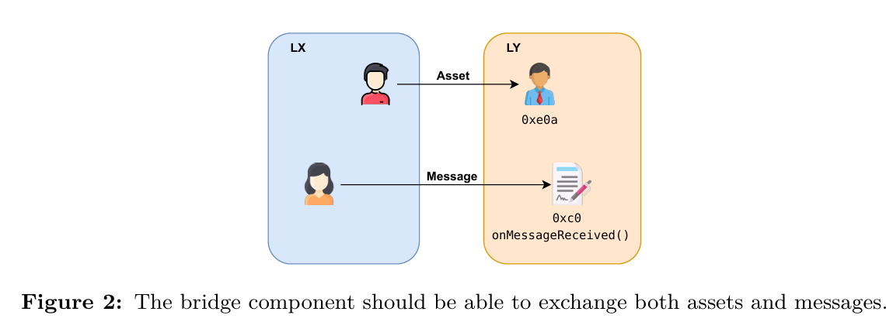
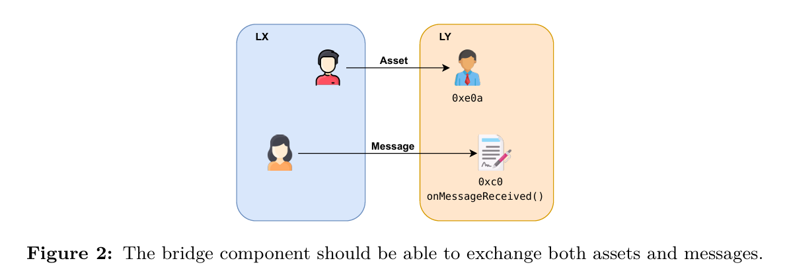
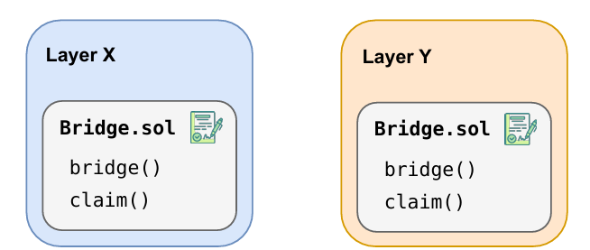

## Exchanging assets and messages 
The objective of the bridge component is to enable the exchange of both assets and messages (See Figure 2). On the one hand, the term asset refers to any digital rep resentation of value within the Ethereum blockchain. Ethereum supports two types of assets: Ether (ETH), which is the native cryptocurrency of the network, and Tokens, including ERC-20 and ERC-721 tokens. On the other hand, a message refers to com munication or interaction between two smart contracts, involving both data and a value (in ETH) transferred from the origin contract (the one initiating the message) to the specified destination contract. Within the zkEVM context, these messages entail theexe cution of a function **onMessageReceived** of some existing contract. This is what we call the messaging mechanism of the bridge

## The Bridge

The bridge is an infrastructure component that allows migration of assets and commu-nication between different layers. From the point of view of the user, they should be able to transfer an asset from one network to another without changing its value or its functionality, as well as being able to send data payloads between networks (cross-chain messaging).
For sake of simplicity, we will start the bridge description by defining exchanges be-tween L1 and an L2 but our intention is to be general, that is, to enable exchanges between multiple layers LX and LY. This is why we call this subsystem the LXLY bridge. For the explanations, we will use three layers denoted as LX, LY and LZ as represented in Figure 1.

The core logic of the **LXLY** bridge is implemented in smart contracts. In particular, the main contract is called zkEVMBridge.sol that is deployed in any layer in which we want exchanging to be enabled. One of the design goals is that this smart contract is exactly the **same in all layers** (See Figure 3). This uniformity is intentional to maintain consistency in the logic whether exchanging assets or messages from a lower layer LY to an upper layer LX, or vice versa and hence externalizing the complexity associated with the layer position distinction from the core contract.

The LXLY bridge follows a bridge-claim model (See Figure 4). Let us suppose we
 are in the situation where some LX user wants to transfer an asset (or, alternatively, a
 message) to some LY user. In the origin layer LX, the source user sends a transaction to
 the bridge() function providing the destination network LY. From now on, transactions
 to the bridge function will also be known as **deposits**.
  Later on, in the destination layer
 LY, the user sends a transaction to the claim() function providing the origin network LX
 in order to claim the transferred (we will explore the meaning of that later on) asset (or
 message). To maintain a record of exchanges across layers, within the zkEVMBridge.sol
 smart contracts we need a compact way of storing the information of calls to the bridge
 function. These data, often referred to **as exits or outgoing transmissions**