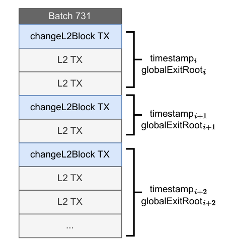
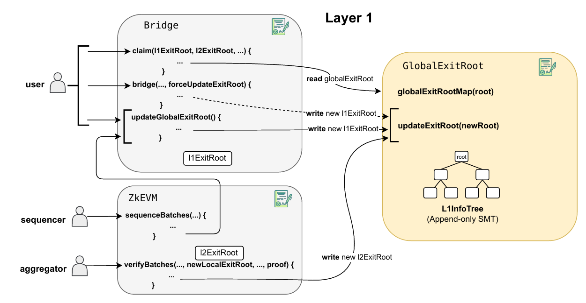
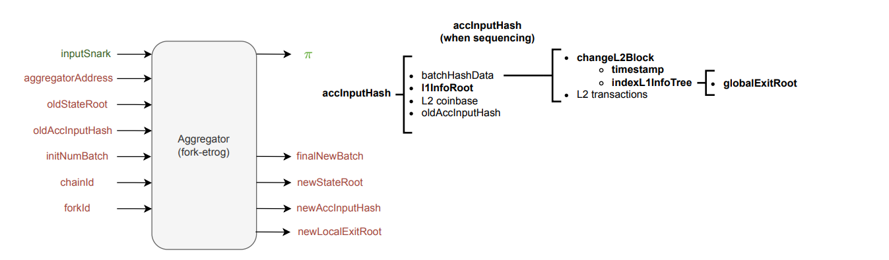

## changeL2Block (fork-etrog)

## L1InfoTree

Recall that in order to check the existence of a **globalExitRoot**, the zkEVM proving
 system would need to have access to all the global exit roots recorded in L1, which are
 stored in a mapping within the GlobalExitRootManager. However, we can not pass a
 mapping to the prover. A naive solution would be to pass a list of global exit roots to the
 prover, but this is highly **inefficient** since this list is a potentially big and always growing
 data structure. A succinct way to do it is to build a Merkle tree with all the global exit
 roots. We will refer to this tree as the **L1InfoTree**.

  In **fork-etrog** the **globalExitRoots** are stored in a Merkle Tree called L1InfoTree
 instead of in a mapping.

 

 To generate a proof for the existence of a specific leaf using an append-only tree-like
 structure that stores all the global exit roots, the **prover** must have access to both the
 **root of the L1InfoTree** and the **index of the globalExitRoot** used for processing the
 L2 blockThis index, called indexL1InfoTree, serves to locate the specific leaf within
 the tree. Observe that providing the prover with both the indexL1InfoTree and the
 corresponding globalExitRoot is **redundant**. Therefore, instead of providing both in the
 changeL2Block transaction, we will only provide the indexL1InfoTree, which completely
 determines the used global exit root.
 With these modifications, we also need to adjust the information provided to the
 aggregator to ensure correct aggregation of proofs. Recall that in fork-dragonfruit each
 batch had its own timestamp and globalExitRoot so this parameters were contained
 in accInputHash at batch level, and within batchHashData we only had the hash of
 the corresponding L2 transactions. In fork-etrog (See Figure 4), since the timestamp is
 defined at the transaction level, we need to include it in the batchHashData, along with
 the indexL1InfoTree and the previously included transactions. Moreover, we should
 include the last root of the L1InfoTree within the batch, which will be called L1InfoRoot.
 Observe that this is enough since the L1InfoTree is incremental, so all the inclusion proofs
 can be generated using the lastly updated root.
 In fact, the leaves of the L1InfoTree, besides storing the global exit roots, also contains
 two other parameters, the **minTimestamp** and the **blockhashL1**, as shown in Figure 5. The
 summary of the three parameters is called L1Data.
 • TheminTimestamp: whichrepresents the time when the globalExitRoot was recorded
 in the tree. This parameter will be used in the timestamps checks as the minimum
 timestamp possible for a block. We will deep into this later on.

We can see how the parameters contained in **accInputHash** have changed with respect
 to the previous version.
 - **TheblockhashL1**: which is the blockhash of the L1 block that precedes the block in
 which it is placed the transaction that inserts the **globalExitRoot** in the **L1InfoTree**.
 Recall that the header of an Ethereum block includes the L1 state root, so making
 available the blockhashL1 provides the L1 state to L2 contracts

 