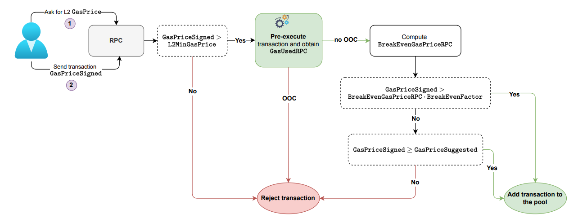
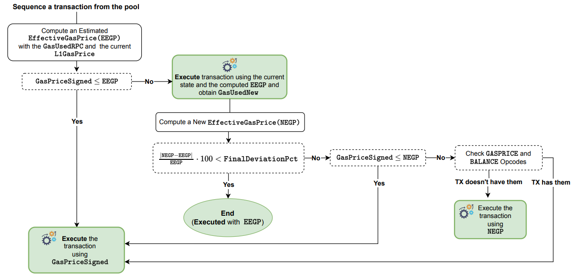

# User Fees Flows
 ## RPC Flow
The RPC is the zkEVM component that, in a high level, handles the acceptance or
rejection of incoming transactions and saves the approved transactions in the Pool. In
Figure 9, the transaction progression within the RPC component is shown, starting from
the moment a user is willing to send a transaction to the network to the point where it
becomes either stored in the Pool or rejected. Let’s examine the Figure 9 in detail.

First of all, the users asks to the RPC for the current GasPriceSuggested, which
recall is a factor of the current L1 GasPrice. More concretely,

GasPriceSuggested = L1GasPrice · SuggestedFactor,

where SuggestedFactor (which is currently of 0.15) satisfies

SuggestedFactor > L1GasPriceFactor

in order to be able to cover data availability costs. Observe that the suggested gas
price varies over time as L1GasPrice also does.

## Sequencer Flow
The Sequencer is the zkEVM component that is responsible for fetching transactions
from the Pool and assembling some of them into a batch. The sequencer submits a
sequence of batches to the L1 which will be then proved by the Aggregator. In Figure 11,
the transaction progression within the Sequencer component is shown, starting from the
moment that a transaction is fetched from the Pool until it is executed by the Executor.
Let’s examine the Figure 11 in detail.

The Sequencer takes from the Pool the transaction having higher gas price and
computes the estimated EffectiveGasPrice (which we will call EEGP) using the
GasUsedRPC obtained in the RPC pre-execution using a previous state root (which
has now changed) and the current L1GasPrice (which also may differ from the one
used when sending the transaction to the RPC)

